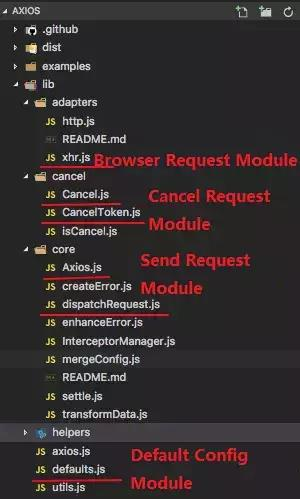

# 插件及工具
## axios使用知识点
### 如何使用 axios
要理解 axios 的设计，首先需要看一下如何使用 axios。我们举一个简单的例子来说明下 axios API 的使用。
```js
axios({
  method:'get',
  url:'http://bit.ly/2mTM3nY',
  responseType:'stream'
})
  .then(function(response) {
  response.data.pipe(fs.createWriteStream('ada_lovelace.jpg'))
});
```
这个实例很简单，不需要我解释了。我们再来看看如何添加一个拦截器函数。

### 如何使用 axios拦截器函数
```js
axios.interceptors.request.use(function (config) {
    return config;
  }, function (error) {
    return Promise.reject(error);
  });

axios.interceptors.response.use(function (response) {
    return response;
  }, function (error) {
    return Promise.reject(error);
  });
```
从上面的代码，我们可以知道：发送请求之前，我们可以对请求的配置参数（config）做处理；在请求得到响应之后，我们可以对返回数据做处理。当请求或响应失败时，我们还能指定对应的错误处理函数。    

### 如何撤销 HTTP 请求
在开发与搜索相关的模块时，我们经常要频繁地发送数据查询请求。一般来说，当我们发送下一个请求时，需要撤销上个请求。因此，能撤销相关请求功能非常有用。axios 撤销请求的示例代码如下：   
```js
const CancelToken = axios.CancelToken;
const source = CancelToken.source();

axios.get('/user/12345', {
  cancelToken: source.token
}).catch(function(thrown) {
  if (axios.isCancel(thrown)) {
    console.log('请求撤销了', thrown.message);
  } else {
  }
});

axios.post('/user/12345', {
  name: '新名字'
}, {
  cancelToken: source.token
}).

source.cancel('用户撤销了请求');
```
从上例中可以看到，在 axios 中，使用基于 <font color="red">CancelToken</font> 的撤销请求方案。然而，该提案现已撤回，详情如点这里。具体的撤销请求的实现方法，将在后面的源代码分析的中解释。   

---

## axios 核心模块的设计和实现
通过上面的例子，我相信每个人都对 axios 的使用有一个大致的了解了。下面，我们将根据模块分析 axios 的设计和实现。下面的图片，是我在本文中会介绍到的源代码文件。如果您感兴趣，最好在阅读时克隆相关的代码，这能加深你对相关模块的理解。   


### HTTP 请求模块
请求模块的代码放在了 <font color="red">core/dispatchRequest.js</font> 文件中，这里我只展示了一些关键代码来简单说明：
```js
module.exports = function dispatchRequest(config) {
    throwIfCancellationRequested(config);

    var adapter = config.adapter || defaults.adapter;

    return adapter(config).then(function onAdapterResolution(response) {
        throwIfCancellationRequested(config);
        return response;
    }, function onAdapterRejection(reason) {
        if (!isCancel(reason)) {
            throwIfCancellationRequested(config);
            return Promise.reject(reason);
        });
};
```
上面的代码中，我们能够知道 <font color="red">dispatchRequest</font> 方法是通过 <font color="red">config.adapter</font> ，获得发送请求模块的。我们还可以通过传递符合规范的适配器函数来替代原来的模块（一般来说，我们不会这样做，但它是一个松散耦合的扩展点）。   
在 <font color="red">defaults.js</font> 文件中，我们可以看到相关适配器的选择逻辑——根据当前容器的一些独特属性和构造函数，来确定使用哪个适配器。    
```js
function getDefaultAdapter() {
    var adapter;
    if (typeof process !== 'undefined' && Object.prototype.toString.call(process) === '[object process]') {
        adapter = require('./adapters/http');
    } else if (typeof XMLHttpRequest !== 'undefined') {
        adapter = require('./adapters/xhr');
    }
    return adapter;
}
```
axios 中的 XHR 模块相对简单，它是对 <font color="red">XMLHTTPRequest</font> 对象的封装，这里我就不再解释了。有兴趣的同学，可以自己阅读源源码看看，源码位于 <font color="red">adapters/xhr.js</font>    

### 拦截器模块
现在让我们看看 axios 是如何处理，请求和响应拦截器函数的。这就涉及到了 axios 中的统一接口 ——<font color="red">request</font> 函数。
```js
Axios.prototype.request = function request(config) {
    var chain = [dispatchRequest, undefined];
    var promise = Promise.resolve(config);

    this.interceptors.request.forEach(function unshiftRequestInterceptors(interceptor) {
        chain.unshift(interceptor.fulfilled, interceptor.rejected);
    });

    this.interceptors.response.forEach(function pushResponseInterceptors(interceptor) {
        chain.push(interceptor.fulfilled, interceptor.rejected);
    });

    while (chain.length) {
        promise = promise.then(chain.shift(), chain.shift());
    }

    return promise;
};
```
这个函数是 axios 发送请求的接口。因为函数实现代码相当长，这里我会简单地讨论相关设计思想：
1. <font color="red">chain</font> 是一个执行队列。队列的初始值是一个携带配置（<font color="red">config</font>）参数的 Promise 对象。

2. 在执行队列中，初始函数 <font color="red">dispatchRequest</font> 用来发送请求，为了与 <font color="red">dispatchRequest</font>对应，我们添加了一个 <font color="red">undefined</font>。添加 <font color="red">undefined</font> 的原因是需要给 <font color="red">Promise</font> 提供成功和失败的回调函数，从下面代码里的 <font color="red">promise = promise.then(chain.shift(), chain.shift())</font>; 我们就能看出来。因此，函数 <font color="red">dispatchRequest</font> 和 <font color="red">undefined</font> 可以看成是一对函数。

3. 在执行队列 <font color="red">chain</font> 中，发送请求的 <font color="red">dispatchRequest</font> 函数处于中间位置。它前面是请求拦截器，使用 <font color="red">unshift</font> 方法插入；它后面是响应拦截器，使用 <font color="red">push</font> 方法插入，在 <font color="red">dispatchRequest</font> 之后。需要注意的是，这些函数都是成对的，也就是一次会插入两个
浏览上面的 <font color="red">request</font> 函数代码，我们大致知道了怎样使用拦截器。下一步，来看看怎样撤销一个 HTTP 请求。   


### 撤销请求模块
与撤销请求相关的模块位于 <font color="red">Cancel/</font> 文件夹下，现在我们来看下相关核心代码。

首先，我们来看下基础  <font color="red">Cancel</font> 类。它是一个用来记录撤销状态的类，具体代码如下：
```js
function Cancel(message) {
  this.message = message;
}

Cancel.prototype.toString = function toString() {
  return 'Cancel' + (this.message ? ': ' + this.message : '');
};

Cancel.prototype.__CANCEL__ = true;
```
使用 <font color="red">CancelToken</font> 类时，需要向它传递一个 Promise 方法，用来实现 HTTP 请求的撤销，具体代码如下：
```js
function CancelToken(executor) {
    if (typeof executor !== 'function') {
        throw new TypeError('executor must be a function.');
    }

    var resolvePromise;
    this.promise = new Promise(function promiseExecutor(resolve) {
        resolvePromise = resolve;
    });

    var token = this;
    executor(function cancel(message) {
        if (token.reason) {
            return;
        }

        token.reason = new Cancel(message);
        resolvePromise(token.reason);
    });
}

CancelToken.source = function source() {
    var cancel;
    var token = new CancelToken(function executor(c) {
        cancel = c;
    });
    return {
        token: token,
        cancel: cancel
    };
};
```
<font color="red">adapters/xhr.js</font>文件中，撤销请求的地方是这样写的：
```js
if (config.cancelToken) {
    config.cancelToken.promise.then(function onCanceled(cancel) {
        if (!request) {
            return;
        }

        request.abort();
        reject(cancel);
        
        request = null;
    });
}
```
通过上面的撤销  HTTP请求的例子，让我们简要地讨论一下相关的实现逻辑：
1. 在需要撤销的请求中，调用 <font color="red">CancelToken</font> 类的 <font color="red">source</font> 方法类进行初始化，会得到一个包含 <font color="red">CancelToken</font> 类实例 <font color="red">A</font> 和 <font color="red">cancel</font> 方法的对象。
2. 当 <font color="red">source</font> 方法正在返回实例 <font color="red">A</font> 的时候，一个处于 <font color="red">pending</font> 状态的 <font color="red">promise</font> 对象初始化完成。在将实例 <font color="red">A</font> 传递给 <font color="red">axios</font> 之后，<font color="red">promise</font> 就可以作为撤销请求的触发器使用了。
3. 当调用通过 <font color="red">source</font> 方法返回的 <font color="red">cancel</font> 方法后，实例 <font color="red">A</font> 中 <font color="red">promise</font> 状态从 <font color="red">pending</font> 变成 <font color="red">fulfilled</font>，然后立即触发 <font color="red">then</font> 回调函数。于是 axios 的撤销方法——<font color="red">request.abort()</font> 被触发了。

#### axios 这样设计的好处是什么？
发送请求函数的处理逻辑   

如前几章所述，axios 不将用来发送请求的 dispatchRequest 函数看做一个特殊函数。实际上，dispatchRequest 会被放在队列的中间位置，以便保证队列处理的一致性和代码的可读性。    

适配器的处理逻辑   

在适配器的处理逻辑上，http 和 xhr 模块（一个是在 Node.js 中用来发送请求的，一个是在浏览器里用来发送请求的）并没有在 dispatchRequest 函数中使用，而是各自作为单独的模块，默认通过 defaults.js 文件中的配置方法引入的。因此，它不仅确保了两个模块之间的低耦合，而且还为将来的用户提供了定制请求发送模块的空间。    

#### 撤销 HTTP 请求的逻辑
在撤销 HTTP 请求的逻辑中，axios 设计使用 Promise 来作为触发器，将 resolve 函数暴露在外面，并在回调函数里使用。它不仅确保了内部逻辑的一致性，而且还确保了在需要撤销请求时，不需要直接更改相关类的样例数据，以避免在很大程度上入侵其他模块。