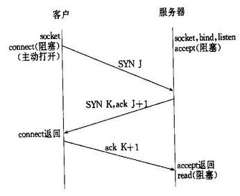
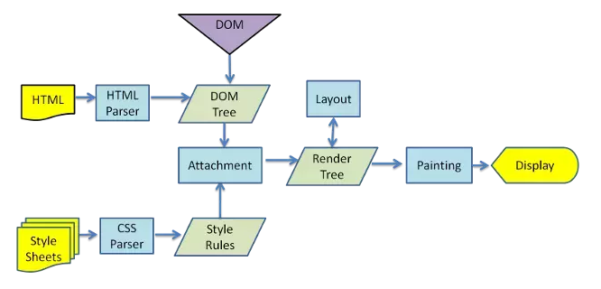
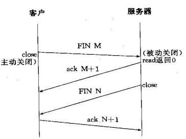
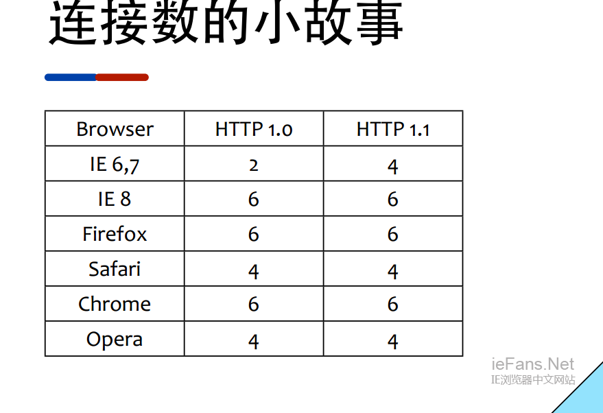

# 浏览器相关
## 从一个url地址到最终页面渲染完成，发生了什么?
1. DNS解析：将域名地址解析为IP地址（依次从下面查找）  
  -- 读取浏览器DNS缓存  
  -- 系统DNS缓存  
  -- 路由器DNS缓存  
  -- 网络运营商DNS缓存  
  -- 递归搜索  例如blog.baidu.com  
    &nbsp;&nbsp;&nbsp;&nbsp;  1. .com域名下查找DNS解析  
    &nbsp;&nbsp;&nbsp;&nbsp;  2. .baidu域名下查找  
    &nbsp;&nbsp;&nbsp;&nbsp;  3. blog域名下查找  
    &nbsp;&nbsp;&nbsp;&nbsp;  4. 都未找到出错  
2. TCP连接：TCP三次握手  
  [TCP为什么需要3次握手与4次挥手](https://cloud.tencent.com/developer/article/1344764)  
  -- 第一次握手：由浏览器发起，告诉服务器我要发送请求了  
  -- 第二次握手：由服务器发起，告诉浏览器我准备接收了，你赶紧发送吧  
  -- 第三次握手：由浏览器发起，告诉服务器，我马上就发了，准备接收吧  
  

3. 发送请求
  -- 请求报文：HTTP协议的通信内容

4. 接收相应
  -- 响应报文

5. 渲染页面
  -- 遇见HTML标记，浏览器调用HTML解析器解析成Token标记并构建成dom树    DOM
  -- 遇见style/link标记：浏览器调用CSS解析器，处理CSS标记并构建cssom树    CSSOM
  -- 遇到script标记，调用javascript解析器，处理script代码（绑定事件，修改dom树/cssom树）  JavaScript
  -- 将dom树和cssom树合并成一个渲染树   RenderTree  
  -- 根据渲染树来计算布局，计算每个节点的几何信息(布局)  Layout
  -- 将各个节点颜色绘制到屏幕上（渲染）  Paint
  补充：真实DOM和其解析流程
  如下图为 webkit 渲染引擎工作流程图
    
  ::: danger 注意
    1. 这五个步骤不一定按照顺序执行。如果dom树或cssom树被修改了，可能会执行多次布局和渲染，往往在实际页面中，这些步骤都会执行多次
    2. CSS阻塞：CSS在head中使用link引入时会阻塞页面的渲染，CSS也会阻塞JS的执行，但是CSS不阻塞外部脚本的加载
    3. JS阻塞：直接通过script src引入的JS脚本会阻塞页面的渲染（如果添加[defer async](https://www.cnblogs.com/jiasm/p/7683930.html)则不会阻塞渲染）, 但是JS不阻塞资源的加载，JS会按顺序执行，前面的执行时会阻塞后续JS的执行
    4. 当页面被CSS或JS阻塞时，webkit会调用HTMLPreloadScanner来扫描后续的代码，使用预加载器下载外部资源
  :::

6. 断开连接：TCP四次挥手  
  -- 第一次挥手： 由浏览器发起的，发送给服务器，我东西发送完了（请求报文），你准备关闭吧  
  -- 第二次挥手： 由服务器发起的，告诉浏览器，我东西接收完了（请求报文），我准备关闭了，你也准备吧  
  -- 第三次挥手： 由服务器发起，告诉浏览器，我东西发送完了（响应报文），你准备关闭吧  
  第四次挥手：由浏览器发起，告诉服务器，我东西接收完了，我准备关闭了（响应报文），你也准备吧  
  

---
## 为什么利用多个域名来存储网站资源会更有效 ？
确保用户在不同地区能用最快的速度打开网站，其中某个域名崩溃用户也能通过其他域名访问网站。

## window 常用属性与方法有哪些 ？
* window 对象的常用属性
   * window.self 返回当前窗口的引用
   * window.parent   返回当前窗体的父窗体对象
   * window.top 返回当前窗体最顶层的父窗体的引用
   * window.outerwidth       返回当前窗口的外部宽
   * window.outerheight  返回当前窗口的外部高
   * window.innerwidth       返回当前窗口的可显示区域宽
   * window.innerheight  返回当前窗口的可显示区域高
   * 提示：通过直接在 Chrome 控制台中输入 console.log(window) 可以查看到其所有的被当前浏览器支持的属性及值。
* window 对象的常用方法
   * window.prompt()   弹出一个输入提示框，若用户点击了“取消”则返回 null
   * window.alert()    弹出一个警告框
   * window.confirm()  弹出一个确认框
   * window.close()  关闭当前浏览器窗口。有些浏览器对此方法有限制。
   * window.open(uri, [name], [features])  打开一个浏览器窗口，显示指定的网页。name 属性值可以是“_blank”、“_self”、“_parent”、“_top”、任意指定的一个窗口名。
   * window.blur( )    指定当前窗口失去焦点
   * window.focus( ) 指定当前窗口获得焦点
   * 已废弃 window.showModalDialog(uri, [dataFromParent])  打开一个“模态窗口”（打开的子窗口只要不关闭，其父窗口即无法获得焦点；且父子窗口间可以传递数据）

## document 常用属性与方法有哪些 ？
* document 常见的属性
   * body 提供对  元素的直接访问。对于定义了框架集的文档，该属性引用最外层的 。
   * cookie 设置或返回与当前文档有关的所有 cookie。
   * domain 返回当前文档的域名。 (例:"www.bilibili.com")
   * lastModified 返回文档被最后修改的日期和时间。
   * referrer 返回载入当前文档的文档的 URL。(例:"https://www.bilibili.com/")
   * title 返回当前文档的标题。
   * URL 返回当前文档的 URL。(例:"https://www.bilibili.com/video/av24239225/?p=8")

* document常见的方法
   * write()：动态向页面写入内容
   * createElement(Tag)：创建一个 HTML 标签对象
   * getElementById(ID)：获得指定 id 的对象
   * getElementsByName(Name)：获得之前 Name 的对象
   * body.appendChild(oTag)：向 HTML 中插入元素对象
   * ...


---

## 获取屏幕宽高width(),outerWidth,innerWidth,clientWidth的区别  
* $(window).width()与$(window).height()：获得的是屏幕可视区域的宽高，不包括滚动条与工具条  
* document.documentElement.clientWidth与document.documentElement.clientHeight：获得的是屏幕可视区域的宽高，不包括滚动条与工具条  
* window.innerWidth与window.innerHeight：获得的是可视区域的宽高，但是window.innerWidth宽度包含了纵向滚动条的宽度，window.innerHeight高度包含了横向滚动条的高度  
* window.outerWidth与window.outerHeight：获得的是加上工具条与滚动条窗口的宽度与高度  
* document.body.clientWidth与document.body.clientHeight: document.body.clientWidth获得的也是可视区域的宽度，但是document.body.clientHeight获得的是body内容的高度
* clientWidth & clientHeigh:  返回本身的宽高 + padding
* clientTop & clientLeft: clientTop = boder.top(上边框的宽度) 、 clientLeft = boder.left(左边框的宽度) 
* offsetWidth & offsetHeight: 返回本身的宽高 + padding + border + 滚动条  
* offsetLeft & offsetTop: 所有HTML元素拥有offsetLeft和offsetTop属性来返回元素的X和Y坐标
* scrollWidth & scrollHeight: 这两个属性是元素的内容区域加上内边距，再加上任何溢出内容的尺寸。因此，如果没有溢出时，这些属性与clientWidth和clientHeight是相等的  
* scrollLeft & scrollTop: 指定的是元素的滚动条的位置

---

## 常见浏览器内核
浏览器 的内核引擎，基本上是四分天下：  
1）Trident: IE 以Trident 作为内核引擎  
2) Gecko: Firefox 是基于 Gecko 开发  
3）WebKit: Safari, Google Chrome,傲游3,猎豹浏览器,百度浏览器 opera浏览器  
4）Presto: Opera的内核，但由于市场选择问题，主要应用在手机平台--Opera mini   
Wekbit是一个开源的Web浏览器引擎，也就是浏览器的内核。Apple的Safari, Google的Chrome, Nokia S60平台的默认浏览器，Apple手机的默认浏览器，Android手机的默认浏览器均采用的Webkit作为器浏览器内核。Webkit的采用程度由 此可见一斑，理所当然的成为了当今主流的三大浏览器内核之一。另外两个分别是Gecko和Trident，大名鼎鼎的Firefox便是使用的Gecko 内核，而微软的IE系列则使用的是Trident内核。  
另外，搜狗浏览器是双核的，双核并不是指一个页面由2个内核同时处理,而是所有网页（通常是标准通用标记语言的应用超文本标记语言）由webkit内核处理,只有银行网站用IE内核 

---

## 经常遇到的浏览器兼容性问题有哪些？原因和解决方法有哪些？常用hack技巧？
*. 常见浏览器兼容性问题
   1. 不同浏览器的标签默认的margin和padding不同（默认8像素）
      * 解决办法：添加 *{margin:0;padding:0;}  或者 引用网上的normalize.css或reset.css样式文件
   2. 字体大小定义不同
      * 问题表现：对字体大小small定义不同，Firefox为13px，而IE为16px，差别比较大
      * 解决方法：使用指定的字体大小如14px或者使用em
   3. 3像素问题，
      * 问题出现的浏览器：IE6及其更低的版本
      * 问题描述：两个相邻的div之间有3个像素的空隙，一个div使用了float,而另一个没有使用产生的。
      * 解决方法：
         1. 对另一个div也使用float;
         2. 给浮动的div添加属性margin-right: –3px，但是这样写，在其他浏览器又会不正常，所以我们需要添加IE6的hack，在属性margin-right前添加下划线_margin-right: –3px。（IE6以及更低版本的hack，是在属性前面添加下划线_）
   4. 双外边距浮动问题  
      * 问题出现的浏览器：IE6及其更低的版本  
      * 问题描述：任何浮动的元素上的外边距加倍，例如：如果元素设置的外边距为margin-left: 15px，在浏览器里会显示为margin-left: 30px。  
      * 解决方法：将元素的display属性设置为inline，因为元素为浮动的，所以这么设置不会影响元素在浏览器的显示。  
   5. IE6不支持min-*
      * 问题出现的浏览器：IE6及其更低的版本
      * 问题描述：IE6不支持min-height该属性。即使定义了元素高度，如果内容超过元素的高度，IE6在解析时，会自动延长元素的高度。
      * 解决方法：利用IE6不识别!important，给元素设置固定高度，并且设置元素高度自动。
        Height : auto  ! important;
        Height:300px;
        Min_height:300px;
        因为IE6不识别!Important，它只识别到了height:300px,当内容超过300px时,它会自动延长高度。IE7以及其他浏览器都识别！Important，虽然定义了Height:300px,但是！Important的优先级别最高。所以内容超过300px时，还是会自动延长。
   6. IE6不能定义1px左右宽度的容器
      * 问题出现的浏览器：IE6及其更低的版本
      * 问题描述：创建一个高度为1px的容器，在IE6中没效果。
      * 解决方法：因为行高line-height在IE6下有默认值，设置ling-height: 1px | overflow: hidden | zoom: 0.08。
   7. IE6不支持png-24透明图片
      * 问题出现的浏览器：IE6及其更低的版本
      * 问题描述：在IE6中，使用png-24透明图片，不透明。
      * 解决方法：图片使用gif格式或者png-8格式图片。
   8. IE5~8不支持opacity
      * 问题出现的浏览器：IE8及其更低的版本
      * 问题描述：IE5~8不支持CSS属性opacity
      * 解决方法：这时可以另外添加ie滤镜alpha，如下：
      ```js
          opacity: 0.8;
          filter: alpha(opacity = 80); /*for IE5~7*/
          -ms-filter: "progid:DXImageTransform.Microsoft.Alpha(opacity = 80)"; /*for IE8*/
      ```
   9. Firefox点击链接出现的虚线框
      * 问题出现的浏览器：Firefox浏览器
      * 问题描述：Firefox浏览器在点击链接时，会自动在元素周围添加一个虚线边框。
      * 解决方法：我们为了和其他浏览器保持一致，需要去掉该虚线框，我们可以给a标签设置outline属性，如下：
        a {outline: none;}  a:focus {outline: none;}
   10. 外边距叠加
      * 问题出现的浏览器：所有浏览器
      * 问题描述：当两个或者更多垂直外边距相遇时，它们将形成一个外边距，这个外边距的高度等于两个发生叠加的外边距的高度中的较大者。
      * 解决方法：这并不是一个浏览器Bug，这是CSS的一个特性，如果想要防止这种情况发生，和padding搭配使用。（要根据实际情况来解决，这里只是简要说明哈~~~）
   11. 图片默认间距
      *  问题出现的浏览器：主流浏览器都有此问题
      * 问题描述：几个img标签排列的时候，浏览器都会有默认的间距。
      * 解决方法：为img标签添加属性float。

---

## 浏览器是怎么对 HTML5 的离线储存资源进行管理和加载的呢  
1. 在线的情况下，浏览器发现 html 头部有 manifest 属性，它会请求 manifest 文件，如果是第一次访问 app，那么浏览器就会根据 manifest 文件的内容下载相应的资源并且进行离线存储。   
2. 如果已经访问过 app 并且资源已经离线存储了，那么浏览器就会使用离线的资源加载页面，然后浏览器会对比新的 manifest 文件与旧的 manifest 文件，如果文件没有发生改变，就不做任何操作，如果文件改变了，那么就会重新下载文件中的资源并进行离线存储。   
3. 离线的情况下，浏览器就直接使用离线存储的资源。

---

## 请描述一下 cookies，sessionStorage 和 localStorage 的区别 ？
1. 区别：
   * cookie 是网站为了标示用户身份而储存在用户本地终端（Client Side）上的数据（通常经过加密）。
   * cookie 数据始终在同源的 http 请求中携带（即使不需要），也会在浏览器和服务器间来回传递。
   * sessionStorage 和 localStorage 不会自动把数据发给服务器，仅在本地保存。
2. 存储大小
   * cookie 数据大小不能超过 4k。
   * sessionStorage 和 localStorage 虽然也有存储大小的限制，但比 cookie 大得多，可以达到 5M 或更大。

3. 有期时间
   * localStorage 存储持久数据，浏览器关闭后数据不丢失除非主动删除数据；
   * sessionStorage 数据在当前浏览器窗口关闭后自动删除。
  cookie  设置的 cookie 过期时间之前一直有效，即使窗口或浏览器关闭。

---

## 讲述你对 reflow 和 repaint 的理解。（具体可见CSS文档中）
repaint 就是重绘，reflow 就是回流。   
* 严重性： 在性能优先的前提下，性能消耗 reflow 大于 repaint。

* 体现：repaint 是某个 DOM 元素进行重绘；reflow 是整个页面进行重排，也就是页面所有 DOM 元素渲染。

* 如何触发：style 变动造成 repaint 和 reflow。
   1. 不涉及任何 DOM 元素的排版问题的变动为 repaint，例如元素的 color/text-align/text-decoration 等等属性的变动。
   2. 除上面所提到的 DOM 元素 style 的修改基本为 reflow。例如元素的任何涉及 长、宽、行高、边框、display 等 style 的修改。

* 常见触发场景
   1. 触发 repaint：
      * color 的修改，如 color=#ddd；
      * text-align 的修改，如 text-align=center；
      * a:hover 也会造成重绘。
      * :hover 引起的颜色等不导致页面回流的 style 变动。
   2. 触发 reflow：
      * width/height/border/margin/padding 的修改，如 width=778px；
      * 动画，:hover 等伪类引起的元素表现改动，display=none 等造成页面回流；
      * appendChild 等 DOM 元素操作；
      * font 类 style 的修改；
      * background 的修改，注意着字面上可能以为是重绘，但是浏览器确实回流了，经过浏览器厂家的优化，部分 background 的修改只触发 repaint，当然 IE 不用考虑；
      * scroll 页面，这个不可避免；
      * resize 页面，桌面版本的进行浏览器大小的缩放，移动端的话，还没玩过能拖动程序，resize 程序窗口大小的多窗口操作系统。
      * 读取元素的属性（这个无法理解，但是技术达人是这么说的，那就把它当做定理吧）：读取元素的某些属性（offsetLeft、offsetTop、offsetHeight、offsetWidth、scrollTop/Left/Width/Height、clientTop/Left/Width/Height、getComputedStyle()、currentStyle(in IE))；

* 如何避免：
   * 尽可能在 DOM 末梢通过改变 class 来修改元素的 style 属性：尽可能的减少受影响的 DOM 元素。
   * 避免设置多项内联样式：使用常用的 class 的方式进行设置样式，以避免设置样式时访问 DOM 的低效率。
   * 设置动画元素 position 属性为 fixed 或者 absolute：由于当前元素从 DOM 流中独立出来，因此受影响的只有当前元素，元素 repaint。
   * 牺牲平滑度满足性能：动画精度太强，会造成更多次的 repaint/reflow，牺牲精度，能满足性能的损耗，获取性能和平滑度的平衡。
   * 避免使用 table 进行布局：table 的每个元素的大小以及内容的改动，都会导致整个 table 进行重新计算，造成大幅度的 repaint 或者 reflow。改用 div 则可以进行针对性的 repaint 和避免不必要的 reflow。
   * 避免在 CSS 中使用运算式：学习 CSS 的时候就知道，这个应该避免，不应该加深到这一层再去了解，因为这个的后果确实非常严重，一旦存在动画性的 repaint/reflow，那么每一帧动画都会进行计算，性能消耗不容小觑。

---


## 什么是跨域? 解决跨域的办法有哪些?
[前端解决跨域的九种方法](https://www.cnblogs.com/sdcs/p/8484905.html)
```js

1. 同源策略
   -- 浏览器安全策略
   -- 协议名、域名、端口号必须完全一致
2. 跨域
   违背同源策略就会产生跨域
3. 解决跨域
   jsonp、cors(Access-Control-Allow-Origin)、postMessage(HTML5 XMLHttpRequest Level 2中的API，且是为数不多可以跨域操作的window属性之一)、服务器代理...

// jsonp 示例  利用script标签天然能跨域的特性解决跨域问题
//1. 创建script标签
var script = document.createElement('script');
//2. 设置回调函数
function getData(data){
  //数据请求回来会被触发的函数
  console.log(data);
}
//3. 设置script的scr属性,设置请求地址
script.src = 'http://localhost:3000?callback=getData';
//4. 让script标签生效
document.body.appendChild(script);
```

---

## HTTP状态码(Status code)常见示例

* 1xx: 临时回应，表示客户端继续

* 2xx: 请求成功
   * 200: 请求成功

* 3xx: 表示请求的目标有变化，希望客户端进一步处理
   * 301: 永久性跳转
   * 302: 临时性跳转
   * 304: 跟客户端缓存一致没有更新

* 4xx: 客户端请求错误
   * 403: 无权限
   * 404: 表示请求的页面不存在
   * 418: It’s	a	teapot.	这是一个彩蛋，来自ietf的一个愚人节玩笑

* 5xx: 服务端请求错误
   * 500: 服务端错误
   * 503: 服务端暂时性错误，可以一会再试

对我们前端来说，1xx系列的状态码是非常陌生的，原因是1xx的状态被浏览器http库直接处理掉了，不会让 上层应用知晓。   


状态码 | 响应类别 | 中文意思
- | - | - 
1XX | 信息性状态码（Informational）	| 服务器正在处理请求
2XX	| 成功状态码（Success）	| 请求已正常处理完毕
3XX	| 重定向状态码（Redirection）	| 需要进行额外操作以完成请求
4XX	| 客户端错误状态码（Client Error） | 客户端原因导致服务器无法处理请求
5XX	| 服务器错误状态码（Server Error）| 服务器原因导致处理请求出错

---

## 浏览器HTTP请求并发数和TCP连接的关系(头条)
1. 网页中的图片资源为什么分放在不同的域名下？
  浏览器对并发请求的数目限制是针对域名的，即针对同一域名（包括二级域名）在同一时间支持的并发请求数量的限制。如果请求数目超出限制，则会阻塞。因此，网站中对一些静态资源，使用不同的一级域名，可以提升浏览器并行请求的数目，加速界面资源的获取速度。   

2. 浏览器与服务器建立一个TCP连接后，是否会在完成一个http请求后断开？什么条件下会断开？
  在HTTP/1.0中，一个http请求收到服务器响应后，会断开对应的TCP连接。这样每次请求，都需要重新建立TCP连接，这样一直重复建立和断开的过程，比较耗时。所以为了充分利用TCP连接，可以设置头字段Connection: keep-alive，这样http请求完成后，就不会断开当前的TCP连接，后续的http请求可以使用当前TCP连接进行通信。   
  HTTP/1.1将Connection写入了标准，默认值为keep-alive。除非强制设置为Connection: close，才会在请求后断开TCP连接。   
  所以这一题的答案就是：默认情况下建立的TCP连接不会断开，只有在请求头中设置Connection: close才会在请求后关闭TCP连接。   

3. 一个TCP连接可以同时发送几个HTTP请求？
  HTTP/1.1中，单个TCP连接，在同一时间只能处理一个http请求，虽然存在Pipelining技术支持多个请求同时发送，但由于实践中存在很多问题无法解决，所以浏览器默认是关闭，所以可以认为是不支持同时多个请求。  
  HTTP2提供了多路传输功能（Multiplexing技术)，多个http请求，可以同时在同一个TCP连接中进行传输。

4. 浏览器http请求的并发性是如何体现的？并发请求的数量有没有限制？
  页面资源请求时，浏览器会同时和服务器建立多个TCP连接，在同一个TCP连接上顺序处理多个HTTP请求。所以浏览器的并发性就体现在可以建立多个TCP连接，来支持多个http同时请求。

  <font color='red'>Chrome浏览器</font>最多允许对<font color='red'>同一个域名Host建立6个TCP连接</font>，不同的浏览器有所区别。
  
---