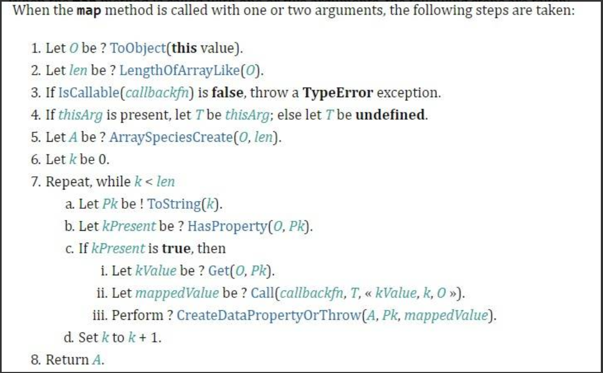
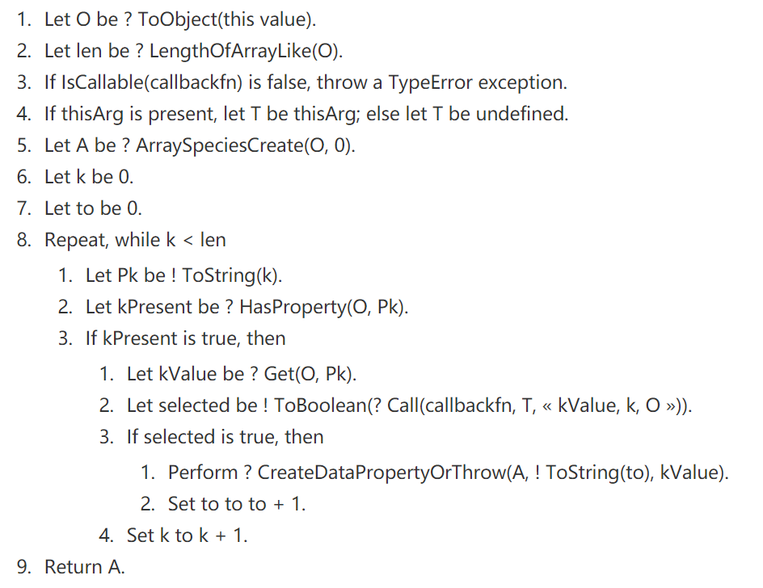
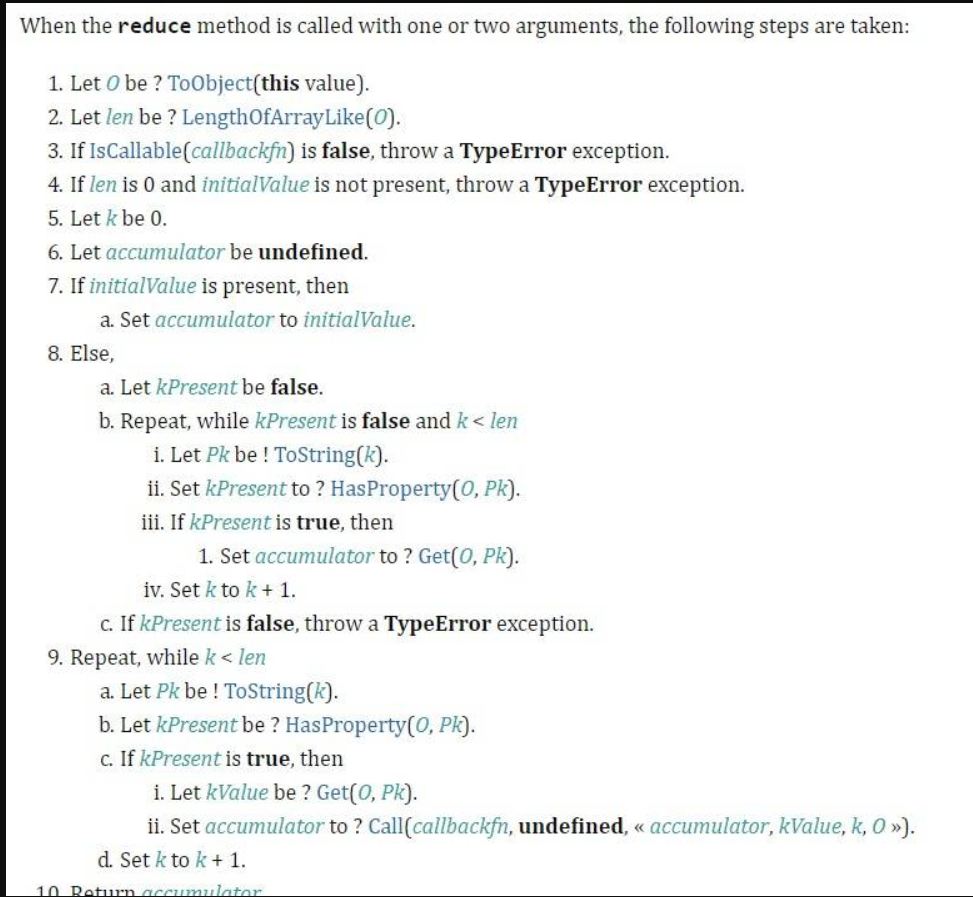
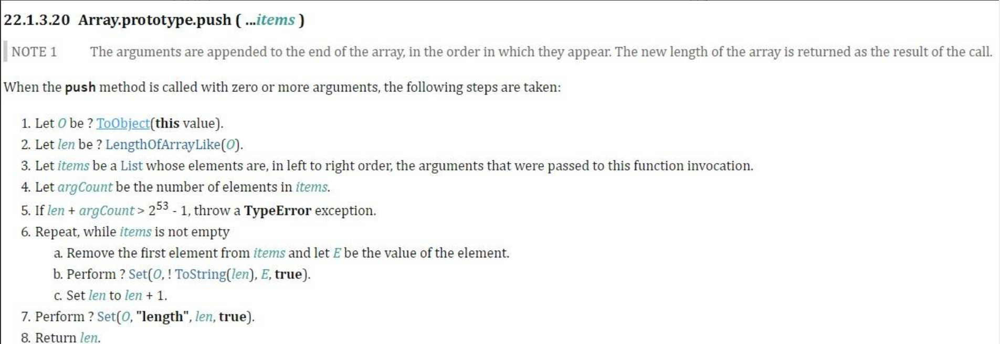
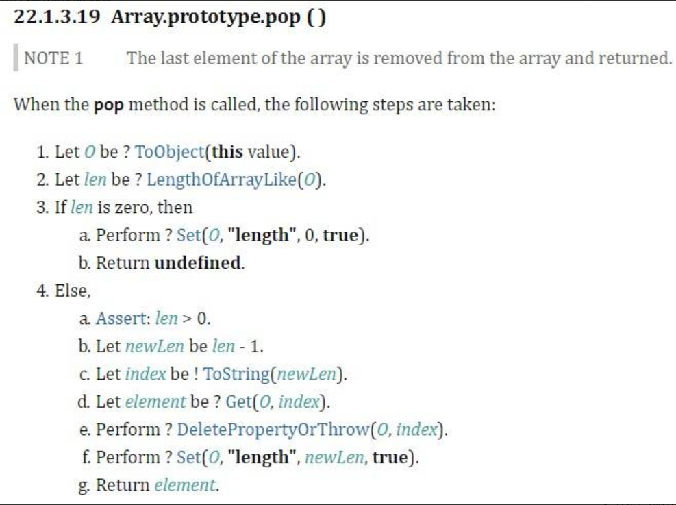
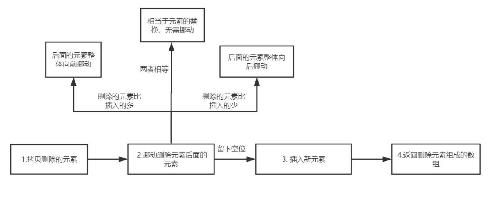

# 手写源码系列
---
[实现数组方法](https://juejin.im/post/5dbebbfa51882524c507fddb#heading-25)   
[Array 原型方法源码实现大揭秘](https://juejin.im/post/5d76f08ef265da03970be192#heading-0)   

## 能不能实现数组map方法 ?
依照[ecma262](https://tc39.es/ecma262/#sec-array.prototype.map) 草案，实现的map的规范如下:   

ECMA-262 规范文档实现如下。:
1. Let O be ? ToObject(this value).
2. Let len be ? LengthOfArrayLike(O).
3. If IsCallable(callbackfn) is false, throw a TypeError exception.
4. If thisArg is present, let T be thisArg; else let T be undefined.
5. Let A be ? ArraySpeciesCreate(O, len).
6. Let k be 0.
7. Repeat, while k < len
   1. Let Pk be ! ToString(k).
   2. Let kPresent be ? HasProperty(O, Pk).
   3. If kPresent is true, then
      1. Let kValue be ? Get(O, Pk).
      2. Let mappedValue be ? Call(callbackfn, T, « kValue, k, O »).
      3. Perform ? CreateDataPropertyOrThrow(A, Pk, mappedValue).
   4. Set k to k + 1.
8. Return A.
下面根据草案的规定一步步来实现map：
```js
Array.prototype.map = function(callbackFn, thisArg){
  //处理数组类型异常
  //可以简化位this == null ，因为null == undefined,所以同时可以判定null和undefined
  if(this === null || this === undefined){
    throw new TypeError("Cannot read property 'map' of null or undefined");
  }
  // Step 1. 转成数组对象， 有length属性和 K-V键值对
  let O = Object(this);
  // Stet 2.  无符号右移0位，左侧用0填充，结果非负
  let len = O.length >>> 0;
  // Stet 3.  callbackfn不是函数时抛出异常。处理回调类型异常
  if(typeof callbackfn !== 'function'){
    throw new TypeError(callbackfn + ' is not a function')
  }
  // Step 4. 
  let T = thisArg
  // Step 5.
  let A = new Array(len);
  // Step 6.
  let k = 0
  // Step 7.
  while(k < len){
    // Step 7.1、7.2、7.3
    //检查 O 及其原型链是否包含属性k
    if(k in O){
      // Step 7.3.1
      let kValue = O[k];
      // Step 7.3.2 执行callbackfn函数
      // 传入 this, 当前元素element，索引 index, 原数组对象 O
      let mappedValue = callbackfn.call(T, kValue, k, O);
      // Step 7.3.3 返回结果赋值给新生成数组
      A[k] = mappedValue;
    }
    // Step 7.4
    k++
  }
  // Step 8. 返回新数组
  return A;
}
```
  看完代码其实挺简单，核心就是在一个 while 循环中执行 callbackfn，并传入 4 个参数，回调函数具体的执行逻辑这里并不关心，只需要拿到返回结果并赋值给新数组就好了。   
  只有 O 及其原型链上包含属性 k 时才会执行  callbackfn 函数，所以对于稀疏数组 empty 元素或者使用 delete 删除后的索引则不会被调用。   

  最后来说说 this，源码中有这么一段<font color="red"> callbackfn.call(T, kValue, k, O)</font>，其中  T 就是 thisArg 值，如果没有设置，那就是 undefined。   
  根据call的解读，传入 undefined 时，非严格模式下指向 Window，严格模式下为 undefined。记住这时候回调函数不能用箭头函数，因为箭头函数是没有自己的 this 的。   
```js
// 1、传入 thisArg 但使用箭头函数
let name = 'Muyiy'
let obj = {
    name: 'Hello',
    callback: (ele) => {
        return this.name + ele
    }
}
let arr = [1, 2, 3]
let result = arr.map(obj.callback, obj);
console.log(result) 
// ["1", "2", "3"]，此时 this 指向 window
// 那为啥不是 "Muyiy1" 这样呢，不急，第 3 步介绍

// 2、传入 thisArg，使用普通函数
let name = 'Muyiy'
let obj = {
    name: 'Hello',
    callback: function (ele) {
        return this.name + ele
    }
}
let arr = [1, 2, 3]
let result = arr.map(obj.callback, obj);
console.log(result) 
// ["Hello1", "Hello2", "Hello3"]，完美
// ----------- 完美分割线 -----------

// 3、不传入 thisArg，name 使用 let 声明
let name = 'Muyiy'
let obj = {
    name: 'Hello',
    callback: function (ele) {
        return this.name + ele
    }
}
let arr = [1, 2, 3]
let result = arr.map(obj.callback);
console.log(result)
// ["1", "2", "3"]
// 为什么呢，因为 let 和 const 声明的变量不会挂载到 window 上
// ----------- 完美分割线 -----------

// 4、严格模式
'use strict'
var name = 'Muyiy'
let obj = {
    name: 'Hello',
    callback: function (ele) {
        return this.name + ele
    }
}
let arr = [1, 2, 3]
let result = arr.map(obj.callback);
console.log(result)
// TypeError: Cannot read property 'name' of undefined
// 因为严格模式下 this 指向 undefined

```
最后给大家奉上V8源码，参照源码检查一下，其实还是实现得很完整了。
```js
function ArrayMap(f, receiver) {
  CHECK_OBJECT_COERCIBLE(this, "Array.prototype.map");

  // Pull out the length so that modifications to the length in the
  // loop will not affect the looping and side effects are visible.
  var array = TO_OBJECT(this);
  var length = TO_LENGTH(array.length);
  if (!IS_CALLABLE(f)) throw %make_type_error(kCalledNonCallable, f);
  var result = ArraySpeciesCreate(array, length);
  for (var i = 0; i < length; i++) {
    if (i in array) {
      var element = array[i];
      %CreateDataProperty(result, i, %_Call(f, receiver, element, i, array));
    }
  }
  return result;
}
```
参考：   
[V8源码](https://github.com/v8/v8/blob/ad82a40509c5b5b4680d4299c8f08d6c6d31af3c/src/js/array.js#L1132)   
[Array 原型方法源码实现大揭秘](https://juejin.im/post/5d76f08ef265da03970be192#comment)   

---

## 能不能实现数组forEach 方法 ?
forEach 的源码和 map 很相同，在 map 的源码基础上做些改造就是啦。
```js
Array.prototype.forEach = function(callbackfn, thisArg) {
  // 相同
  ...
  while(k < len) {
    if (k in O) {
      let kValue = O[k]
 
      // 这部分是 map
      // let mappedValue = callbackfn.call(T, kValue, k, O)
      // A[k] = mappedValue
      
      // 这部分是 forEach
      callbackfn.call(T, kValue, k, O)
    }
    k++
  }
  // 返回 undefined
  // return undefined
}
```
可以看到，不同之处在于不处理 callbackfn 执行的结果，也不返回。

---

## 能不能实现数组filter方法 ?
完整的结构是<font color="red"> Array.prototype.filter(callbackfn[, thisArg]) </font>，和 map 是一样的。
filter 字如其名，它的主要功能就是过滤，callbackfn 执行结果如果是 true 就返回当前元素，false 则不返回，返回的所有元素组合在一起生成新数组，并返回。如果没有任何元素通过测试，则返回空数组。
所以这部分源码相比 map 而言，多了一步判断 callbackfn 的返回值。
ECMA-262 规范文档实现如下。

```js
Array.prototype.filter = function(callbackfn, thisArg) {
  // 异常处理
  if (this === null || this == undefined) {
  	throw new TypeError("Cannot read property 'map' of null or undefined");
  }
  if (typeof callbackfn !== 'function') {
    throw new TypeError(callbackfn + ' is not a function')
  }
  let O = Object(this), len = O.length >>> 0,
      T = thisArg, A = new Array(len), k = 0
  // 新增，返回数组的索引
  let to = 0
  while(k < len) {
    if (k in O) {
      let kValue = O[k]
      // 新增
      if (callbackfn.call(T, kValue, k, O)) {
        A[to++] = kValue;
      }
    }
    k++
  }
  // 新增，修改 length，初始值为 len
  A.length = to;
  return A
}
```
看懂 map 再看这个实现就简单多了，改动点在于判断 callbackfn 返回值，新增索引 to，这样主要避免使用 k 时生成空元素，并在返回之前修改 length 值。    

这部分源码还是挺有意思的，惊喜点在于 A.length = to，之前还没用过。    

---

## 能不能实现数组reduce方法 ?
依照 ecma262 草案，实现的reduce的规范如下:

<font color="red">reduce</font> 可以理解为「归一」，意为海纳百川，万剑归一，完整的结构是<font color="red"> Array.prototype.reduce(callbackfn[, initialValue]) </font>，这里第二个参数并不是 thisArg 了，而是初始值 <font color="red"> initialValue</font>，关于初始值之前有介绍过。    
*. 如果没有提供 initialValue，那么第一次调用 callback 函数时，accumulator 使用原数组中的第一个元素，currentValue 即是数组中的第二个元素。
*. 如果提供了 initialValue，accumulator 将使用这个初始值，currentValue 使用原数组中的第一个元素。
*. 在没有初始值的空数组上调用 reduce 将报错。
用 JS 来模拟实现，核心逻辑如下：   
```js
Array.prototype.reduce = function(callbackfn, initialValue) {
  // 异常处理
  if (this == null || this === undefined) {
  	throw new TypeError("Cannot read property 'map' of null or undefined");
  }
  if (typeof callbackfn !== 'function') {
    throw new TypeError(callbackfn + ' is not a function')
  }
  let O = Object(this)
  let len = O.length >>> 0
  let k = 0, accumulator
  
  // 新增
  if (initialValue) {
    accumulator = initialValue
  } else {
    // Step 4.
    if (len === 0) {
      throw new TypeError('Reduce of empty array with no initial value');
    }
    // Step 8.
    let kPresent = false
    while(!kPresent && (k < len)) {
      kPresent = k in O
      if (kPresent) {
        accumulator = O[k] 
      }
      k++
    }
  }
  
  while(k < len) {
    if (k in O) {
      let kValue = O[k]
      accumulator = callbackfn.call(undefined, accumulator, kValue, k, O)
    }
    k++
  }
  return accumulator
}

```
这部分源码主要多了对于 initialValue 的处理，有初始值时比较简单，即 accumulator = initialValue，kValue = O[0]。   
无初始值处理在 Step 8，循环判断当 O 及其原型链上存在属性 k 时，accumulator = O[k] 并退出循环，因为 k++，所以 kValue = O[k++]。   
更多的数组方法有 find、findIndex、forEach 等，其源码实现也是大同小异，无非就是在 callbackfn.call 这部分做些处理，有兴趣的可以看看 TC39 和 MDN 官网，参考部分链接直达。   

最后附上V8源码：
```js
function ArrayReduce(callback, current) {
  CHECK_OBJECT_COERCIBLE(this, "Array.prototype.reduce");

  // Pull out the length so that modifications to the length in the
  // loop will not affect the looping and side effects are visible.
  var array = TO_OBJECT(this);
  var length = TO_LENGTH(array.length);
  return InnerArrayReduce(callback, current, array, length,
                          arguments.length);
}

function InnerArrayReduce(callback, current, array, length, argumentsLength) {
  if (!IS_CALLABLE(callback)) {
    throw %make_type_error(kCalledNonCallable, callback);
  }

  var i = 0;
  find_initial: if (argumentsLength < 2) {
    for (; i < length; i++) {
      if (i in array) {
        current = array[i++];
        break find_initial;
      }
    }
    throw %make_type_error(kReduceNoInitial);
  }

  for (; i < length; i++) {
    if (i in array) {
      var element = array[i];
      current = callback(current, element, i, array);
    }
  }
  return current;
}
```
参考：[V8源码](https://github.com/v8/v8/blob/ad82a40509c5b5b4680d4299c8f08d6c6d31af3c/src/js/array.js#L1132)

---

## 能不能实现数组 push、pop 方法 ?
参照 ecma262 草案的规定，关于 push 和 pop 的规范如下图所示:

首先来实现一下 push 方法:
```js
Array.prototype.push = function(...items) {
  let O = Object(this);
  let len = this.length >>> 0;
  let argCount = items.length >>> 0;
  // 2 ** 53 - 1 为JS能表示的最大正整数
  if (len + argCount > 2 ** 53 - 1) {
    throw new TypeError("The number of array is over the max value restricted!")
  }
  for(let i = 0; i < argCount; i++) {
    O[len + i] = items[i];
  }
  let newLength = len + argCount;
  O.length = newLength;
  return newLength;
}
```


然后来实现 pop 方法:
```js
Array.prototype.pop = function() {
  let O = Object(this);
  let len = this.length >>> 0;
  if (len === 0) {
    O.length = 0;
    return undefined;
  }
  len --;
  let value = O[len];
  delete O[len];
  O.length = len;
  return value;
}
```
参考: [V8数组源码](https://github.com/v8/v8/blob/ad82a40509c5b5b4680d4299c8f08d6c6d31af3c/src/js/array.js)

---

## 能不能实现数组splice方法?
splice 可以说是最受欢迎的数组方法之一，api 灵活，使用方便。现在来梳理一下用法:    
1. splice(position, count) 表示从 position 索引的位置开始，删除count个元素    
2. splice(position, 0, ele1, ele2, ...) 表示从 position 索引的元素后面插入一系列的元素   
3. splice(postion, count, ele1, ele2, ...) 表示从 position 索引的位置开始，删除 count 个元素，然后再插入一系列的元素   
4. 返回值为<font color="red">被删除元素</font>组成的<font color="red">数组</font>。   

接下来实现这个方法,首先梳理一下实现的思路。

```js

//拷贝被删除的元素
const sliceDeleteElements = (array, startIndex, deleteCount, deleteArr) => {
  for (let i = 0; i < deleteCount; i++) {
    let index = startIndex + i;
    if (index in array) {
      let current = array[index];
      deleteArr[i] = current;
    }
  }
};

//移动被删除元素后面跟着的元素
const movePostElements = (array, startIndex, len, deleteCount, addElements) => {
  // 如果添加的元素和删除的元素个数相等，相当于元素的替换，数组长度不变，被删除元素后面的元素不需要挪动
  if (deleteCount === addElements.length) return;
  // 如果添加的元素和删除的元素个数不相等，则移动后面的元素
  else if(deleteCount > addElements.length) {
    // 删除的元素比新增的元素多，那么后面的元素整体向前挪动
    // 一共需要挪动 len - startIndex - deleteCount 个元素
    for (let i = startIndex + deleteCount; i < len; i++) {
      let fromIndex = i;
      // 将要挪动到的目标位置
      let toIndex = i - (deleteCount - addElements.length);
      if (fromIndex in array) {
        array[toIndex] = array[fromIndex];
      } else {
        delete array[toIndex];
      }
    }
    // 注意注意！这里我们把后面的元素向前挪，相当于数组长度减小了，需要删除冗余元素
    // 目前长度为 len + addElements - deleteCount
    for (let i = len - 1; i >= len + addElements.length - deleteCount; i --) {
      delete array[i];
    }
  } else if(deleteCount < addElements.length) {
    // 删除的元素比新增的元素少，那么后面的元素整体向后挪动
    // 思考一下: 这里为什么要从后往前遍历？从前往后会产生什么问题？
    for (let i = len - 1; i >= startIndex + deleteCount; i--) {
      let fromIndex = i;
      // 将要挪动到的目标位置
      let toIndex = i + (addElements.length - deleteCount);
      if (fromIndex in array) {
        array[toIndex] = array[fromIndex];
      } else {
        delete array[toIndex];
      }
    }
  }
};

const computeStartIndex = (startIndex, len) => {
  // 处理索引负数的情况
  if (startIndex < 0) {
    return startIndex + len > 0 ? startIndex + len: 0;
  } 
  return startIndex >= len ? len: startIndex;
}

const computeDeleteCount = (startIndex, len, deleteCount, argumentsLen) => {
  // 删除数目没有传，默认删除startIndex及后面所有的
  if (argumentsLen === 1) 
    return len - startIndex;
  // 删除数目过小
  if (deleteCount < 0) 
    return 0;
  // 删除数目过大
  if (deleteCount > len - deleteCount) 
    return len - startIndex;
  return deleteCount;
}

Array.prototype.splice = function(startIndex, deleteCount, ...addElements)  {
  let argumentsLen = arguments.length;
  let array = Object(this);
  let len = array.length >>> 0;
  let deleteArr = new Array(deleteCount);

  startIndex = computeStartIndex(startIndex, len);
  deleteCount = computeDeleteCount(startIndex, len, deleteCount, argumentsLen);

  // 判断 sealed 对象和 frozen 对象, 即 密封对象 和 冻结对象
  if (Object.isSealed(array) && deleteCount !== addElements.length) {
    throw new TypeError('the object is a sealed object!')
  } else if(Object.isFrozen(array) && (deleteCount > 0 || addElements.length > 0)) {
    throw new TypeError('the object is a frozen object!')
  }
   
  // 拷贝删除的元素
  sliceDeleteElements(array, startIndex, deleteCount, deleteArr);
  // 移动删除元素后面的元素
  movePostElements(array, startIndex, len, deleteCount, addElements);

  // 插入新元素
  for (let i = 0; i < addElements.length; i++) {
    array[startIndex + i] = addElements[i];
  }

  array.length = len - deleteCount + addElements.length;

  return deleteArr;
}

```
奉上V8源码，供大家检查： [V8数组 splice 源码第 660 行](https://github.com/v8/v8/blob/ad82a40509c5b5b4680d4299c8f08d6c6d31af3c/src/js/array.js#L660)   

---

## 能不能模拟实现一个new的效果？
<font color="red">new</font>被调用后做了三件事情:    
1. 让实例可以访问到私有属性    
2. 让实例可以访问构造函数原型(constructor.prototype)所在原型链上的属性   
3. 如果构造函数返回的结果不是引用数据类型  

```js
function newOperator(ctor, ...args) {
    if(typeof ctor !== 'function'){
      throw 'newOperator function the first param must be a function';
    }
    let obj = Object.create(ctor.prototype);
    let res = ctor.apply(obj, args);
    
    let isObject = typeof res === 'object' && res !== null;
    let isFunction = typoof res === 'function';
    return isObect || isFunction ? res : obj;
};
```

---

## 能不能模拟实现一个 bind 的效果？
实现bind之前，我们首先要知道它做了哪些事情。   
1. 对于普通函数，绑定this指向   
2. 对于构造函数，要保证原函数的原型对象上的属性不能丢失    

```js
Function.prototype.bind = function (context, ...args) {
    if (typeof this !== "function") {
      throw new Error("Function.prototype.bind - what is trying to be bound is not callable");
    }

    var self = this;

    var fbound = function () {
        self.apply(this instanceof self ? 
            this : 
            context, args.concat(Array.prototype.slice.call(arguments)));
    }

    fbound.prototype = Object.create(self.prototype);

    return fbound;
}
```
参考：[深度解析bind原理、使用场景及模拟实现](https://muyiy.cn/blog/3/3.4.html#bind)

---

## 能不能实现一个 call/apply 函数？
引自<font color="red">冴羽</font>大佬的代码，可以说比较完整了。
```js
Function.prototype.call = function (context) {
    var context = context || window;
    context.fn = this;

    var args = [];
    for(var i = 1, len = arguments.length; i < len; i++) {
        args.push('arguments[' + i + ']');
    }

    var result = eval('context.fn(' + args +')');

    delete context.fn
    return result;
}

/**********使用ES6精简代码*************/
Function.prototype.call = function (context, ...args) {
  var context = context || window;
  context.fn = this;

  var result = eval('context.fn(...args)');

  delete context.fn
  return result;
}

```
类似的，有apply的对应实现:
```js
Function.prototype.apply = function (context, args) {
  let context = context || window;
  context.fn = this;
  let result = eval('context.fn(...args)');

  delete context.fn
  return result;
}

```

参考：[深度解析 call 和 apply 原理、使用场景及实现](https://muyiy.cn/blog/3/3.3.html)

---

## [手写Promise](https://juejin.im/post/5dd9fec751882573520fb166)
下面一步步自己实现一个 <font color="red">Promsie</font>，目的并不是完全实现一个和es6一样功能的 <font color="red">Promsie</font>，而是通过手写一个 <font color="red">Promsie</font>，更深入的了解 <font color="red">Promsie</font> 的原理。
下面我们先实现一个符合 <font color="red">Promise/A+</font> 规范的 <font color="red">Promsie</font>。   

### 工具函数定义
首先定义 <font color="red">Promsie</font> 的状态常量和和一些工具函数
```js
const PENDING = 'pending';
const FULFILLED = 'fulfilled';
const REJECTED = 'rejected';

//工具函数，判断是否为函数
const isFunction = fn => Object.prototype.toString.call(fn) === '[object Function]';
//工具函数，判断状态是否为pending
const isPending = status => status === PENDING;
//工具函数，判断是否是promise实例
const isPromise = target => target instanceof Promise;
```

经过上面我们知道，<font color="red">Promsie</font> 类接收一个函数作为参数，这个函数又有两个参数 <font color="red">resolve</font>，<font color="red">reject</font>，这两个参数也是方法。

### Promise类创建
```js
// 创建Promise类
class Promise{
	constractor(executor){
		// 要求Promise的参数必须为函数，如果不是函数就抛出错误
		if(!isFunction(executor)){
			throw new Error('Promise must accept a function as a parameter')
		}
		
		this._status = PENDING // 初始化状态值为pending
		this._value = undefined // 给value设置默认值
		this._reason = undefined  // 给reason设置默认值
    // 执行executor方法,把参数resole，reject传递进来
    try {
        executor(this._resolve.bind(this), this._reject.bind(this))
    }				
    catch (err) { // executor执行出现异常调用rejected方法
        this._reject(err)
    }
	}

	// 定义executor的参数resolve的执行函数
	_resolve(value){
		const {_status: status} = this
		if (isPending(status)) { // 状态只能由pending变成其他两种状态，且只能改变一次
			this._value = value // 将resove方法传递进来的参数保存下来
			this._status = FULFILLED // 状态更新为fufilled
		}
	},

	// 定义executor的参数reject的执行函数
	_reject(reason){
		const {_status: status} = this
		if(isPending(status)){ // 状态只能由pending变成其他两种状态，且只能改变一次
			this._reason = reason
			this._status = REJECTED
		}
	}
}
```

### then方法实现

在实现 <font color="red">then</font> 方法之前，建议读者再仔细阅读上面 <font color="red">Promise/A+</font> 规范的 <font color="red">then</font> 部分，有助于更好的理解这部分代码。
<font color="red">then</font> 方法接受两个参数，<font color="red">onFulfilled</font> 和 <font color="red">onRejected</font>。并且 <font color="red">then</font>  方法必须返回一个 <font color="red">promise</font> 对象，可以被同一个 <font color="red">promise</font> 对象调用多次，当 <font color="red">promise</font> 成功状态时，所有 onFulfilled 需按照其注册顺序依次回调
当 <font color="red">promise</font> 失败状态时，所有 <font color="red">onFulfilled</font> 需按照其注册顺序依次回调。
首先在 <font color="red">constractor</font> 增加两个数组，<font color="red">fulfilledQueues</font>，<font color="red">rejectedQueues</font>，用来维护每次 <font color="red">then</font> 注册时的回调函数。
```js
this._fulfilledQueues = [] // 添加成功回调函数队列
this._rejectedQueues = [] // 添加失败回调函数队列

// then 方法实现
then(onFulfilled, onRejected) {
    // 定义then方法返回的promise
    return new Promise((resolve, reject) => {
        // 成功时执行的函数
        let fulfilledHandle = (value) => {
        try {
            // 如果onFulfilled不是函数，忽略掉
            if (isFunction(onFulfilled)) {
                const result = onFulfilled(value)
                // 如果当前回调函数返回值为promise实例，需要等待其状态变化后再执行下一个回调
                if (isPromise(result)) {
                    result.then(resolve, reject)
                } else {
                // 如果当前回调函数返回值不是promise实例，直接执行下一个then的回调，并将结果作为参数
                    resolve(result)
                }
            }

        } catch (err) {
            // 如果新的promise执行出错，新的promise状态直接变为rejected，调用reject函数，并将error作为参数
            	reject(err)
            }

        }

        // 失败时执行的函数，实现上同成功时执行的函数
        let rejectedHandle = (reason) => {
            try {
            	// 如果onFulfilled不是函数，忽略掉
                if (isFunction(onRejected)) {
                	const result = onRejected(reason)
                    if (isPromise(result)) {
                        result.then(resolve, reject)
                    } else {
                        reject(reason)
                    }
                }
            } catch (err) {
                reject(err)
            }
        }

    const { _value: value, _status: status, _reason: reason, _fulfilledQueues: fulfilledQueues, _rejectedQueues: rejectedQueues } = this

    switch (status) {

        // 状态为pending时，将then方法回调函数加入执行队列等待执行
        case PENDING:
        fulfilledQueues.push(fulfilledHandle)
        rejectedQueues.push(rejectedHandle)
        break

        // 状态为fulfilled时，直接执行onFulfilled方法
        case FULFILLED:
        fulfilledHandle(value)
        break

        // 状态为rejected时，直接执行onRejected方法
        case REJECTED:
        rejectedHandle(reason)
        break
    }
})
}

```