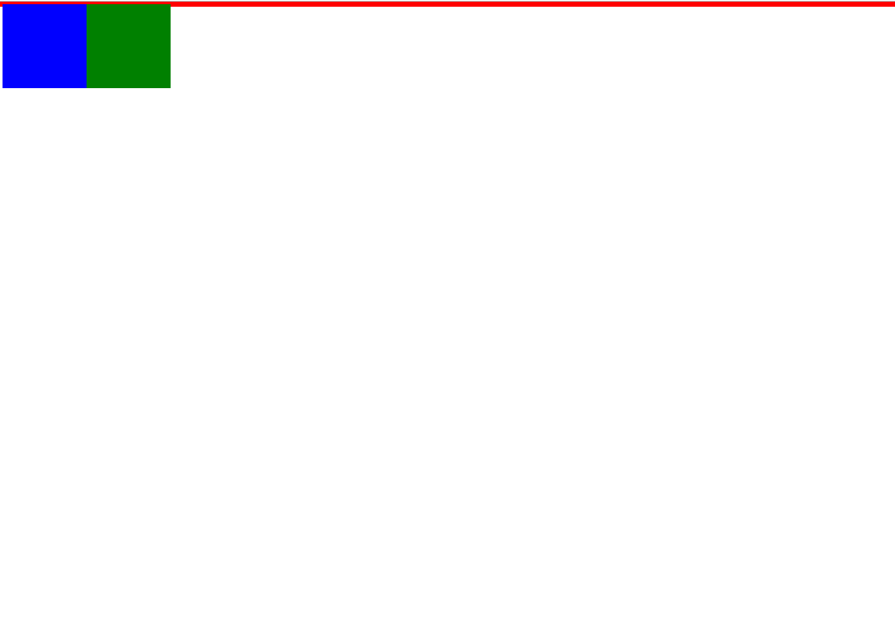
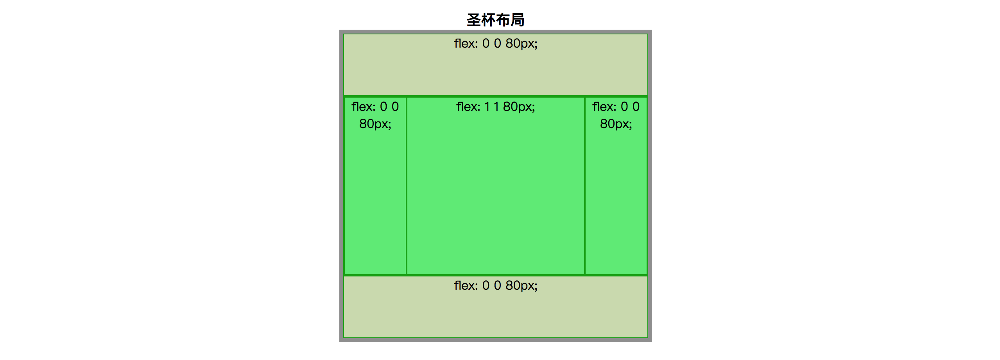
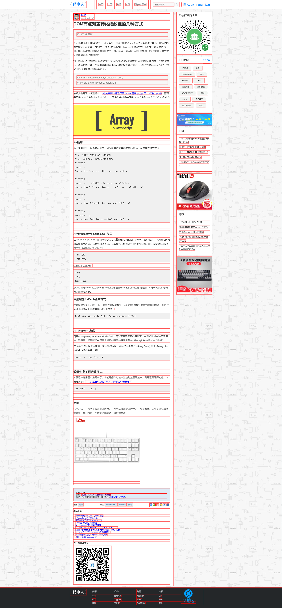
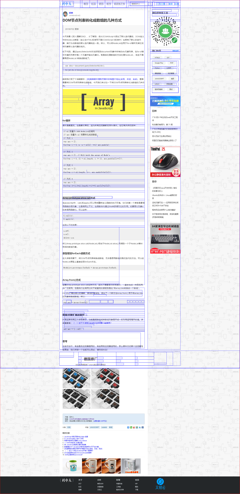

# CSS面试题
## 1物理像素的实现 (方案1)
[1物理像素](https://segmentfault.com/a/1190000020431752?utm_source=tag-newest)
```html
<html lang="en">

<head>
    <meta charset="UTF-8">
    <!-- 这一行不写，由js动态生成 -->
    <!-- <meta name="viewport" content="width=device-width, initial-scale=1.0"> -->
    <meta http-equiv="X-UA-Compatible" content="ie=edge">
    <title>Document</title>
    <script>
        function setViewport() {
            var dpr = window.devicePixelRatio
            var scale = (1 / dpr).toFixed(5)
            var metaNode = document.createElement('meta')
            metaNode.setAttribute('name', 'viewport')
            metaNode.setAttribute('content', `width=device-width, initial-scale=${scale},user-scalable=no,maximum-scale=${scale},minimum-scale=${scale}`)
            document.head.appendChild(metaNode)
        }
        window.onresize = setViewport
        setViewport()
    </script>
    <style>
        .demo{
            margin-top: 100px;
            width:400px;
            height:1px;
            background:black;
        }
    </style>
</head>
<body>
    <div class="demo"></div>
</body>

</html>
```

---

## 1物理像素的实现 (方案2)
```html
<!DOCTYPE>
<html>
<head>
  <meta charset='UTF-8'>
  <meta name='viewport' content='width=device-width,initial-scale=1,user-scalable=no'>
  <!-- initial-scale 缩放比 -->
  <title>1px物理像素的实现(方案1)</title>
  <!-- 像素比 = 物理像素 / CSS像素 -->
  <style>
    * {
      margin:0;
      padding:0
    }
    #box{
      width:0.5rem;
      height:0.5rem;
      border-bottom: 1px solid #000;
    }
  </style>
</head>
<body>
  <div id='box'></div>
</body>
<script>
window.onload = function(){
  //像素比 = 物理像素 / CSS像素
  var dpr = window.devicePixelRatio;
  //缩放比例 (比如在dpr为2时，1物理像素只需要0.5CSS像素即可呈现，
  //那么需要我们将1CSS像素缩小一半就可以呈现1物理像素。
  //但是CSS像素只能是整数，因此我们只需要在1CSS像素下设置
  //0.5（1/dpr）的缩放比就可以呈现1物理像素)
  var scale = 1/dpr;
  //获取meta标签,重新声明缩放比即可
  var metaNode = document.querySelector('meta[name="viewport"]')
  metaNode.setAttribute('content','width=device-width,initial-scale=' + sacle + ',user-scalable=no')

  //获取屏幕区域的宽度
  var width = document.documentElement.clientWidth

  //页面中元素宽度,高度比例需要反向乘回来（即乘 1/scale = dpr）
  var htmlNode = document.querySelector('html');
  htmlNode.style.fontSize = width * dpr + 'px';


}
</script>
</html>

```

## 1物理像素的实现 (方案3 使用伪元素)
```html
...省略
<style>
  * {
    margin:0;
    padding:0
  }
  #box{
    width:200px;
    height:200px;
    position:relative;
  }
  //像素比dpr = 物理像素 / CSS像素
  #box:before{
    content:'';
    position: absolute;
    left: 0;
    bottom: 0;
    width: 100%;
    height: 1px;
    background:#000;
  }
  @media screen and (-webket-min-device-pixel-ratio:2){
    //在最小像素比dpr为2(包含二点几)时，需要在Y方向上缩放（1/dpr）= 0.5
    #box:before{
      transform:scaleY(0.5)
    }
  }
  @media screen and (-webket-min-device-pixel-ratio:3){
    //在最小像素比dpr为3(包含三点几)时，需要在Y方向上缩放（1/dpr）= 0.333
    #box:before{
      transform:scaleY(0.333)
    }
  }
</style>
<body>
  <div id='box'></div>
</body>
```

## div水平垂直居中
```html
<!DOCTYPE>
<html>
<head>
<meta charset='UTF-8'>
<title>使用flex实现元素水平垂直居中(新版本与老版本)</title>
<style type="text/css">
  *{
    margin: 0;
    padding: 0;
  }
  
  #wrap{
    width: 500px;
    height: 500px;
    background: grey;

    /*方案一*/
    /* position:relative; */

    /*方案二*/
    /* position:relative; */

    /*方案三  只对新版本浏览器生效*/
    display: flex;
    justify-content: center;
    align-items: center;

    /*方案四  针对老版本浏览器生效*/
    display: -webkit-box;
    -webkit-box-pack: center;
    -webkit-box-align: center;
  }
  #wrap .box{
    width: 200px;
    height: 200px;
    background: pink;

    /*方案一*/
    /* position:absolute;
    top:0;
    left:0;
    right:0;
    bottom:0;
    margin:auto; */

    /*方案二*/
    position:absolute;
    top:50%;
    left:50%;
    /* margin-left:-100px; */  /*向左和上移动自身一半*/
    /* margin-top:-100px; */
    transform: translate(-50%,-50%);  /*向X轴和Y轴偏移自身宽高的50%*/


  }
</style>
</head>
<body>
<div id='wrap'>
  <div class='box'></div>
</div>
</body>
</html>
```
::: danger 补充说明 flex布局
```
flex布局；
flex-direction: 整体布局的排列  
                row     项目在容器内按行排列
                row-reverse  与row相同，但是顺序相反
                column  列
                column-reverse 与column相同，但是顺序相反
                initial  设置该属性为它的默认值
                inherit   从父元素继承该属性

justify-content: 用于设置或检索弹性盒子元素在主轴（横轴）方向上的对齐方式。
              flex-start	默认值。项目位于容器的开头
              flex-end	项目位于容器的结尾
              center	项目位于容器的中心
              space-between	项目位于各行之间留有空白的容器内
              space-around	项目位于各行之前、之间、之后都留有空白的容器内(首、末项目与容器之间的空白为项目之间空白的一半)
              initial	设置该属性为它的默认值
              inherit	从父元素继承该属性

align-items : 属性定义flex子项在flex容器的当前行的侧轴（纵轴）方向上的对齐方式
            stretch	  默认值。元素被拉伸以适应容器
            center	  元素位于容器的中心
            flex-start	元素位于容器的开头
            flex-end    元素位于容器的结尾
            baseline  元素位于容器的基线上
            initial   设置该属性为它的默认值
            inherit   从父元素继承该属性

align-content  (针对沿主轴排列且有换行的多行项目生效)
            stretch	  默认值。元素被拉伸以适应容器
            center	  元素位于容器的中心
            flex-start	元素位于容器的开头
            flex-end    元素位于容器的结尾
            space-between	项目位于各行之间留有空白的容器内
            space-around	项目位于各行之前、之间、之后都留有空白的容器内(首、末项目与容器之间的空白为项目之间空白的一半)
            initial	设置该属性为它的默认值
            inherit	从父元素继承该属性

      作用:
        会设置自由盒内部所有行作为一个整体在垂直方向排列方式。针对多行作为一个整体在纵轴上的排列方式，该属性对单行无效。

      条件:
        必须对父元素设置自由盒属性display:flex;，并且设置排列方式为横向排列flex-direction:row;并且设置换行，flex-wrap:wrap;这样这个属性的设置才会起作用。 
```
:::


## 纯CSS实现三角形
```html
<style>
  *{
    margin: 0px;
    padding: 0px;
  }
  /*方案1*/
  #box{
    width: 0px;
    height: 0px;
    border: 100px solid;
 
    /*保留top的border即可得到一个向下的三角形*/
    border-top-color: red;
    /* border-right-color: blue;
    border-bottom-color: deeppink;
    border-left-color: yellow; */
    border-right-color: transparent;
    border-bottom-color: transparent;
    border-left-color:transparent;
  }

  /*方案2*/
  /*使用before和after伪元素也可以实现三角*/
  #box{
    width:100px;
    height:100px;
    position:relative;
  }
  #box:after{
    content: "";
    width: 0px;
    height: 0px;
    border-left: 10px solid green;
    border-right: 10px solid pink;
    border-bottom: 10px solid grey;
    border-top: 10px solid red;
    position: absolute;
  }
</style>
<div id='box'></div>
```

## 如何实现移动端rem适配
```html
<!DOCTYPE>
<html>
<head>
<meta charset='UTF-8'>
<meta name='viewport' content='width=device-width,initial-scale=1,user-scalable=no'>
<title>如何实现移动端rem适配</title>
<style type='text/css'>
  *{
    margin: 0;
    padding: 0;
  }
  #box{
    /* width:200px; 
    height: 200px; */
    width: 0.5rem;
    height: 0.5rem;
    background: red;
  }

  /*
    html根元素字体大小设置为屏幕区域的宽，rem才可以生效
  */


</style>
</head>
<body>
<div id='box'></div>
</body>
<script type='text/javascript'>
 window.onload = function(){
   // 1. 获取屏幕区域的宽度
   var width = document.documentElement.clientWidth;
   //获取htmlr
   var htmlNode = document.querySelector('html');  //document.documentElement也是html根元素
   //设置字体大小
   htmlNode.style.fontSize = width + 'px';
 }
</script>
</html>
```


## 求背景图片左边到#box盒子左边框外侧的距离
```html
<!DOCTYPE>
<html>
<head>
<meta charset='UTF-8'>
<meta name='viewport' content='width=device-width,initial-scale=1,user-scalable=no'>
<title>求背景图片左边到#box盒子左边框外侧的距离</title>
<style type='text/css'>
  *{
    margin: 0;
    padding: 0;
  }
  #box{
    width: 100px;
    height: 200px;
    background: pink;
    padding: 100px;
    border: 80px solid blue;
    background-image: url('img/1.png');  
    /*背景图片默认在padding box的左上角，即不考虑padding区域的大小 */
    /*此时距离左边框外侧的距离是border的左侧宽度80px*/
    background-repeat: no-repeat;
    background-origin: content-box;  
    /*background-origin -- 背景图片起始源的位置  */
    /*此行样式的意思是将背景图片起始源的位置从padding box的左上角换到content内容区域的左上角，*/
    /*即考虑padding区域的大小. 此时距离左边框外侧的距离是*/
    /*border的左侧宽度加上padding左侧的宽度  80 + 100 = 180px*/
    background-position: -50px 0;
    /*background-position将图片左上角位置水平向左移动50px; 因此距离左边框外侧的距离是 180 - 50 = 130px*/
  }
</style>
</head>
<body>
<div id='box'></div>
</body>
<script type='text/javascript'>
 window.onload = function(){
 
 }
</script>
</html>
```

---

## 写一个 div + css 布局，左边图片，右边文字，文字环绕图片，外面容器固定宽度，文字不固定。
直接就一个 img，它 float：left，加文字加 p 标签就好了。


---

## 一个200x200的div在不同分辨率屏幕上下左右居中，用CSS实现
```js
<head>
  <style>
    *{margin:0;padding:0;}
    .box{
      width:200px;
      height:200px;
    }
    //第一种方式
    .box{
      position:absolute;
      top:50%;
      left:50%;
      margin-left:-100px;
      margin-top:-100px;
      //或者使用transform
      // transform:translate(-50%,-50%)
    }
    //第二种方式
    .box{
      position:absolute;
      top:0;
      bottom:0;
      left:0;
      right:0;
      margin:auto;
    }
  </style>
</head>
<body>
  <div class="box"></div>
</body>
```

---

## 写一个左中右布局占满屏幕，其中左，右两块固定宽度200px，中间自适应宽，要求先加载中间块，请写出结构及样式
双飞翼布局
```js
<head>
  <style>
    *{margin:0;padding:0;}
    .main>div{float:left;}
    .container{
      width:100%;
    }
    .content{
      background:red;
      margin:0 200px;
    }
    .left{
      background:pink;
      width:200px;
      margin-left:-100%;
    }
    .right{
      background:blue;
      width:200px;
      margin-left:-200px;
    }
  </style>
</head>
<body>
  <div class="main">
    <!--这个container是必须的，本身是100%宽度，便于内部的div空出两端的margin给left和right占位-->
    <div class="container"> 
      <div class="content">中间</div>
    </div>
    <div class="left">左边</div>
    <div class="right">右边</div>
  </div>
</body>
```

---

## 简述清除浮动的几种方式
```js
<head>
  <style>
    *{margin:0;padding:0;}
    .main{border:3px solid red;}
    .main>div{
      float:left;
      width:100px;
      height:100px;
    }
    .div1{
      background:blue;
    }
    .div2{
      background:green;
    }
  </style>
</head>
<body>
  <div class="main">
    <div class="div1"></div>
    <div class="div2"></div>
  </div>
</body>
```

可以看到子元素浮动后脱离了父级   
解决方法：
1. 给父级元素单独定义高度（height）
  ```js
    .main{widht:100px;} 
  ```
   * 原理：如果父级元素没有定义高度，父元素的高度完全由子元素撑开时，父级div手动定义height，就解决了父级div无法自动获取到高度的问题。
   * 优点：简单、代码少、容易掌握。
   * 缺点：只适合高度固定的布局，要给出精确的高度，如果高度和父级div不一样时，会产生问题。对于响应式布局会有很大影响。

2. 在标签结尾处加空div标签 clear:both
  ```js
  .clear{clear:both;}
  <div class="main">
    <div class="div1"></div>
    <div class="div2"></div>
    <div class="clear"></div>
  </div>
  ```
   * 原理：添加一个空div，利用css提高的clear:both清除浮动，让父级div能自动获取到高度。
   * 优点：简单、代码少、浏览器支持好、不容易出现怪问题
   * 缺点：不少初学者不理解原理；如果页面浮动布局多，就要增加很多空div，不利于页面的优化。

3. 父级div定义 overflow:hidden
   * 优点：简单、代码少、浏览器支持好
   * 缺点：不能和position配合使用，因为超出的尺寸的会被隐藏。（不建议使用此种方式，可能会影响页面元素布局）

4. 父级div定义 伪元素::after 和 zoom (推荐使用)
  ```js
  .main{zoom:1;}
  .main::after{
    content:'';
    display:block;
    clear:both;
    visibility:hidden;
    height:0
  }
  ```
  * 原理：元素生成伪类的作用和效果相当于方法2中的原理，但是IE8以上和非IE浏览器才支持:after，zoom(IE私有属性)可解决ie6,ie7浮动问题
  * 优点：浏览器支持好、不容易出现怪问题，写法是固定的，不理解也可以直接复制使用
  * 缺点：css代码多、不少初学者不理解原理，要两句代码结合使用才能让主流浏览器都支持。

---

## 行内元素有哪些？块级元素有哪些？空(void)元素有哪些?
* 行内元素：
  a( 锚点) ,b(粗体(不推荐)) ,span(常用内联容器，定义文本内区块) img(图片) input(输入框) select(项目选择) strong(粗体强调) label(表格标签) cite (引用)code(计算机代码) 
* 块级元素：
  div ul(无序列表) ol(有序列表) dl(定义列表) table(表格)form(表单) h1 (一级标题))p(段落)pre(预格式化) 
* 空元素(空标签)：即系没有内容的HTML元素
   1. 常见的空元素： br hr img input link meta
   2. 鲜为人知的空元素 ：area base col command embed keygen param source track wbr
   >> H5中规定自关闭的斜线(/)对空标签无效，即需要自闭合(/)这个小尾巴了，如果要写上也是可以的。

---

## CSS选择符有哪些？优先级算法如何计算？
类型 | 选择符
-|-
id | #
class | .
标签 | div
相邻元素 | ul+div
直系子元素 | ul>li
后代元素 | ul li
通配符 | *
属性 | a[href='xxx']
伪类 | a:link(未访问的链接) a:visited(已访问的链接) a:hover(当有鼠标悬停在链接上) a:active(被选择的链接)  a:first-child p:focus
伪元素 | a::after  a::before

优先级算法:  
!important > 行内样式> ID选择器 > 类选择器 > 标签 > 通配符 > 继承 > 浏览器默认属性

css优先级，可以给选择器分配权值：
1. id选择器的权值为100
2. class、属性和伪类选择器的权值为10
3. 标签选择器的权值为1
特殊！important，优先级最高

权值较大的优先级越高   
比较样式时，将对应的选择器权值相加，大的优先级高
权值相同的，根据从上往下的原则，后定义的优先级高

---

## CSS哪些属性可以继承？
* 有继承性的属性
   1. 字体系列属性
      * ```js
          font：组合字体        
          font-family：规定元素的字体系列        
          font-weight：设置字体的粗细        
          font-size：设置字体的尺寸        
          font-style：定义字体的风格        
          font-variant：设置小型大写字母的字体显示文本，这意味着所有的小写字母均会被转换为
          ...
        ```
   2. 文本系列属性
      * ```js
        color：文本颜色
        line-height：行高        
        text-align：文本水平对齐        
        text-indent：文本缩进        
        word-spacing：增加或减少单词间的空白（即字间隔）        
        letter-spacing：增加或减少字符间的空白（字符间距）        
        text-transform：控制文本大小写        
        direction：规定文本的书写方向        
        ```
   3. 元素可见性：visibility
   4. 表格布局属性：caption-side、border-collapse、border-spacing、        empty-cells、table-layout        
   5. 列表属性：list-style-type、list-style-image、list-style-position、list-style        
   6. 生成内容属性：quotes        
   7. 光标属性：cursor        
   8. 页面样式属性：page、page-break-inside、windows、orphans        
   9. 声音样式属性：speak、speak-punctuation、speak-numeral、speak-header、  speech-rate、volume、voice-family、pitch、pitch-range、  stress、richness、、azimuth、elevation

* 所有元素可以继承的属性：1、元素可见性：visibility、opacity        2、光标属性：cursor
* 内联元素可以继承的属性: 1、字体系列属性        2、除text-indent、text-align之外的文本系列属性
* 块级元素可以继承的属性: 1、text-indent、text-align
* 无继承的属性：
   1. display
   2. 文本属性：vertical-align：text-decoration：text-shadow： white-space: unicode-bidi        
   3. 盒子模型的属性:宽度、高度、内外边距、边框等
   4. 背景属性：背景图片、颜色、位置等        
   5. 定位属性：浮动、清除浮动、定位position等        
   6. 生成内容属性:content、counter-reset、counter-increment        
   7. 轮廓样式属性:outline-style、outline-width、outline-color、outline        
   8. 页面样式属性:size、page-break-before、page-break-after

---

## CSS3中新增的伪类
1. 伪类与伪元素 -- 单冒号(:)用于CSS3伪类，双冒号(::)用于CSS3伪元素。   
CSS伪类：用于向某些选择器添加特殊的效果。  
CSS伪元素：用于将特殊的效果添加到某些选择器。伪元素代表了某个元素的子元素，这个子元素虽然在逻辑上存在，但却并不实际存在于文档树中

伪元素 | 作用
-|-|
::first-letter | 将样式添加到文本的首字母
::first-line | 将样式添加到文本的首行
::before | 在某元素之前插入某些内容
::after | 在某元素之后插入某些内容   

2. CSS3新增伪类   

新增伪类 | 作用
-|-
p:first-of-type | 选择属于其父元素的首个p元素的每个p元素。
p:last-of-type | 选择属于其父元素的最后p元素的每个p元素。
p:only-of-type | 选择属于其父元素唯一的p元素的每个p元素。
p:only-child | 选择属于其父元素唯一的子元素的每个p元素。
p:nth-child(n) | 选择属于其父元素的第n个子元素的每个p元素。
p:nth-last-child(n) | 选择属于其父元素的倒数第n个子元素的每个p元素。
p:nth-of-type(n) | 选择属于其父元素第n个p元素的每个p元素。
p:nth-last-of-type(n) | 选择属于其父元素倒数第n个p元素的每个p元素。
p:last-child | 选择属于其父元素最后一个子元素的每个p元素。
p:empty | 选择没有子元素的每个p元素（包括文本节点）。
p:target | 选择当前活动的p元素。
:not(p) | 选择非p元素的每个元素。
:enabled | 控制表单控件的可用状态。
:disabled | 控制表单控件的禁用状态。
:checked | 单选框或复选框被选中。

---

## flex布局的应用场景？
[flex布局是什么](http://www.ruanyifeng.com/blog/2015/07/flex-examples.html)

1. 基本网格等分布局  
  为每个项目设定flex: 1;
2. 百分比网格布局  
  为每个项目设定flex: 1;然后再为想要设定百分比的项目设定flex: 0 0 %;
3. 圣杯布局  
  
  上面的 “上下固定高度、中间自适应” + “左右固定宽度，中间自适应的”的组合方式。这里需要注意的一点是，作为 flex 容器内成员的 DOM 元素，仍旧可以通过设置 display: flex; 而变成 flex 容器，
4. 输入框的布局  
  实现输入框前方添加提示，后方添加按钮，为输入框添加flex: 1;就行了。
5. 悬挂式布局  
  交叉轴设定align-items: flex-start;使得左对齐，然后为文字设定flex: 1;
6. 固定的底栏  
  更换主轴方向flex-direction: column，设定最小高度min-height: 100vh，然后中间内容flex: 1;
7. 流式布局  
  设定换行，再设定flex: 0 0 %;控制每行数量。

---

## iOS 关闭键盘默认首字母大写
input中加入这个属性autocapitalize="off"
<input type="text" autocapitalize="off" />

---

## div+css布局较table布局有哪些优点？
1. div+css布局符合W3C标准(W3C标准提出网页由三部分组成：结构（Structure）、表现（Presentation）和行为（Behavior）), 结构清晰明了，结构、样式和行为分离，带来足够好的可维护性。
2. div+css布局易于维护和改版。 
3. div+css布局更利于seo优化
4. table布局加载网页时，必须整体加载完，降低了网页的呈现速度，而div+css布局是边加载边显示的。

---

## 当margin-top、padding-top的值是百分比时，分别是如何计算的？
 可以对元素的margin设置百分数，百分数是相对于父元素的<font color=red>width</font>计算，不管是margin-top/margin-bottom还是margin-left/margin-right。（padding同理）  

 如果没有为元素声明width，在这种情况下，元素框的总宽度包括外边距取决于父元素的width，这样可能得到“流式”页面，即元素的外边距会扩大或缩小以适应父元素的实际大小。如果对这个文档设置样式，使其元素使用百分数外边距，当用户修改浏览窗口的宽度时，外边距会随之扩大或缩小。  
 
 为什么margin-top/margin-bottom的百分数也是相对于width而不是height呢？  

 CSS权威指南中的解释：  
 我们认为，正常流中的大多数元素都会足够高以包含其后代元素（包括外边距），如果一个元素的上下外边距是父元素的height的百分数，就可能导致一个无限循环，父元素的height会增加，以适应后代元素上下外边距的增加，而相应的，上下外边距因为父元素height的增加也会增加，如果循环。

---

## 回流与重绘

### 回流
* 当render tree中的一部分(或全部)因为元素的<font color=red>规模尺寸</font>，<font color=red>布局</font>，<font color=red>隐藏</font>等改变而需要重新构建。这就成为<font color=red>回流(reflow)</font>
* 当<font color=red>页面布局</font>和<font color=red>几何属性</font>改变时就需要回流
* 触发页面重布局(回流)的属性
   1. 盒子模型相关属性
      * width、height、padding、margin、display、border-width、border、min-height
   2. 定位属性及浮动
      * top、bottom、left、right、position、float、clear
   3. 改变节点内部文字结构
      * text-align、overflow、font-weight、font-family、line-height、vertical-align、white-space、font-size

### 重绘
* 当render tree中的一些元素需要更新属性，而这些属性只是影响元素的<font color=red>外观、风格</font>，而不会影响布局的，比如background-color、color等，就成为重绘
* 回流必将引起重绘，而重绘不一定会引起回流
* 只触发重绘的属性
   * color、border-style、border-redius、visibility、text-decoration、background、background-image、background-position、background-repeat、background-size、outline-color、outline、outline-style、outline-width、box-shadow

### 具体优化点
1. 用translate替代top（top会引发回流）
2. 用opacity替代visibility(visibility会触发重绘)
3. 用预先定义好的class替代一条一条修改DOM样式
4. 把DOM离线后修改（比如：先把DOM给display:none[有一次reflow],然后修改多次样式，再将它显示出来）
5. 不要把DOM节点的属性值放在循环里当成循环里的变量
6. 不要使用table布局，可能很小的一个改动会造成整个table的重新布局
7. 动画实现的速度的选择
8. 对于动画新建图层（will-change:transform或者transform:translateZ(0)）
9 启用GPU硬件加速（transform3D(0,0,0)）

---

## 为什么js用script标签的src引入，而css用link标签的href引入

w3c最初的设计中\<script\>标签也没有src属性，使用 \<link rel="..." href="..."\> 来引入当前文档外部的资源，如：父文档，翻译，或者层叠样式表等。\<link rel="" href="" meidia=""\> 元素规定了当前文档和外部资源之间的关系，它常用来引入外部的样式表，我们可以通过rel属性设置为stylesheet来使用。后来为\<script\>添加了src属性。

href是引用和页面关联，是在当前元素和引用资源之间建立联系，src表示引用资源，表示替换当前元素，用在img，script，iframe上，src是页面内容不可缺少的一部分。

\<script src="js.js"\>\</script\>当浏览器解析到这一句的时候会暂停其他资源的下载和处理，直至将该资源加载，编译，执行完毕，图片和框架等元素也是如此，类似于该元素所指向的资源嵌套如当前标签内，这也是为什么要把放在底部而不是头部。

\<link href="common.css" rel="stylesheet"/\>当浏览器解析到这一句的时候会识别该文档为css文件，会下载并且不会停止对当前文档的处理，这也是为什么建议使用link方式来加载css而不是使用@import。

---

## css引入的两种方法link和@import的区别和用法

  link语法结构:
  ```js
  <link href="外部CWSS文件的URL路径" rel="stylesheet" type="text/css" />
  ```
  link标签通过URL路径引入外部的CSS文件到HTML中，是一种HTML标签，属于书写HTML的语法，只能放在HTML源代码中使用   

  @import语法结构:
  ```js
  <style type="text/css">
    @import + 空格 + url(外部CSS文件URL路径地址);
  </style>
  ```
  @import是在样式表定义中再引入外部的CSS文件，相当于一种样式，属于书写CSS的语法。   


两者的区别   
::: tip 区别
  区别1：link是XHTML标签，除了加载CSS外，还可以定义RSS等其他事务；@import属于CSS范畴，只能加载CSS。   

  区别2：link引用CSS时，在页面载入时同时加载；@import需要页面完全载入后才加载。   

  区别3：link是XHTML标签，无兼容问题；@import是在CSS2.1中提出的，低版本的浏览器不支持。   

  区别4：link支持使用JavaScript控制DOM去改变样式；@import不支持这样的操作（JavaScript可以获取link标签元素，但获取不到@import，因为@import只是一种CSS语法）。   
:::

---

## 请找一个网页，用我们今天讲的API(getClientRects、getBoundingClientRect)， 把页面上的所有盒的轮廓Rect画到一个canvas元素上。
1. 方式一
  ```js
  void function (){
    const canvas = document.createElement('canvas');
    canvas.width = document.documentElement.offsetWidth;
    canvas.height = document.documentElement.offsetHeight;
    
    canvas.style.position = 'absolute';
    canvas.style.left = '0';
    canvas.style.right = '0';
    canvas.style.top = '0';
    canvas.style.bottom = '0';
    canvas.style.zIndex = '9999';
    
    document.body.appendChild(canvas);
    
    const ctx = canvas.getContext('2d');
    draw(ctx, getAllRects());
    
    function draw(ctx,rects){
      let i = 0;
      ctx.strokeStyle = 'red';
      window.requestAnimationFrame(_draw);
      
      function _draw(){
        let {x, y, width, height} = rects[i++];
        ctx.strokeRect(x,y,width,height);
        if(i < rects.length){
          window.requestAnimationFrame(_draw);   //HTML5新增的定时器。用法与settimeout很相似，只是不需要设置时间间隔而已。
        }else{
          console.log('%cDONE','background-color:green;color:white,padding:0.3em 0.5em;');
        }
      }
    }
    
    function getAllRects(){
      const allElements = document.querySelectorAll('*');
      const rects = [];
      const {x:htmlX, y:htmlY} = document.documentElement.getBoundingClientRect();
      allElements.forEach(element => {
        const eachElRects = Array.prototype.slice.call(element.getClientRects()).filter(rect => {
          return rect.width || rect.height
        }).map(rect => {
          return {
            x:rect.x - htmlX,
            y:rect.y - htmlY,
            width:rect.width,
            height:rect.height
          }
        })
        rects.push(...eachElRects);
      })
      return rects;
    }
    
  }()
  ```


::: tip requestAnimationFrame
[requestAnimationFrame](https://www.cnblogs.com/xiaohuochai/p/5777186.html)采用系统时间间隔，保持最佳绘制效率，不会因为间隔时间过短，造成过度绘制，增加开销；也不会因为间隔时间太长，使用动画卡顿不流畅，让各种网页动画效果能够有一个统一的刷新机制，从而节省系统资源，提高系统性能，改善视觉效果
:::


2. 方式二
```js
void function(){
  const canvas = document.createElement('canvas');
  canvas.width	=document.documentElement.getBoundingClientRect().width; 
  canvas.height	=	document.documentElement.getBoundingClientRect().height; 
  canvas.style.position="absolute"; 
  canvas.style.top=0; 
  canvas.style.left=0; 
  canvas.style.border='1px	solid	red'; 
  canvas.style.zIndex = '9999';
  document.body.appendChild(canvas);
  const	ctx	=	canvas.getContext('2d'); 
  function	travaldom(root){	
    if(root.tagName	&&	root.tagName	!=='text'	&&	root.tagName!=='canvas'){ 
      const	startX	=	root.getBoundingClientRect().x; 
      const	startY	=	root.getBoundingClientRect().y; 
      const	width	=	root.getBoundingClientRect().width; 
      const	height	=	root.getBoundingClientRect().height; 
      ctx.beginPath(); 
      ctx.lineWidth="1"; 
      ctx.strokeStyle="blue"; 
      ctx.rect(startX,startY,width,height); 
      ctx.stroke(); 
    } 
    root.childNodes.forEach(node=>{travaldom(node);}); 
  } 
  travaldom(document);
}()
```


---