# JS面试题

## 请分析以下代码执行结果----parseInt问题(百度面试题)
```js
['1', '3', '10'].map(parseInt);
// [1, NaN, 2]
```
[解析](https://blog.csdn.net/weixin_44135121/article/details/88050214)
::: tip 原因分析
1. map函数
  将数组的每个元素传递给指定的函数处理，并返回处理后的数组，所以 ['1','2','3'].map(parseInt) 就是将字符串1，2，3作为元素；0，1，2作为下标分别调用 parseInt 函数。即分别求出 parseInt('1',0), parseInt('2',1), parseInt('3',2)的结果。
2. parseInt函数（<font color='red'>重点</font>）
概念：以第二个参数为基数来解析第一个参数字符串，通常用来做十进制的向上取整（省略小数）   
特点：接收两个参数parseInt(string,radix)   
string：字母（大小写均可）、数组、特殊字符（不可放在开头,特殊字符及特殊字符后面的内容不做解析）的任意字符串  
::: tip MDN
MDN文档中指明 parseInt 第二个参数是一个2到36之间的整数值，用于指定转换中采用的基数。如果省略该参数或其值为0，则数字将以10为基础来解析。如果该参数小于2或者大于36，则 parseInt 返回 NaN。此外，转换失败也会返回 NaN
::: 
radix：解析字符串的基数，基数规则如下：  
   1. 区间范围介于2~36之间；  
   2. 当参数为 0，parseInt() 会根据十进制来解析；   
   3. 如果忽略该参数，默认的基数规则：   
      *. 如果 string 以 "0x" 开头，parseInt() 会把 string 的其余部分解析为十六进制的整数；parseInt("0xf")   //15    
      *. 如果 string 以 0 开头，其后的字符解析为八进制或十六进制的数字；parseInt("08")   //8   
      *. 如果 string 以 1 ~ 9 的数字开头，parseInt() 将把它解析为十进制的整数；parseInt("88.99f")   //88   
      *. 只有字符串中的第一个数字会被返回。parseInt("10.33")   //返回10；   
      *. 开头和结尾的空格是允许的。parseInt(" 69 10 ")   //返回69   
      *. 如果字符串的第一个字符不能被转换为数字，返回 NaN。parseInt("f")  //返回NaN  而parseInt("f"，16)  //返回15   
3.再来分析一下结果
['1','2','10'].map(parseInt)即
parseInt('1',0);radix 为 0，parseInt() 会根据十进制来解析，所以结果为 1；
parseInt('2',1);radix 为 1，超出区间范围，所以结果为 NaN；
parseInt('10',2);radix 为 2，用2进制来解析，所以结果为 2
:::
---

## "arguments[0]()"问题（百度）
```js
var number = 10;
function fn() {
  console.log(this.number);
}
var obj = {
  number: 2,
  show: function(fn) {
    this.number = 3;
    fn();
    arguments[0]();
  }
};
obj.show(fn);
//输出10 undefined
//原因：函数的执行环境只与它在哪声明有关，与它在哪执行无关，所以fn()执行时，this指向window，输出10；
//而arguments[0]指向fn，但是arguments是一个对象，所以arguments中this指向arguments，因此输出undefined

/*        相应变体          */
var length = 10;
function fn(){
    console.log(this.length);
}
var obj = {
    length:5,
    methods:function(fn){
        fn();
        arguments[0]();
    }
};
obj.methods(fn, 1);  // 10 2
/*
第一个 fn  this指向window   输出10
第二个 arguments[0]() 可以理解为arguments.0() [只是方便理解] ，
            即argument对象调用fn函数，所以this指向arguments对象
arguments = {
  0:fn,    //function fn(){console.log(this.length);}
  1:第二个参数 1，
  length:2
}
*/


var len = 10;
var obj1 = {
    len:6,
    method:function(){
        console.log(this.len);
    }
};
var obj2 = {
    len:5,
    method:function(fn){
        fn();
        arguments[0](); 
    }
};

obj2.method(obj1.method,obj2.method);  // 10 undefined
/*
第一个 fn  this指向window   输出10
第二个 arguments[0]()    this指向arguments
 arguments = {
  0:obj1.method,   //function(){console.log(this.len);}
  1:obj2.method,
  length:2
}
arguments没有len属性，所以为undefined
*/
```
---

## 请写出 inner 的实际高度。
```html
<style>
  .outer {
    width: 200px;
    height: 100px;
  }
  .inner {
    width: 60px;
    height: 60px;
    padding-top: 20%;
  }
</style>
<div class="outer"><div class="inner"></div></div>
```
[CSS中的一些属性百分比值，相对于谁计算？](https://blog.csdn.net/sunshine1990916/article/details/80938294)
::: tip 解析
1. inner整体高度padding-box为100px, content-box内容区高度为60px;
2. <font color='red'>padding-top,right,buttom,left百分比值; margin-top,right,buttom,left百分比值;都是相对于父元素的宽度的值计算，而不是相对于高度来计算的</font>
:::

---

## 函数返回表达式，请写出以下代码执行结果。（快手）
```js
var x = 1,
  y = 0,
  z = 0;
function add(x) {
  return (x = x + 1);
}
y = add(x);
function add(x) {
  return (x = x + 3);
}
z = add(x);
// x:1 y:4 z:4
//函数覆盖，函数执行内部形参不影响外部，函数return x = 3的表达式相当于x = 3;return x；
```

---

## this指向问题，自执行函数中this问题(快手)
```js
var num = 1;
var myObject = {
  num: 2,
  add: function() {
    this.num = 3;
    (function() {
      console.log(this);
      console.log(this.num);
      this.num = 4;
    })();
    console.log(this.num);
  },
  sub: function() {
    console.log(this.num);
  }
};
myObject.add();
console.log(myObject.num);
console.log(num);
var sub = myObject.sub;
sub();
// 1  3  3  4  4
//核心问题在于：自执行函数生成私有作用域，执行完后销毁，且自执行函数中this指向window
```

---
## 循环绑定click点击事件(腾讯面试题)
```js
<div id="btnBox">
  <input type="button" value="button_1" />
  <input type="button" value="button_1" />
  <input type="button" value="button_1" />
</div>
<script type="text/javascript">
  var btnBox = document.getElementById('btnBox'),
  inputs = btnBox.getElementsByTagName('input');
  var l = inputs.length;
  for(var i = 0; i < l; i++){
    inputs[i].onclick=functon(){
      alert(i);
    }
  }
</script>
```
::: tip 原因分析
1. 以上代码能正常执行么？为啥不行？
   * 事件绑定是"异步编程"，当触发点击行为，绑定的方法执行的时候，外层循环已经结束：方法执行产生私有作用域，用到变量i，i不是私有的变量，按照"作用域链"的查找机制，找到的是全局下的i(此时全局的i已经成为循环最后一次的结果3)
2. 如何解决?
   1. 自定义属性：声明一个类，使this指向当前类
      * ```js
        for(var i=0; i < l; i++){
          var btnTemp = inputs[i];
          btnTemp.myIndex = i;  //给该元素添加一个index属性来存储i
          btnTemp.onclick = function () {
            alert(this.myIndex);
          }
        }
        ```
   2. 闭包
      * ```js
        for(var i=0; i < l; i++){
          (function(i){
            inputs[i].onclick=functon(){
                alert(i);
              }
          })(i)
        }

        /*----------------------------*/
        for(var i=0; i < l; i++){
          inputs[i].onclick=(function(i){
            return function(){
              alert(i);
            }
          })(i)
        }
        ```
   3. ES6  （let）
:::

---

## 函数的arguments为什么不是数组？如何转化成数组？
因为arguments本身并不能调用数组方法，它是一个另外一种对象类型，只不过属性从0开始排，依次为0，1，2...最后还有callee和length属性。我们也把这样的对象称为类数组。   
常见的类数组还有：   
1. 用getElementsByTagName/ClassName()获得的HTMLCollection   
2. 用querySelector获得的nodeList   
那这导致很多数组的方法就不能用了，必要时需要我们将它们转换成数组，有哪些方法呢？   
1. Array.prototype.slice.call()
```js
function sum(a, b) {
  let args = Array.prototype.slice.call(arguments);
  console.log(args.reduce((sum, cur) => sum + cur));//args可以调用数组原生的方法啦
}
sum(1, 2);//3
```

2. Array.from()
```js
function sum(a, b) {
  let args = Array.from(arguments);
  console.log(args.reduce((sum, cur) => sum + cur));//args可以调用数组原生的方法啦
}
sum(1, 2);//3
```
这种方法也可以用来转换Set和Map   

3. ES6展开运算符
```js
function sum(a, b) {
  let args = [...arguments];
  console.log(args.reduce((sum, cur) => sum + cur));//args可以调用数组原生的方法啦
}
sum(1, 2);//3
```

4. 利用concat+apply
```js
function sum(a, b) {
  let args = Array.prototype.concat.apply([], arguments);  //apply方法会把第二个参数展开
  console.log(args.reduce((sum, cur) => sum + cur));  //args可以调用数组原生的方法啦
}
sum(1, 2);//3
```

---

## 你理解的闭包作用是什么? 优缺点? (乐视)
闭包就是函数中返回函数或对象，形成一个不销毁的私有作用域或栈内存，既保护了里面的私有变量不受外部变量的影响，也保存了一些变量信息。（对于保护的功能来说在封装插件的时候，为了避免插件中方法与别的方法重名，使用闭包将方法保护起来，防止全局变量的污染，对于保存来说，有些时候需要做循环事件绑定，而此时用到的索引已经是全局下的，可以用闭包的机制将索引保存下来）
> [JS高级函数(惰性函数，函数柯里化，级联函数)用到闭包](https://www.cnblogs.com/xiaoai-tang/p/6561740.html)  
> [JS高级函数讲解](http://www.jikexueyuan.com/course/1272.html)   
>[你遇到过[ ].slice.call()吗？](https://www.jianshu.com/p/ae57baecc57d)

```js
//函数柯里化使用闭包
var currying = function(fn){
  var _args = [];
  return function(){
    if(arguments.length === 0){
      return fn.apply(this,_args);
    }
    Array.prototype.push.apply(_args, [].slice.call(arguments));
    return arguments.callee;
  }
}
var multi = function(arg){
  var total = 0;
  for(var i = 0;i < arg.length;i++){
    total += arg[i];
  }
  return total;
}
var sum = currying(multi);
sum(100,200)(300);
sum(400);
console.log(sum());  // 1000  （空白调用时才真正计算）

```
---

## 数组去重问题
```js
/*-----------方式1(使用对象)------------------*/
function unique(arr){
  var obj = {};
  for(var i = 0; i < arr.length;){
    var item = arr[i];
    if(obj.hasOwnProperty(item)){
      arr.splice(i,1);
      continue;
    }
    obj[item] = item;
    i++
  }
  return Object.values(obj);
}

/*-----------方式2------------------*/
function unique(arr){
  var obj = {};
  for(var i = 0; i < arr.length;i++){
    var item = arr[i];
    if(obj.hasOwnProperty(item)){
      /**
       *优化方案一：
       * 不适用splice删除(删除当前项，后面索引都会移动位置，如果后面有很多项，会导致性能消耗大)
       * 解决方案：把最后一项替换当前项，再把最后一项删除即可(会导致数组顺序发生变化)
      */
      //原始方案
      // arr.splice(i,1);
      // i--
      // continue;
      //优化方案
      arr[i] = arr[arr.length - 1];
      arr.pop();
      i--
      continue;
    }
    obj[item] = item;
  }
  return arr;
}

/*--------方式3(将方法添加到原型链上--------*/
Array.prototype.myUnique = function myUnique(){
  //方法中的this一般都是当前类的实例(也就是我们要操作的数组)
  //操作this相当于操作arr，方法执行完成会改变原有数组
  /**
   * arr.myUnique()  this -> arr
   * arr.__proto__.myUnique()  this -> arr.__proto__
   * arr.prototype.myUnique()  this -> arr.prototype
  */
  var obj = {};
  for(var i = 0; i < this.length; i++){
    var item = this[i];
    obj.hasOwnProperty(item)?(this[i] = this[this.length - 1],this.length--,i--):obj[item] = item;
  }
  obj = null;
  return this;
}
var arr = [1,2,3,1,3,5,6,2];
arr.myUnique(); // [1, 2, 3, 6, 5]

/*--------方式4(使用数组 reduce方法)--------*/
let arr = [1,2,3,4,5,5,3];
arr.reduce(function(result,item){
  if(result.indexOf(item) === -1){
    result.push(item);
  }
  return result;
},[])

/*--------方式5(使用ES6 set方法)--------*/
let result = Array.from(new Set(arr));


/*-------------思考题-------------------*/
//var n = 5,使得n.plus(3).minus(2)返回6
(function(pro){
  pro.plus = function plus(val){
    return this + Number(val);
  };
  pro.minus = function minus(val){
    return this - Number(val);
  }
})(Number.prototype);
var n = 5;
var res = n.plus(3).minus(2);
console.log(res);  // 6
```

---

## 对象中this指向(用友面试题)
::: tip 核心
1. 元素绑定事件，方法中的this是当前操作的元素
2. 方法名前面是否有"."，有"."，"."前面是谁this就是谁，没有的话this指向window(严格模式下是undefined)
3. 构造函数执行，方法体中的this是当前类的一个实例
:::
```js
var funllName = 'language';
var obj = {
  fullName:'javascript',
  prop:{
    getFullName:function(){
      return this.fullName;
    }
  }
};
console.log(obj.prop.getFullName()); // this => obj.prop => 输出obj.prop.fullName => undefined
var test = obj.prop.getFullName;
console.log(test());  //this => window => window.fullName => language

/*----------------变体--------------------*/
var name = 'window';
var Tom = {
  name : "Tom",
  show: function(){
    console.log(this.name); // => window.name => window
  },
  wait:function(){
    var fun = this.show;  // this=>Tom => Tom.show
    fun(); //this => window
  }
}
Tom.wait();  //=> window
```
---

## this指向问题(阿里)
```js
var name = "A";
var object = {
  name : "B",
  getNameFunc : function(){
    return function () {
      return this.name;  // this => window
    }
  }
}
console.log(object.getNameFunc()());  // A  [object.getNameFunc()]() 等价于 a = object.getNameFunc(),a() 实际函数是默认执行this指向window
var name2 = "A";
var object2 = {
  name2 : "B",
  getNameFunc : function(){
    var that = this;  //this => object2 使用闭包变量that保存this
    return function () {
      return that.name2;  
    }
  }
}
console.log(object2.getNameFunc()()); // B
```

---

## 原型链(腾讯面试题)
```js
function Fn(){
  var n = 10;
  this.m = 20;
  this.aa = function () {console.log(this.m)}
}
Fn.prototype.bb = function () {console.log(this.n);}
var f1 = new Fn;
Fn.prototype = {
  aa:function(){console.log(this.m + 10);}
}
var f2 = new Fn;
console.log(f1.constructor);  // Fn
console.log(f2.constructor);  // Object
f1.bb();  // this -> f1 => f1.n = undefined
f1.aa();  // this -> f1 => f1.m = 20
f2.bb();  // 找不到bb，报错
f2.aa();  // this -> f2 => f2.m = 20
f2.__proto__.aa(); // this -> f2.__proto__ => f2.__proto__.m + 10 = undefined + 10 = NaN
```


---
## 原型链问题(京东)
```js
var F = function(){}
Object.prototype.a = function(){
  console.log('a()');
}
Function.prototype.a = function(){
  console.log('a1()');
}
Function.prototype.b = function(){
  console.log('b()');
}
var f = new F();
//console.dir(F);
//console.dir(f)
F.a();   // a1()  F是函数，也就是Function()构造函数的实例，直接使用F上的方法会去原型链中找，最后找到Function.prototype上
F.b();   // b()
f.a();   // a()  // new出来的f是F的实例，而f的原型指向Object，跟Function无关，因此f上的a会去Object中寻找
f.b();   // 报错 Uncaught TypeError: f.b is not a function
```
---
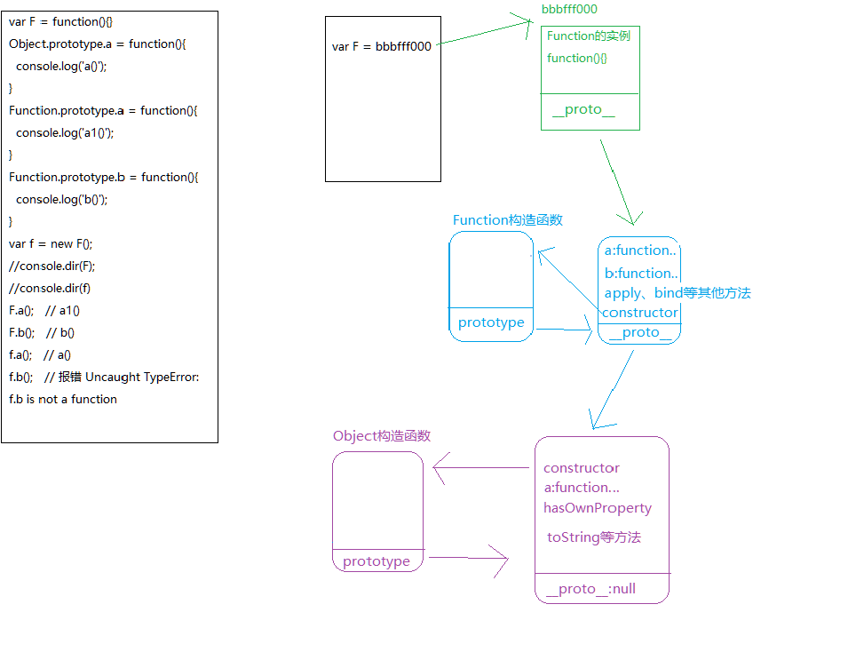
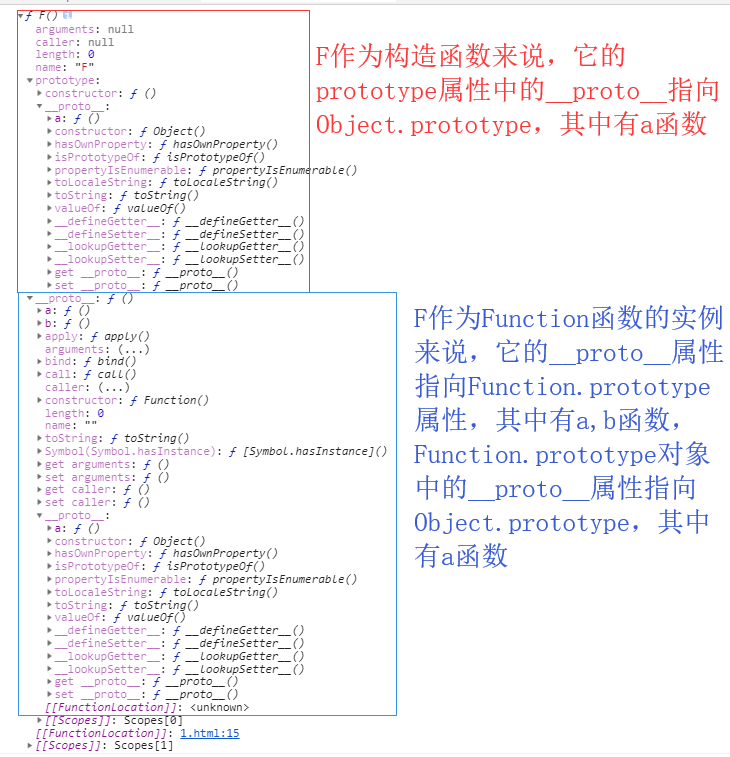
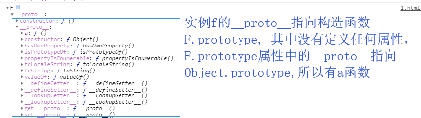

## 阿里超经典面试题 (比较难)
[解题思路](https://blog.csdn.net/mongo__/article/details/72810338)   
[Javascript解惑之 new A.B() 与 new A().B() 的区别](https://blog.csdn.net/cuixiping/article/details/15037061)   
[一道被人轻视的前端面试题](https://www.jianshu.com/p/8cee7dacd5b6)   
```js
function Foo(){
  getName = function(){
    console.log(1);
  }
  this.getName2 = function(){
      console.log('只在实例中出现');
  }
  return this;
}

Foo.getName = function(){
  console.log(2);
}

Foo.prototype.getName = function(){
  console.log(3);
}
var getName = function (){
  console.log(4);
}

function getName(){
  console.log(5);
}

Foo.getName();      // 2  调用Foo.getName()方法输出2
getName();          // 4 调用windiw.getName(()方法输出4
Foo().getName();   // 1  ( Foo() ).getName()
// .优先级最高，但是.getName()无法执行，因此往前找Foo().getName(),先执行Foo(),将全局的getName重新赋值,返回this(因为是当普通函数用，所以this指向默认的window),window.getName()输出1
getName();          // 1  上一步将全局的函数重新赋值了，所以输出1
new Foo.getName(); // 2 点的优先级比new高，Foo.getNmae()能找到方法因此先执行 => new ( Foo.getName() )
//.优先级最高，先执行Foo.getName(),输出2
//new Foo不带参优先级为16
//而‘.’成员访问的优先级为18, 函数调用的优先级为17
//根据优先级的顺序应该事18 > 17 > 16，所以先执行Foo.getName，然后执行函数调用(Foo.getName)(),最后执行new
new Foo().getName();    // 3 ( new Foo() ).getName()
//先执行new Foo(),再调用实例中的getName方法，实例中没有再去原型链中找，找到输出3
/*
为啥是先new Foo(),再执行getName()方法，而不是Foo().getName(): 
根据下面优先级的顺序来看
new Foo为不带参的优先级17
new Foo()为带参数的优先级为18
而‘.’成员访问的优先级为18, 函数调用的优先级为17
优先级想要同从左往右执行。
所以先执行new Foo(), 然后执行(new Foo()).getName, 最后执行函数(new Foo()).getName
*/
new new Foo().getName(); // 3  new ( (new Foo()).getName )（）
// new Foo()为带参数的优先级为18,而‘.’成员访问的优先级为18, 函数调用的优先级为17
//所以先执行new Foo(), 返回实例f， new f(不带参)的优先级仅为17， 而‘.’的成员访问为18，所以再执行new Foo().getName =》 f1, 
//接下来new f1()的优先级为18， 而new f1 和 f1()的优先级都为17，所以执行new f1(),而不是从左往右分别执行new f1 返回f2,再执行f2()
//先执行new Foo(),再找到实例中的getName方法，实例中没有再去原型链中找，，然后new 实例上的getName方法, 执行输出3

new Foo().getName2(); //只在实例中出现
//new Foo()带参执行为18， ‘.’成员访问为18，函数调用为17，所以从左往右执行new Foo(), 返回实例f，接着执行f.getName得到f1, 最后执行f1()
```
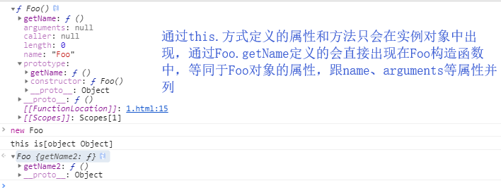


---
## 闭包对象问题(滴滴 很难)
```js
function fun(n, o) {
    console.log(o)
    return {
        fun: function(m) {
            return fun(m, n);
        }
    };
}
var a = fun(0);   // undefiend  形成闭包1 n = 0
a.fun(1);      //0 fun(1,0) => 形成闭包2 n = 1
a.fun(2);      //0 fun(2,0) => 形成闭包3 n = 2
a.fun(3);      //0 fun(3,0) => 形成闭包3 n = 3
var b = fun(0).fun(1).fun(2).fun(3);
//fun0  =>   undefined  返回对象obj0 形成闭包 n = 0
//.fun(1) => 0           obj0调用函数fun(1,0),返回对象obj1,形成闭包n=1
//.fun(2) => 1           obj1调用函数fun(2,1),返回对象obj2,形成闭包n=2
//.fun(3) => 2           obj2调用函数fun(3,2),返回对象obj3,形成闭包n=3
var c = fun(0).fun(1);
//fun0  =>   undefined  返回对象obj0 形成闭包 n = 0
//.fun(1) => 0           obj0调用函数fun(1,0),返回对象obj1,形成闭包n=1
c.fun(2);  // 1    obj1调用函数fun(2,1),返回对象obj2,形成闭包n =  2
c.fun(3);  // 1    obj1调用函数fun(3,1),返回对象obj22,形成闭包n =  3
```
---

## document.parentNode和document.parentnode的区别？(腾讯)
每个节点都有parentNode节点，但是document是最外层节点，因此它的parentNode属性为null；而parentnode是不存在的属性，因此为undefined.   
有这个属性，但是属性值没有则为null；没有这个属性，属性值则为undefined

---

## 怎么规避多人开发函数重名的问题?(百度搜索)
1. 基于单例设计模式   
::: tip 实现单例核心思想
无非是用一个变量来标志当前是否已经为某个类创建过对象，如果是，则在下一次获取该类的实例时，直接返回之前创建的对象   
:::
```js
var Singleton = function( name ){
  this.name = name;
};

Singleton.prototype.getName = function(){
  alert ( this.name );
};

Singleton.getInstance = (function(){ 
  var instance = null;
  return function( name ){
    if ( !instance ){
      instance = new Singleton( name );
    }
    return instance;
  }
})();
var sg1 = Singleton.getInstance('小明');
```
2. 基于闭包
3. 模块化开发 COMMONJS(module.exports 和 exports require) ES6 (export default 和 export import)
::: tip exports与module.exports的区别?
用一句话来说明就是，require方能看到的只有module.exports这个对象，它是看不到exports对象的，而我们在编写模块时用到的exports对象实际上只是对module.exports的引用。
:::

---

## 条件语句中定义变量(腾讯)
核心：不管条件是否成立，条件语句中定义的该变量都要进行变量提升。
```js
var name = 'World';
(function(){
  /**自执行函数执行时，在局部作用域中会将var name进行变量提升，不考虑条件是否成立。*/
  if(typeof name === 'undefined'){
    var name = 'Jack';  //name提升后为undefined,进入此处重新赋值Jack
  }else{
    console.log(name);
  }
})()
//输出Jack
```


## 全局及局部作用域变量提升
```js
var foo = 10;
function bar(){
  //函数会生成局部作用域，先进行形参赋值，再进行变量提升
  //局部作用域中 var foo(undifiend)  注意：不管条件是否成立，都要进行变量提升，但是新浏览器中对于判断体中的函数只是提前声明
  if(!foo){
    var foo = 100;
  }
  console.log(foo);
}
bar(); //打印100
```
---

---
## 条件判断中的函数声明提升(360面试题)
::: danger 核心
在当前作用域下，不管条件是否成立都要进行变量提升
* 带var的变量只是声明
* 带function的在老版浏览器渲染机制下，声明+定义都处理，但是为了迎合ES6中的块级作用域，新版浏览器对于函数(在条件判断中的函数), 不管条件是否成立，都只是先声明，没有定义，类似于var
* 匿名函数不进行变量提升
条件判断相关
* 条件语句中数据类型默认的布尔值
   1. 基本数据类型:' '、0、null、undefiend、NaN在条件判断中都是false    if(' '){console.log('a')}else{console.log('b')}都输出b
   2. 引用数据类型:[]、{}在条件判断中都是true  if({}){console.log('a')}else{console.log('b')}都输出a
* ！语句中数据类型的布尔值
   1. 基本数据类型:''、0、null、undefiend、null、NaN在'!'语句后中都是false, 跟条件语句中处理一致  !''  => true
   2. 引用数据类型:[]、{}在'!'语句后都是true, 跟条件语句中处理一致  ![] => false
* '=='语句中强制类型转换
  1. '=='存在强制类型转换,因此在'=='中, ''、0、[]都转化成false，
  2. undefiend、null、NaN即不跟false相等，也不跟true相等(undefiend、null、NaN == false/true都为false,但是undefined == null,任何类型都不跟NaN连等, 包括它自己)
  3. []转化成false [] == false 为true ; 而{}无法转化，{} == true/false都报错    
* '=='比较规则
  1. 如果一个值是null, 另一个是undefined，则它们相等
  2. 如果一个值是数字，另一个是字符串，先将字符串转换为数字，然后使用转换后的值进行比较
  3. 如果其中一个值是true，则将其转换为1再进行比较。如果其中一个值是false，则将其转换为0再进行比较。
* '[]'转化规则
  1. '[]'转字符串为' '
  2. '[]'转布尔值为true
  3. '[]'转数字为0
:::
```js
/*------------示例------------------*/
b = function () {console.log(1)};
(function (){
  /*
    自执行函数执行时形成私有作用域：
      形参赋值：无
      变量提升：
          function b 在条件判断语句中，因此只声明未定义
          function a 不在条件语句内，直接声明并定义
  */
  console.log(a);  // 打印a函数
  console.log(b);  // undefined
  if(a){
    function b(){
      console.log(2)
    }
    b();   // 2
  }
  function a(){
  }
})()
b()  // 1  全局下的函数b未被自执行函数中的私有变量更改
console.log(a); // Uncaught ReferenceError: a is not defined


/*-----------------------例题--------------------------------*/
f = function () {return true;}
g = function () {return false;}
~function () {
  /**
    自执行函数执行形成私有作用域
      形参赋值：无
      变量提升：function g声明但不定义
      代码执行：g()执行时会报错 Uncaught TypeError: g is not a function
              如果把function g(){}挪到条件判断外面则可以正常执行，声明并定义的function g会覆盖只声明未定义的function g;
              不管function g(){}函数定义在条件语句之前还是之后
              条件判断中g()返回true ![]为false [] == false， 有一方为false，所以false变成0，然后比较[] == 0，[]转换成数字0，0 == 0为true，因此全局函数f被重新赋值，输出false,false
  */
  if(g() && [] == ![]){
    f = function () {return false;};  //影响全局作用域中f
    function g() {return true;}
  }
  //function g(){return true;} //不加这条语句报错
}();
console.log(f());
console.log(g()); //全局定义的g未被影响


/****************变量提升变体******************/
f = function () {return true;}
g = function () {return false;}
~function () {
  if([] == ![]){
    console.log(g())  // 1
    //进入判断体中第一件事不是执行代码，而是类似变量提升一样，将函数声明和定义
    function g() {return 1;}
    console.log(g())  // 1
    f = function () {return false;};
  }
  function g(){return 2;}
}();
```
---

---
## 作用域和值类型引用类型的传递:
```js
<script type="text/javascript">
  //第一题 作用域
  var num1 = 55;
  var num2 = 66;
  function f1(num, num1){
    //首先声明形式参数num，num1，分别赋值传入的55 66
    //num = 55 num1 = 66
    num = 100;  //形式参数num = 100
    num1 = 100; //形式参数num1 = 100
    num2 = 100; //全局变量num2 = 100
    console.log(num);  // 打印100
    console.log(num1); // 打印100
    console.log(num2); // 打印100
  }
  f1(num1, num2);  //此处传入值num1:55 num2:66
  console.log(num1); //打印 全局num1 = 55
  console.log(num2); //打印 全局num2 = 100
  console.log(num);  //报错 not defined
</script>
```
---

```js
  function Person(name, age, salary){
    this.name = name;
    this.age = age;
    this.salary = salary;
  }

  function f1(person){
    // var person = p
    person.name = "ls";
    person = new Person("aa", 18, 10);
  }

  var p = new Person("zs", 18, 1000);
  console.log(p.name);  //zs
  f1(p);
  console.log(p.name);  //ls
```
>> 执行过程内存解析
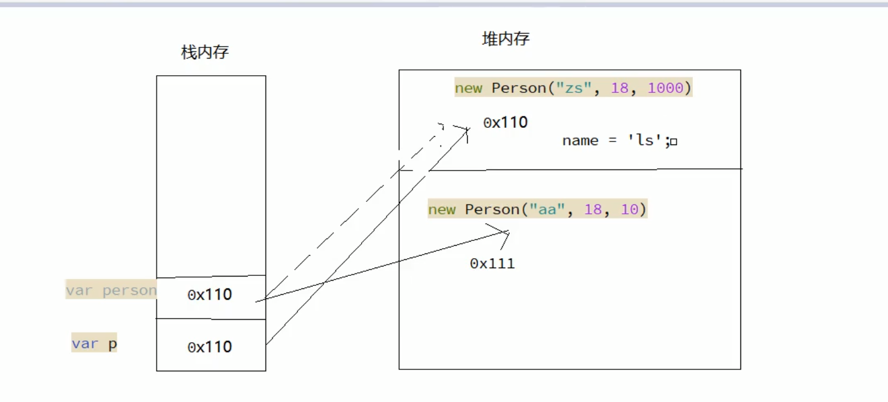

## JS变量提升问题
原则：函数声明提升优先于变量提升，函数声明会被变量赋值影响，但不会被变量声明影响
```js
console.log(func && typeof(func))  //function
function func () {
}
var func

/*----------------------------------------------*/
console.log(func && typeof(func))  //function
function func () {
}
var func = 10

/*----------------------------------------------*/
var func = 10
console.log(func && typeof(func))  //number
function func () {
}
```
---

```js
//变量提升：不管条件是否成立都要进行变量提升，在全局作用域下声明的变量，
//也相当于给window设置了一个对象的属性，而且两者之间建立了映射的机制<=>window.a = undefined
/*
in : 检测某一个属性是否隶属于这个对象（不管是私有属性还是共有属性），只要有这个属性结果就是TRUE
hasOwnProperty ： 所有继承了 Object 的对象都会继承到 hasOwnProperty 方法。
这个方法可以用来检测一个对象是否含有特定的自身属性；和 in 运算符不同，
该方法会忽略掉那些从原型链上继承到的属性
*/
if(!("a" in window)){
  var a = 1;
}
console.log(a);   //undefined

if(!(window.hasOwnProperty("a"))){
  var a = 1;
}
console.log(a);   //undefined
```
---

## ES6中class和普通构造函数有何区别？
* class在语法上更加贴合面向对象的写法
* class实现继承更加易读、易理解
* 更易于java等后端语言的使用
* class本质还是语法糖，编译后其实还是使用的prototype

---

## 形参及实参问题  
在JS非严格模式下，函数中的形参变量和arguments存在映射机制（相互影响）
* 第一个形参变量x值修改为100，那么arguments[0]的值也跟着修改为100
* arguments[1]的值修改为200，那么第二个形参变量y的值也跟着修改为200
* 在严格模式下代码输出3 3 undefined
```js
var a = 4;
function b(x, y, a){
  /**
  1. 形参赋值：x = 1 y = 2 a = 3
  2. 变量提升： 无
  3. 执行代码
     arguments: 函数内置的实参集合，不管是否设置形参，传递的实参值在这个集合中都存在
     argumens ==> {
       0:1
       1:2
       2:3
       length: 3
       callee:函数本身
     }
  */
  console.log(a);  //3
  arguments[2] = 10;
  console.log(a); //10
}
a = b(1, 2, 3); // a = undefined  b函数中并没有return，所以默认函数的返回值是undefined
console.log(a);  //undefined

/*---------------------------------------------------*/
function fn(x, y){
  /*
  形参： x = 10 y = undefiend
  arguments: {
    0 : 10
    length : 1
  }
  arguments和形参之间的映射是以arguments的索引为基础完成的额，
  arguments中有这个索引，浏览器会完成和对应形参变量中的映射机制搭建，
  如果形参个数比arguments个数多，那么多出来的形参是无法和arguments中对应的索引建立关联的

  arguments和形参的映射机制只发生在函数执行后形参赋值的一瞬间，
  此后再操作之前未建立映射的形参和arguments均不能重新建立映射
  */
  arguments[0] = 100;
  console.log(x);  // 100
  arguments[1] = 300;
  console.log(y,arguments[1]);   // undefiend 300
  y = 200;
  console.log(y, arguments[1]);  // 200 300
}
fn(10);
```
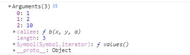

---

---
## 严格模式和非严格模式区别
1. 严格模式下不允许使用"arguments.callee"和"arguments.callee.caller"
   * arguments.callee：返回正被执行的 Function 对象，也就是所指定的Function 对象的正文。
   * arguments.callee.caller：返回一个对函数的引用，该函数调用了当前函数。
2. 严格模式下arguments和形参没有映射机制
3. 严格模式下,函数执行，如果没有明确指定执行的主体(函数前面没有加'.')， 不再像非严格模式下一样，统一都交给window，而是让this指向undefiend,代表没有执行主体；“严格模式下，有执行主体this就指向谁，没有执行主体，this就是undefined”

## 逻辑与&&和逻辑或||
优先级：逻辑与的优先级高于逻辑或
```js
console.log(0 || 1 && 2 || 0 || 3 && 2 || 1);  // 2
```

## 封装函数进行字符串驼峰命名
```js
//已知有字符串foo='get-element-by-id',写一个function将其转化成驼峰表示法"getElementById"

var foo = 'get-element-by-id';
function toString(foo){
  //根据某个字符进行切割
  var arr = foo.split('-');
  //获取每个元素中的第一个字符并转换成大写
  for(var i = 1; i < arr.length; i++){
    //核心在于使用charAt(0)获取第一个字符，然后将其用toUpperCase()方法转换成大写
    arr[i] = arr[i].charAt(0).toUpperCase() + arr[i].substr(1, arr[i].length - 1);
  }
  return arr.join('');
}
console.log(toString(foo));
```

## 冒泡排序
```js
function bubbleSort(arr){
  //比较轮数
  for(var i = 0; i < arr.length - 1; i++){
    //比较的具体方法
    //比较的范围j在0到数组长度 - 轮数
    for(var j = 0; j < arr.length - i; j++){
      if(arr[j] > arr[j + 1]){
        //前面的值大于后面的值，交换双方的值
        var tmp = arr[j + 1];
        arr[j + 1] = arr[j];
        arr[j] = tmp;
      }else{
        //前面的值小于后面的值，指针顺位后移
      }
    }
  }
}
arr = [8, 11, 20, 5, 20, 8, 0, 2, 4, 0, 8]
bubbleSort(arr);
console.log(arr); //[0, 0, 2, 4, 5, 8, 8, 8, 11, 20, 20]
```

## 去除数组中重复性的数据:
```js
//原数组
var arr = [8, 11, 20, 5, 20, 8, 0, 2, 4, 0, 8];
function Redup(arr){
  //创建新数组，插入原数组第一个元素
  var newArr = [];

  //依次将原数组中的元素不重复的插入新数组
  for(var i = 0; i < arr.length; i++){
    if(newArr.indexOf(arr[i]) === -1){
      newArr.push(arr[i]);
    }
  }
  console.log(newArr);
}
```

## js综合面试题
```js
function Foo(){
  getName = function(){alert(1);}
  return this;
}
Foo.getName = function(){alert(2);}
Foo.prototype.getName = function(){alert(3);}
var getName = function(){alert(4);}
function getName(){alert(5);}

//请写出下列的输出结果
Foo.getName();
getName();
Foo().getName();
getName();
new Foo.getName();
new Foo().getName();
new new Foo().getName();
```
::: danger 整体代码分析
```js
//1. JS会将变量和函数声明进行提升
  //首先进行函数提升
  function Foo(){...}
  function getName(){alert(5)}
  //再进行变量提升
  var getName; //undefined 由于getName已经声明为函数，所以变量声明不起作用
  //变量提升之后变量getName和函数getName重名，会只保留提升的函数getName()
  /******************************************************************/
//2. 未被提升的代码依次执行
Foo.getName = function(){alert(2);}
Foo.prototype.getName = function(){alert(3);}
getName = function(){alert(4);}   //由于前面提升的时候声明了函数getName,
//因此这里的函数对getName赋值会覆盖之前的getName函数。

/*
优先级：（） 19 
'.'成员访问  new Foo()构造函数带参 18
函数调用  new Foo不带参  17
*/

//结果
Foo.getName();           // 2
getName();               // 4
Foo().getName();         // 1
// '.'的优先级为18，函数调用为17，所以先执行成员访问，
//但是().getName()获取不到方法， 因此先执行Foo()函数,再执行.getName()方法。
//因为Foo()中的getName方法并没有用var声明，因此会寻找沿着作用域链找到全局的getName，
//然后对getName重新赋值为函数fucntion(){alert(1);}
//由于Foo()是被window调用的，所以Foo()中return this返回的就是window对象，所以最终是window.getName()方法调用输出1
getName();  // 找到全局中的getName方法  1
new Foo.getName();  // '.'的优先级18，，new Foo不带参优先级为17， 先执行Foo.getName => fn，再执行new fn()---> new (Foo.getName)()  
//--->  new (fucntion(){alert(2);})() 
// 输出 2  并生成实例对象
new Foo().getName(); // '.'的优先级18, new Foo()优先级18，优先级一样从左往右执行, 因此先执行new Foo()再执行getName()方法  
//(new Foo()).getName()  ---> 实例对象foo.getName()  
//Foo本身并未声明getName方法，因此会去原型链上找到Foo.prototype.getName  //  输出  3  并生成实例对象
new new Foo().getName();
//new Foo()优先级18， '.'优先级18，先执行new Foo() => foo(返回实例)
//然后new foo优先级17， '.'优先级18， 函数调用优先级17，因此执行foo.getName => fn(返回的函数)，再执行new fn()
// 先new Foo(),再调用getName,再new
// new ((new Foo()).getName)()  --> 
// new (实例foo.getName)()  -->
// new (function(){alert(3)})()
// 输出 3  并生成实例对象
```
:::
---

## 函数防抖和函数节流
::: tip 概念
函数节流：是确保函数在特定的执行时间(周期)内至多执行一次。
   * 一个函数执行一次后，只有大于设定的执行周期后才会执行第二次
   * 有个需要频繁触发的函数，出于性能优化角度，在规定时间内，只让函数触发的第一次生效，后面不生效
函数防抖：是函数在特定的时间内不被再调用后执行。
   * 一个需要频繁触发的函数，在规定的时间内，只让最后一次生效，前面的不生效
:::
```js
//节流函数
function throttle(fn, delay){
  //记录上一次函数触发的时间
  let lastTime = 0;
  return function () {
    //获取参数
    let args = arguments;
    //记录当前函数触发的时间
    let nowTime = Data.now();
    if(nowTime - lastTime > delay){
      //修正this指向问题
      fn.apply(this, args);
      //同步时间
      lastTime = nowTime;
    }
  }
}
document.onscroll = throttle(function(){console.log('scroll事件被触发' + Date.now())},1000);

//防抖函数
function debounce(fn, delay){
  //记录上一次的延时器
  let timer = null;
  return function(){
    let args = arguments; 
    // let args = [].slice.call(arguments)
    //arguments这个”伪数组“,除了不是”原型继承自’Array.prototype‘“之外，其他特征和数组是一样的。所以可以当作数组使用
    //清除上一次的延时器
    if(timer){
        clearTimeout(timer);
    }
    //重新设置新的延时器
    timer = setTimeout(() => {
      //修复this指向问题
      fn.apply(this,args);
    }, delay)
  }
}
document.getElementById('btn').onclick = debounce(function(){console.log('点击事件被触发了' + Date.now());}, 1000)
```

---
## node.js的事件轮询机制
[js 异步执行顺序](https://www.jianshu.com/p/ca480f9e7dea)  
[js异步梳理：1.从浏览器的多进程到JS的单线程，理解JS运行机制](https://www.imooc.com/article/281793)  
[js 异步 microtask 和 macrotask 的时机问题](https://www.v2ex.com/amp/t/474900)  
[JavaScript进阶之异步回调的执行时机](https://www.cnblogs.com/dasusu/p/10081231.html)  
[JavaScript异步精讲，让你更加明白Js的执行流程](https://www.jianshu.com/p/ab1a02e863be)  
[浏览器进程线程、Web Workers、Event Loop 图解](https://segmentfault.com/a/1190000017204460)  
[作用域和执行上下文](https://segmentfault.com/a/1190000009522006)

```js
setTimeout(function(){
  console.log('setTimeout()');
}, 0)

setImmediate(function(){
  console.log('setImmediate()');
})

process.nextTick(function(){
  console.log('process.nextTick()');
})

//不管上面三个函数位置如何调换，输出始终不变
process.nextTick()
setTimeout()
setImmediate()
//process.nextTick方法可以在当前"执行栈"的尾部----下一次Event Loop（主线程读取"任务队列"）之前----触发回调函数。
//setImmediate方法则是在当前"任务队列"的尾部添加事件，也就是说，它指定的任务总是在下一次Event Loop时执行
//代码执行分析
//
//1. 首先进入timers阶段，优先执行process.nextTick，输出process.nextTick()，然后发现setTimeout的计时为0，那么执行到点的定时器回调函数输出setTimeout()
//2. 依次向后执行到check阶段时，执行setImmediate的回调函数输出setImmediate()
```

::: tip 说明
node.js事件轮询机制: 借助[libuv库 uv_run](https://github.com/libuv/libuv/blob/v1.x/src/unix/core.c)实现的
概括事件轮询机制，分为6个阶段：
  1. timers 定时器阶段
    -- 计时和执行到点的定时器回调函数
  2. pending callbacks
    -- 某些系统操作(例如TCP错误类型)的回调函数
  3. idle, prepare
    -- 准备工作
  4. poll轮询阶段（轮询队列）
    1) 如果轮询队列不为空:
        依次同步取出轮询队列中第一个回调函数执行,  
        直到轮询队列为空或者达到系统最大的限制
    2) 如果轮询队列为空:
        一、如果之前设置过setImmediate函数
            直接进入下一个check阶段
        二、如果之前没有设置过setImmediate函数
            在当前poll阶段等待
              直到轮询队列添加回调函数,就去第一个情况1)执行
              如果定时器到点了，回去下一个阶段
  5. check 查阶段
    -- 执行setImmediate设置的回调函数
  6. close callbacks 关闭阶段
    -- 执行close事件回调函数

  process.nextTick能在任意阶段优先执行
:::

---

## Node.js的Event Loop中promise.then()和process.nextTick执行顺序问题
[Node.js的Event Loop](http://www.ruanyifeng.com/blog/2014/10/event-loop.html)
```
setTimeout(() => {
    console.log("setTimeout 1")
  },0)
process.nextTick(() => {
  console.log("nextTick 1");
  Promise.resolve().then(() => {
    console.log('promise 1');
  })
})
Promise.resolve().then(() => {
    console.log("window has promise");
    process.nextTick(() => {
      console.log("nextTick 2");
      Promise.resolve().then(() => {
        console.log('promise 2');
      })
    })
    Promise.resolve().then(() => {
      console.log('promise 3');
    })
})
  
//输出结果：
nextTick 1
window has promise
promise 1
promise 3
nextTick 2
promise 2
setTimeout 1
```
::: tip 说明
process.nextTick 永远大于 promise.then，原因其实很简单。。。在Node中，_tickCallback在每一次执行完TaskQueue(宏任务队列)中的一个任务后被调用，而这个_tickCallback中实质上干了两件事：   
1. nextTickQueue中所有任务执行掉(长度最大1e4，Node版本v6.9.1)  
2. 第一步执行完后执行_runMicrotasks函数，执行microtask中的部分(promise.then注册的回调),所以很明显 process.nextTick > promise.then  

:::

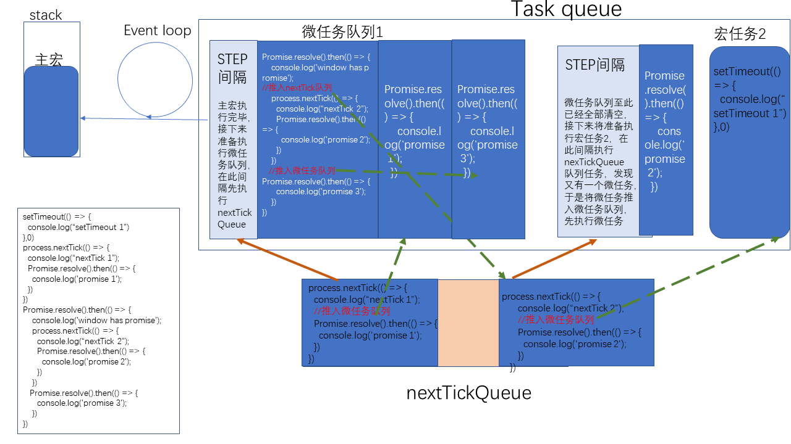
思考：下列代码结果为啥是这样？
```js
setTimeout(() => {
  console.log("1")
  Promise.resolve().then(()=> {
    console.log("2");
  })
  process.nextTick(() => {
      console.log("3");
  })
},0)
setTimeout(() => {
  console.log("2-1")
  Promise.resolve().then(()=> {
    console.log("2-2");
  })
  process.nextTick(() => {
      console.log("2-3");
  })
},0)
//1 > 2-1 > 3 -> 2-3 -> 2 -> 2-2

/**********************下列代码在Node和浏览器中执行不一样***************************/
setTimeout(() => {
  console.log("1")
  let pro = new Promise((resolve,reject) => {
    console.log("2");
    resolve();
  })
  pro.then(()=> {
    console.log("3");
  })
},0)
setTimeout(() => {
  console.log("2-1")
  let pro = new Promise((resolve,reject) => {
    console.log("2-2");
    resolve();
  })
  pro.then(()=> {
    console.log("2-3");
  })
},0)
//node结果： 1 >2 > 2-1 > 2-2 > 3 > 2-3
//chrome结果：1 > 2 > 3 > 2-1 > 2-2 > 2-3
//浏览器中严格按照一个宏任务，一个微任务队列来执行
//而Node中不是按照这个方式来执行，宏任务可以是一个队列, 等宏任务队列执行完成才执行nextTick队列，最后执行微任务队列
```


---
## 闭包
*. 什么是闭包:    
   1. 密闭的容器，类似于set、map容器，存储数据的     
   2. 闭包是一个对象，存放数据的格式：key:value的形式      
*. 形成的条件:    
   1. 函数嵌套     
   2. 内部函数引用外部函数的局部变量     
*. 闭包的优点:    
   1. 延长外部函数局部变量的生命周期    
*. 闭包的缺点:    
   1. 容易造成内存泄漏    
*. 注意点:    
   1. 合理的使用闭包    
   2. 用完闭包要及时清除(销毁)  
::: tip 闭包原理
注意：只有this是动态作用域，其他的都是词法作用域（即this会随着调用它的对象而改变，而其他变量和函数的私有作用域的上级跟此函数在哪执行无关，只跟它在哪创建有关----> 闭包核心）
:::
```js
//示例
function fun(){
  var count = 1;
  return function(){
    count++;
    console.log(count);
  }
}
var fun2 = fun()
fun2() //2
fun2() //3

//经典面试题
//说出它们的输出情况  （核心：闭包中保存的变量只在当前闭包中存在，嵌套闭包每个都有自己的变量）
function fun(n, o){
  console.log(o);
  return {
    fun: function (m){
      return fun(m, n);
    }
  }
}
var a = fun(0)  //0被赋值给n, o仅声明未赋值输出 undefined 
a.fun(1)  //调用return的fun(1,0) n被赋值为1，o被赋值为0 打印的o为0  
a.fun(2)  //调用return的fun(2,0) n被赋值为2，o被赋值为0 打印的o为0  
a.fun(3)  //调用return的fun(3,0) n被赋值为3，o被赋值为0 打印的o为0

var b = fun(0).fun(1).fun(2).fun(3)  // undefined, 0, 1, 2
// 调用fun(0)输出undefined; 返回对象{fun:function (m)} 闭包中'n:0'
// 接着调用.fun(1), 实际调用的function(1){return fun(m,n)}, 调用函数fun(1,0) 输出0， 返回对象{fun:function(m)} 闭包中'n:1'  
// 再调用.fun(2), function(2),调用fun(2,1), 输出1 返回对象{fun:function (m){ }} 闭包中'n:2'   
//最后调用.function(3), 实际调用的fun(3,2), 输出2 返回对象{fun:function (m){ }} 闭包中'n:3'

var c = fun(0).fun(1)  //输出undefined, 0, 1， 1
//返回对象{fun:function (m){ }}c中闭包保留的n为1
c.fun(2)  //实际调用function (2) {return fun(2,1)} c闭包中n为1 因此调用fun(2, 1) 输出1,返回对象{fun:function (m){ }}中闭包保留的n为2
c.fun(3)  //实际调用function (3){return fun(3,1)} c闭包中n为1 因此调用fun(3, 1)  输出1,返回对象{fun:function (m){ }}中闭包保留的n为3
//
```

```js
var a = 9;
function fn(){
  a = 0;
  return function(b){
    return b + a++;
  }
}
var f = fn();
console.log(f(5));     // 5
console.log(fn()(5));  // 5
console.log(f(5));     // 6
console.log(a);        // 2
```
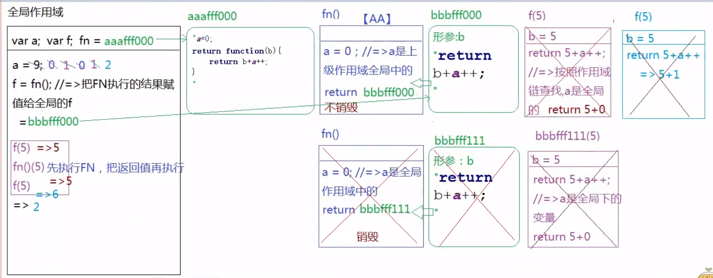

---

## 变量和函数的私有作用域的上级跟此函数在哪执行无关，只跟它在哪创建有关？
示例：
```js 
//	这是	foo.js	文件里的代码 
var	b	=	2; 
module.exports	=	function()	{	
  //	导出function 
    console.log(b); 
    console.log(a); 
  }; 
``` 
```js 
//	这是test.js	文件里的代码 
var	foo	=	require("./foo.js");	
//	引入function	为foo 
var	a	=	1; 
foo(); 
//	node	执行	test.js	输出： 
//	->	2 
//	->	ReferenceError:	a	is	not	defined 
```


```js

var	b	=	2; 
function	foo	()	{ 
  console.log(b);	//	2 
  console.log(a);	//	error 
}
void	function	()	{ 
  var	a	=	1 
  foo() 
}()

```
---

## this关键字的机制和定义
this则是一个复杂的机制，JavaScript标准定义了\[\[thisMode\]\]	私有属性。

\[\[thisMode\]\]	私有属性有三个取值。
1. lexical：表示从上下文中找this，这对应了箭头函数。
  ```js
    const	showThis = () => { console.log(this);}
    var	o	= { showThis:	showThis }
    showThis();	//	global 
    o.showThis();	//	global
  ```
2. global：表示当this为undefined时，取全局对象，对应了普通函数。
  ```js
  function	showThis(){	console.log(this); }
  var	o	=	{ showThis:	showThis }
  showThis();   // global 
  o.showThis(); // o
  ```
3. strict：当严格模式时使用，this严格按照调用时传入的值，可能为null或者undefined
  非常有意思的是，方法的行为跟普通函数有差异，恰恰是因为class设计成了默认按strict模式执行。
  ```js
  //class中this的使用
  class C { showThis() { console.log(this); } }
  var	o	=	new	C(); 
  var	showThis	=	o.showThis;
  showThis();	//	undefined 
  o.showThis();	//	o
  ```
  ```js
    //严格模式中this的使用
    "use	strict";
    function showThis(){ console.log(this);}
    var	o = {showThis:	showThis }
    showThis();	//	undefined 
    o.showThis();	//	o
  ```

---

## 对象中方法的闭包及this指向问题
::: danger 问题核心
1. 在非严格模式下，自执行函数中的this指向window
2. 在非严格模式下，函数未用"."方式调用时函数中this指向全局对象window
3. 使用"."方式调用函数，函数中的this指向"."之前的对象
:::
```js
var num = 10;
var obj = {num:20};
obj.fn=(function(num){
  this.num = num * 3;
  num++;  //返回的函数中用到了这个形参变量，形成闭包
  return function(n){
    this.num += n;
    num++;
    console.log(num);
  }
})(obj.num)
var fn = obj.fn;
fn(5);                     // => 22
obj.fn(10);                // => 23
console.log(num, obj.num); // => 65 30
```
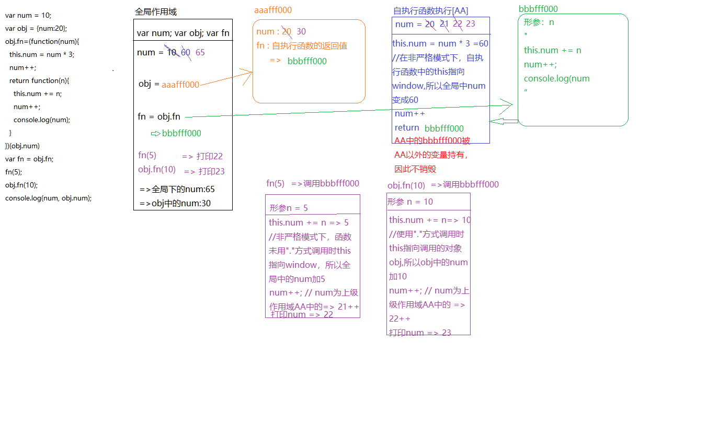

变体
```js
var num = 10;
var obj = {num:20};
obj.fn=(function(num){
  num = this.num + 10;
  this.num = num + 10;
  return function(){
    this.num += ++num;
  }
})(num)
var fn = obj.fn;
fn();
obj.fn();
console.log(num, obj.num);  // 51 42
```
---

## 数组作为参数传入
```js
/*
  变量提升
    var arr;
    fn = aaafff000
    var res
*/
var arr =  [1, 2, 3, 4]; // arr = bbbfff111 [全局变量]
function fn(arr){
  /*
    形参赋值：arr = bbbfff111 [私有变量]
  */
  arr[0] = 0;  //  bbbfff111 => [0,2,3,4]
  arr = [0];   // => arr = bbbfff222 [0]
  arr[0] = 100; // bbbfff222 [100]
  return arr; // return bbbfff222
}

var res = fn(arr);  // bbbfff222 => [100]
console.log(arr);   // bbbfff111 => [0,2,3,4]
console.log(res);

```

## i++问题
::: danger (i++)
不管是否加括号，i++都是先将i赋值给调用它的语句，最后再执行++操作    
var i = 1;10 + (i++)和10 + i++执行之后都是11，i=2 
:::
```js
function fn(i){
  return function(n){
    console.log(n + (i++));
  }
}
var f = fn(10);
f(20);      // 30
fn(20)(40); // 60
fn(30)(50); // 80
f(30)       // 41
```
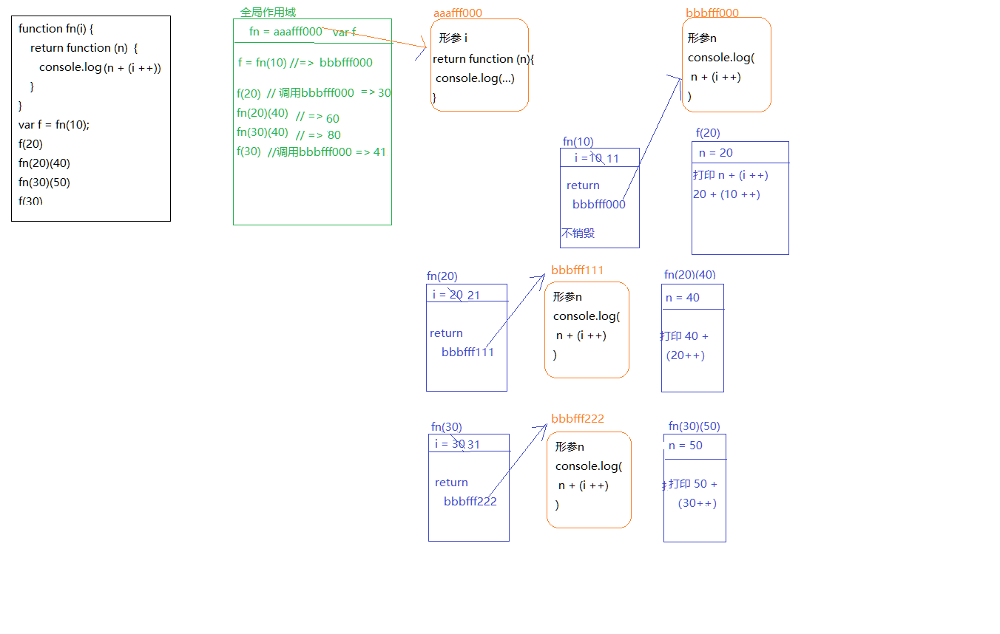
```js
var i = 10;
function fn(){
  return function(n){
    console.log(n + (++i));
  }
}
var f = fn();
f(20);    // 31
fn()(20); // 32
fn()(30); // 43
f(30);    // 44
```
---

## 变量提升/预处理 && 执行上下文
```js
/*
js引擎在代码正式执行之前会做一个预处理的工作:  
  1. 收集变量  
  2. 收集函数  
  依据：  
    var 将var后边的变量定义但是不赋值 var username = undefined;  
    function(){}  提前定义该函数
*/

console.log(username);  //undifiend
var username = 'kobe';
console.log(username);  //kobe

fun();  //fun()
function fun(){
  console.log('fun()');
}

//执行上下文（execute context/EC/Execution Context）  
/*
理解：代码执行的环境
时机：代码正式执行之前会进入到执行环境    ----作用域在代码定义时产生  
工作：  
  1. 创建变量对象  --变量提升
    1). 变量
    2). 函数及函数的参数
    3). 全局: window
    4). 局部: 抽象的但是确实存在
  2. 确认this的指向
    1). 全局: this ---> window
    2). 局部: this ---> 调用其的对象
  3. 创建作用域链
    父级作用域链 + 当前的变量对象
  4. 扩展:
    ECObj = {
      变量对象: {变量， 函数， 函数的形参}
      scopeChain: 父级作用域链 + 当前的变量对象
      this: {window || 调用其的对象}
    }
*/
```

## 宏任务 && 微任务
JS是单线程的  
[微任务、宏任务、同步、异步、Promise、Async、await](https://www.cnblogs.com/jiangyuzhen/p/11064408.html)      
[微任务、宏任务与Event-Loop](https://blog.csdn.net/qq_42606051/article/details/81736462)   
[JS宏任务与微任务执行顺序（仅参考）](https://www.cnblogs.com/mmykdbc/p/10401759.html)   
[浏览器和node不同的事件执行和循环机制（仅参考）](https://tobethelight.github.io/2018/03/11/浏览器和node不同的事件执行和循环机制/)   
[不要混淆nodejs和浏览器中的event loop](https://cnodejs.org/topic/5a9108d78d6e16e56bb80882)   
[node中的Event模块](https://github.com/SunShinewyf/issue-blog/issues/34)   
宏任务：  
&emsp;&emsp;分类：在浏览器环境中，常见的 macro task 有 setTimeout、setInterval、MessageChannel、postMessage、requrestAnimationFrame；在Node中有setImmediate、setTimeout、setInterval、
&emsp;&emsp;1. 宏任务所处的队列就是宏任务队列  
&emsp;&emsp;2. 第一个宏任务队列中只有一个任务：执行主线程的JS代码  
&emsp;&emsp;3. 宏任务队列可以有多个  
&emsp;&emsp;4. 当宏任务队列中的任务全部执行完后会查看是否有微任务队列，如果有则先执行微任务队列，如果没有就查看是否有宏任务队列  

微任务:  
&emsp;分类：浏览器有new Promise().then(回调)中的回调、MutationObserver  Node中有process.nextTick  
&emsp;&emsp;1. 微任务所处的队列就是微任务队列  
&emsp;&emsp;2. 只有一个微任务队列  
&emsp;&emsp;3. 在上一个宏任务执行完毕后如果有微任务队列就会执行微任务队列中的所有任务  


```js
/--------------------------面试题-----------------------------/
console.log('----------------start-----------------')

setTimeout(() => {
  console.log('setTimeout');
}, 0) 
//setTimeout是宏任务，应该被放置到宏任务队列中，但是第一个宏任务队列只能执行JS主线程上的代码，所以被放到第二个宏任务队列中

//new Promise本身是同步任务。被主线程执行
new Promise((resolve, reject) => {
  //此处是在主线程中执行的代码，应该打印i的值
  for(var i = 0; i < 5; i++){
    console.log(i);
  }
  //执行到resolve进入回调函数
  resolve();   //修改promise实例对象的状态为成功的状态
}).then(() => {
  //Promise的回调函数是微任务，因此会放到微任务队列中,会等待第一个宏任务队列完成后执行
  console.log('promise实例成功回调执行');
})

console.log('----------------end-----------------')

//整体分析是先执行主线程打印'start',然后打印 '0 - 4', 然后打印'end', 再打印'promise实例成功回调执行'，最后打印'setTimeout'
主线程（第一个宏任务） ----->  微任务队列  -----> 第二个宏任务
```
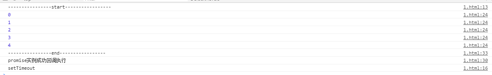   

/--------------------------面试题2-----------------------------/
[async/await以及js中的微任务和宏任务](https://blog.csdn.net/qq_41681425/article/details/85775077)
[参考链接](https://segmentfault.com/q/1010000016147496)
```js
async function async1() {
  console.log('async1 start')
  await async2()
  console.log('async1 end')
}
async function async2() {
  console.log('async2')
}
console.log('script start')
setTimeout(function() {
  console.log('setTimeout')
}, 0)
async1(); 
new Promise( function( resolve ) {
 console.log('promise1')
 resolve();
} ).then( function() {
 console.log('promise2')
} )
console.log('script end')

//输出 script start  --> async1 start  --> async2  --> promise1  --> 
//script end  --> async1 end  --> promise2  --> setTimeout
```
核心：
1. async做了一件什么事情？
  async将你的函数返回值转换为promise对象，不需要显式地返回promise对象，async关键字自动将函数的返回值变为promise对象。

2. await的作用
  await关键字只能在带有async关键字的函数内部使用，在外部使用时会报错。await等待的是右侧的[表达式结果]，如果右侧是一个函数，等待的是右侧函数的返回值，如果右侧的表达式不是函数则直接是右侧的表达式。await在等待时会让出线程阻塞后面的执行。await的执行顺序为从右到左，会阻塞后面的代码执行，但并不是直接阻塞await的表达式。  

  await之后如果不是promise，await会阻塞后面的代码，会先执行async外面的同步代码，等外面的同步代码执行完成在执行async中的代码。  

  如果它等到的是一个 promise 对象，await 也会暂停async后面的代码，先执行async外面的同步代码，等着 Promise 对象 fulfilled，然后把 resolve 的参数作为 await 表达式的运算结果。  

记住，await之后的代码必须等await语句执行完成后（包括微任务完成），才能执行后面的，也就是说，<font color="red">只有运行完await语句，才把await语句后面的全部代码加入到微任务行列</font>，所以，在遇到await promise时，必须等await promise函数执行完毕才能对await语句后面的全部代码加入到微任务中，所以，

在等待await Promise.then微任务时，

1. 运行其他同步代码，

2. 等到同步代码运行完，开始运行await promise.then微任务，

3. await promise.then微任务完成后，把await语句后面的全部代码加入到微任务行列，

4. 根据微任务队列，先进后出执行微任务

<font color="red">await 语句是同步的，await语句后面全部代码才是异步的微任务</font>  


async await宏任务微任务(难度较高)
```js
async function t1 () {
  console.log(1)           //  一  ->  1
  console.log(2)           //  二  ->  2
  new Promise( function ( resolve ) {
    console.log( 'promise3' )     // 三  ->  promise3
    resolve();
  } ).then( function () {
    console.log( 'promise4' )     //推入第一个微任务队列，编号1-1     //  九  -> promise4  //然后执行1-2
  })
  //遇见await，会执行await右边的代码，等await中代码执行完之前阻塞后续的代码（await后面是promise则会等promise代码中resolve执行完之后才将await之后的代码推入微任务队列中）
  await new Promise( function ( resolve ) {
    console.log( 'b' )           //   四  ->  b
    resolve();
  }).then( function () {
    console.log( 't1p' )         //  推入第一个微任务队列，编号1-2   //  十  ->  t1p   
    //执行完成后await语句完成，会将后续的代码放入微任务队列中，然后执行 1-3 
  })

  //阻塞状态   //  放入第一个微任务队列，编号 1-5
  console.log(3)   //  十三  ->  3
  console.log(4)   //  十四  ->  4

  new Promise( function ( resolve ) {
    console.log( 'promise5' )   //  十五  ->  promise5
    resolve();
  }).then( function () {
    console.log( 'promise6' )   //  推入第一个微任务队列，编号1-7，然后执行1-6  //  十八  ->  promise6  微任务队列执行完毕，然后执行第二个宏任务队列
  })

}

setTimeout( function () {
  console.log( 'setTimeout' )  //推入第二个宏任务队列   //  十九  ->  setTimeout
}, 0 )

async function t2() {
  console.log(5)     //   六  ->  5
  console.log(6)     //   七  ->  6
  await Promise.resolve().then(() => console.log('t2p'))  // 推入第一个微任务队列，编号1-4   
  //  十二  -> t2p  
  //  await执行完成，将后续代码放入第一个微任务队列，编号1-6，然后执行1-5
  //遇到await，阻塞
  // 编号1-6
  console.log(7)  //  十六  ->  7
  console.log(8)  //  十七  ->  8  //然后执行1-7
}

t1() 

new Promise( function ( resolve ) {
  console.log( 'promise1' )    // 五  ->  promise1
  resolve();
  } ).then( function () {
    console.log( 'promise2' )  // 推入第一个微任务队列，编号1-3     //  十一  -> promise2  //然后执行1-4
  } )

t2()

console.log('end');   //  八  ->  end   第一个宏任务队列执行完成，立马执行微任务队列1-1

```

---

## Promise.resolve()执行顺序
Promise.resolve()用于将现有对象转换为Promise对象，从而控制异步流程。而立即resolve的Promise对象是在<font color='red'>本轮“事件循环”（Event loop）的结束时，而不是在下一轮“事件循环”的开始时</font>。  
[从一道题浅说 JavaScript 的事件循环](https://www.jianshu.com/p/a72e71fbd46a)
[Promise.resolve():阮一峰](http://es6.ruanyifeng.com/#docs/promise#Promise-resolve)
```js
setTimeout(function(){console.log('1')},0)
new Promise(function(resolve, reject){
  resolve(2);
  Promise.resolve().then(function(){console.log(3)})
  console.log(4)
}).then(function(result){
  console.log(result)
})
console.log(5)
//输出 4 -> 5 -> 3 -> 2 -> 1

/****************Promise.resolve()和正常promise顺序*********************/
new Promise(function(resolve, reject){
  console.log(1);
  resolve(2);
}).then(function(result){
  console.log(result)
})
Promise.resolve().then(() => {
	console.log(4)
})
console.log(5)
//1 -> 5 -> 2 -> 4
//可见立即resolve的Promise对象并不是放在本轮事件循环的末尾，而是放入微任务队列


/****************变体********************/
//下列代码均输出相同结果
setTimeout(function(){console.log('1')},0)
new Promise(function(resolve, reject){
  resolve(2);
  new Promise(function(resolve, reject){
	  resolve(3);
  }).then(function(result){
	  console.log(result)
  })
  console.log(4)
}).then(function(result){
  console.log(result)
})
console.log(5)
//输出 4 -> 5 -> 3 -> 2 -> 1

setTimeout(function(){console.log('1')},0)
new Promise(function(resolve, reject){
  new Promise(function(resolve, reject){
	  resolve(3);
  }).then(function(result){
	  console.log(result)
  })
  console.log(4)
  resolve(2);
}).then(function(result){
  console.log(result)
})
console.log(5)
//输出 4 -> 5 -> 3 -> 2 -> 1
//可以认为Promise中resolve的位置不管在哪，
//都会把Promise中代码执行完后才将then中代码加入微任务队列
//所以 3 先输出， 2 后输出


/************特例***************/
let thenable = {
  then: function(resolve, reject) {
    resolve(42);
  }
};
new Promise(resolve => {
    resolve(1);
    Promise.resolve(thenable).then((t) => { 
    	console.log(t)
    });
    console.log(4)
}).then(t => {
	console.log(t)
});
console.log(3);
// 4 -》 3 -》 1 -》 42
```

---

## 红绿灯问题
仿照红绿灯，将div按照绿色3秒，黄色2秒，红色1秒依次变颜色
```js
<!DOCTYPE html>
<html lang="en">
<head>
  <meta charset="UTF-8">
  <meta name="viewport" content="width=device-width, initial-scale=1.0">
  <meta http-equiv="X-UA-Compatible" content="ie=edge">
  <title>Document</title>
</head>
<body>
  <div id='div' style="width:500px;height:500px;background-color:green">

  </div>
</body>
<script>
window.onload = function(){
  //按照需求将div按绿色3秒，黄色1秒，红色2秒依次变颜色
  var div = document.getElementById('div');
  function circle(){
    setTimeout(function(){
      div.style.backgroundColor = "yellow";
      setTimeout(function(){
        div.style.backgroundColor = "red";
        setTimeout(function(){
          div.style.backgroundColor = "green";
        },2000)
      },1000)
    },3000)
  }
  circle()
  setInterval(circle,6000)
}

//使用promise方法
function sleep(duration)
{ 
  return	new	Promise(function(resolve){
    setTimeout(resolve,	duration);
  })
} 
  
async	function changeColor(duration,color){ 
  document.getElementById("div").style.background	=	color; 
  await	sleep(duration);
} 

//代码优化 
async function changeColor(duration,color){ 
  document.getElementById("div").style.background	=	color; 
  return	new	Promise(function(resolve){
    setTimeout(resolve,	duration);
  })
} 
async	function main(){ 
  while(true){ 
    await	changeColor(3000,"green"); 
    await	changeColor(1000,	"yellow"); 
    await	changeColor(2000,	"red"); 
  } 
}
main();
</script>
</html>

```
---

## JS中浅拷贝的手段有哪些？
1. 手动实现
```js
const shallowClone = (target) => {
  if (typeof target === 'object' && target !== null) {
    const cloneTarget = Array.isArray(target) ? []: {};
    for (let prop in target) {
      if (target.hasOwnProperty(prop)) {
          cloneTarget[prop] = target[prop];
      }
    }
    return cloneTarget;
  } else {
    return target;
  }
}
```

2. Object.assign
但是需要注意的是，Object.assgin() 拷贝的是对象的属性的引用，而不是对象本身。也就是说，如果源对象某个属性的值是对象，那么目标对象拷贝得到的是这个对象的引用。
```js
let obj = { name: 'sy', age: 18 };
const obj2 = Object.assign({}, obj, {name: 'sss'});
console.log(obj2);//{ name: 'sss', age: 18 }

const obj1 = {a: {b: 1}};
const obj2 = Object.assign({}, obj1);

obj1.a.b = 2;
obj2.a.b // 2
```

3. concat浅拷贝数组
```js
let arr = [1, 2, 3];
let newArr = arr.concat();
newArr[1] = 100;
console.log(arr);//[ 1, 2, 3 ]
```

4. slice拷贝数组
```js
let arr = [1, 2, 3];
let newArr = arr.slice();
newArr[0] = 100;

console.log(arr);//[1, 2, 3]
```

5. '...'展开运算符
```js
let arr = [1, 2, 3];
let newArr = [...arr];//跟arr.slice()是一样的效果
```


---
## 深拷贝
[浅拷贝与深拷贝](https://www.jianshu.com/p/2188dcd91090)    
[能不能写一个完整的深拷贝？](https://juejin.im/post/5dbebbfa51882524c507fddb#heading-56)
1. 简易版及问题
```js 
JSON.parse(JSON.stringify());   
```
存在问题：
1. 无法解决循环引用的问题：const a = {val:2}; a.target = a;
2. 无法拷贝一些特殊的对象，诸如 RegExp, Date, Set, Map等。
3. 无法拷贝函数(划重点)。


```js
var obj1 = {
  name:'haha',
  age:20,
  car:["奔驰","宝马","劳斯莱斯"],
  dog:{
    name:'大黄',
    age:5
  }
}

//深拷贝：
function deepClone(obj){ 
  let result = Array.isArray(obj)?[]:{};
  if(obj && typeof obj === "object"){
    for(let key in obj){
      if(obj.hasOwnProperty(key)){
        if(obj[key] && typeof obj[key] === "object"){
          result[key] = deepClone(obj[key]);
        }else{
          result[key] = obj[key];
        }
      }
    }
  }
  return result;
}


//深拷贝优化(支持基本数据类型、原型链、RegExp、Date类型)
//问题：当obj中有属性指向自身时会因循环递归而暴栈  obj[z] = obj
function deepClone(obj, parent = null){ 
  let result; // 最后的返回结果
  if(obj && typeof obj === "object"){ // 返回引用数据类型(null已被判断条件排除))
    if(obj instanceof RegExp){ // RegExp类型
      result = new RegExp(obj.source, obj.flags)
    }else if(obj instanceof Date){ // Date类型
      result = new Date(obj.getTime());
    }else{
      if(obj instanceof Array){ // Array类型
        result = []
      }else{ // Object类型，继承原型链
        let proto = Object.getPrototypeOf(obj);
        result = Object.create(proto);
      }
      for(let key in obj){ // Array类型 与 Object类型 的深拷贝
        if(obj.hasOwnProperty(key)){
          if(obj[key] && typeof obj[key] === "object"){
            result[key] = deepClone(obj[key]);
          }else{
            result[key] = obj[key];
          }
        }
      }
    }
  }else{ // 返回基本数据类型与Function类型,因为Function不需要深拷贝
    return obj
  }
  return result;
}

/*-------------------------最终优化版----------------------*/
function deepClone(obj, parent = null){ 
  let result; // 最后的返回结果

  let _parent = parent; // 防止循环引用
  while(_parent){
    if(_parent.originalParent === obj){
      return _parent.currentParent;
    }
    _parent = _parent.parent;
  }
  
  if(obj && typeof obj === "object"){ // 返回引用数据类型(null已被判断条件排除))
    if(obj instanceof RegExp){ // RegExp类型
      result = new RegExp(obj.source, obj.flags)
    }else if(obj instanceof Date){ // Date类型
      result = new Date(obj.getTime());
    }else{
      if(obj instanceof Array){ // Array类型
        result = []
      }else{ // Object类型，继承原型链
        let proto = Object.getPrototypeOf(obj);
        result = Object.create(proto);
      }
      for(let key in obj){ // Array类型 与 Object类型 的深拷贝
        if(obj.hasOwnProperty(key)){
          if(obj[key] && typeof obj[key] === "object"){
            result[key] = deepClone(obj[key],{ 
              originalParent: obj,
              currentParent: result,
              parent: parent
            });
          }else{
            result[key] = obj[key];
          }
        }
      }
    }
  }else{ // 返回基本数据类型与Function类型,因为Function不需要深拷贝
    return obj
  }
  return result;
}


// 测试用
var obj1 = {
    x: {
        m: 1
    },
    y: undefined,
    z: function add(z1, z2) {
        return z1 + z2
    },
    a: Symbol("foo"),
    b: [1,2,3,4,5],
    c: null
};
var obj2 = deepClone(obj1);
obj2.x.m = 2;
obj2.b[0] = 2;
console.log(obj1);
console.log(obj2);
```

## 递归遍历所有DOM节点
```js
function forDom(root){
  //获取根节点中所有的子节点
  var children = root.children;
  //遍历所有子节点
  for(var i = 0; i < children.length; i++){
    var child = children[i];
    //显示子节点名字
    console.log(child.nodeName);
    //判断child下面有没有子节点，如果有子节点，那么就继续的遍历
    child.children&&forDom(child);
  }
}
var root = document.documentElement;  //拿到html节点
forDom(root);
```

## 实例对象和构造函数的关系
```js
//自定义构造函数 ----> 实例化对象
function Person(name, age, sex){
  this.name = name;
  this.age = age;
  this.eat = function (){
    console.log('饭');
  }
}
//构造函数 ---> 创建对象
var per = new Person('小苏', 38);
console.dir(per);  //显示对象的结构
console.dir(Person);
```
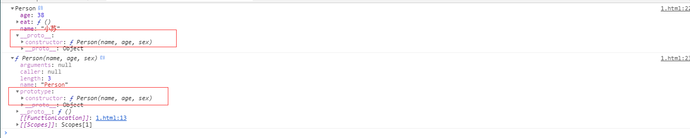

::: tip
实例对象是通过构造函数来创建的，实例对象会指向自己的构造函数
实例对象的构造器(构造函数)  
实例对象中有__proto__属性，叫做原型。不是标准的属性，是给浏览器使用的（IE8不支持，谷歌和火狐支持）
构造函数中有prototype属性，叫做原型。是标准的属性，是给程序员用的。
```js
console.log(per.constructor == Person);  //true   
console.log(per.__proto__.constructor == Person); //true
console.log(per.__proto__.constructor == Person.prototype.constructor); //true
console.log(per instanceof Person); //true  
```
实例对象的__proto__中的constructor和构造函数的prototype中的constructor一致
:::

::: tip 实例对象和构造函数的关系
1. 实例对象是通过构造函数来创建的 ----> 创建的过程叫实例化
2. 如何判断对象是不是这个数据类型?
   1. 通过构造器的方式   实例对象.构造器 == 构造函数名字
   2. 对象  instanceof 构造函数名字
3. 如何理解JS面向对象
   1. 每一个函数(类)都有一个prototype(原型)属性, 属性值是一个对象：这个对象中存储了前类供实例调取使用的共有属性和方法
   2. 在"浏览器默认"给原型开辟的堆内存中有一个属性constructor：存储的是当前类本身
   3. 每一个对象(实例)都有一个__proto__(原型链)属性，这个属性指向当前实例所属类的原型(prototype)：不确定所属的类，都指向Object.prototype
4. 构造函数执行机制
   1. 构造函数执行时，在形参赋值和变量提升之后，构造函数内代码执行之前，会在当前形成的私有栈中创建一个对象(创建一个堆内存：暂时不存储任何的东西)，并且让函数中的执行主体(THIS)指向这个新的堆内存(THIS===创建的对象)
5. 构造函数返回值问题
   1. 默认情况下，构造函数会创建一个对象（类的实例），然后让this指向这个对象，最后自动返回这个对象
   2. 如果自己在构造函数里写了return会怎么样?
      1. 如果return的是一个基本值，返回的结果依然是类的实例，没有受到影响
      2. 如果返回的是引用值，则会把默认返回的实例覆盖，此时接收到的结果就不是当前类的实例了
:::

::: danger 构造函数、原型对象、实例对象之间的关系
1. 构造函数中有个原型对象(prototype),原型对象中有构造器(constructor)，构造器指向构造函数
2. 实例对象是由构造函数产生的，实例对象中有原型对象(__proto__),原型对象跟构造函数中原型(prototype)一样
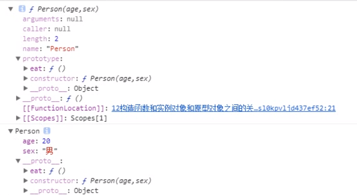
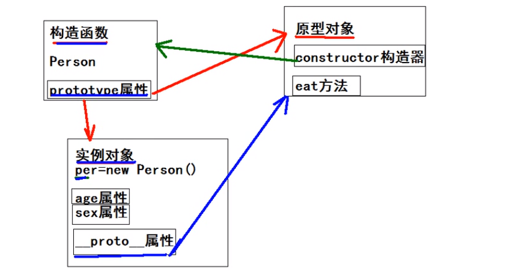
:::


## JavaScript如何实现面向对象中的继承？(百度移动)
[JS继承的几种方式:其中组合式继承有误](https://www.jianshu.com/p/b76ddb68df0e)
* JS中没有类(es6之前),但是JS中会通过构造函数来模拟类的概念

1. 原型式继承：借用构造函数的原型对象实现继承
::: danger 问题
1. 父构造函数的原型对象和子构造函数的原型对象上的成员有共享问题
2. 只能继承父构造函数的原型对象上的成员, 不能继承父构造函数的实例对象的成员
:::
```js
//父类
function Person(name,age){
  this.name = name;
  this.age = age;
}
Person.prototype.eat = function(){
  console.log('人可以吃东西');
}

//子类
function Student(score){
  this.score = score;
}
// 设置子构造函数的原型对象实现继承
SubClass.prototype = SuperClass.prototype;
```

2. 原型链继承：即 子构造函数.prototype = new 父构造函数()
::: danger 问题
不能给父构造函数传递参数，父子构造函数的原型对象之间有共享问题
:::
```js

//使用继承，改变学生的原型的指向即可
function Student(score){
  this.score = score;
}
// 实现继承
Student.prototype = new Person('小明',10);  //存在问题：所有子级的name，age属性都一样
// 修改子构造函数的原型的构造器属性
Student.prototype.constructor = Student;
Student.prototype.study = function(){
  console.log('学生学习');
}
var stu = new Student(70);
```


3. 借用构造函数：父级构造函数名.call(当前对象, 属性, 属性...)
将要继承的父级的构造函数拿过来使用
::: danger 优势及缺陷
* 优势：解决了子类继承父类属性且值不重复的问题
* 缺陷：父级原型对象上的方法不能继承
:::
```js
function Student(name, age, score){
  Person.call(this, name, age)
  this.score = score;
}
Student.prototype.study = function(){
  console.log('学生学习');
}
var stu = new Student('小丽', 10, 60);
stu.eat();  //报错
```

4. 组合继承： 借用构造函数 + 原型链继承

::: danger 优势及缺陷
* 优势
   1. 子构造函数的实例对象上能继承父构造函数上的属性,
并且能继承父构造函数原型对象上的属性和方法
   2. 解决了给父构造函数传递参数问题
* 缺陷：
   1. 共享的问题
   2. 父类的构造函数多执行一次(Student.prototype = new Person();)
::: 
```js
// 创建子构造函数
function Student(name, age, score){
  Person.call(this, name, age)
  this.score = score;
}
Student.prototype.study = function(){
  console.log('学生学习');
}
// 设置继承
Student.prototype = new Person();
Student.prototype.constructor = Student;
var stu = new Student('小丽', 10, 60);
stu.eat();
```

5. 组合继承优化(寄生组合继承) : 借用构造函数 + 原型式继承
::: danger 优势
* 优势
   1. 子构造函数的实例对象上能继承父构造函数上的属性,
并且能继承父构造函数原型对象上的属性和方法
   2. 解决了给父构造函数传递参数问题
   3. 父类的构造函数不多执行一次
::: 
```js
function Student(name, age, score){
  Person.call(this, name, age)
  this.score = score;
}
Student.prototype.study = function(){
  console.log('学生学习');
}
// 设置继承
Student.prototype = Object.create(Person.prototype);
//下面的方式更好，能继承父类上的静态方法
//Object.setPrototypeOf(Student,Person);
Student.prototype.constructor = Student;
var stu = new Student('小丽', 10, 60);
stu.eat();
```

---

## 函数声明及函数表达式
* 区分函数声明和函数表达式的最简单的方法就是看function关键字出现在声明中的位置。如果function是声明中的第一个词，那么就是一个函数声明，否则就是一个函数表达式
* 匿名函数叫做匿名函数表达式
* 立即执行函数叫做立即执行函数表达式 (function(){..})() 等价于 (function(){..}()), 使用哪种全凭个人喜好
```js


(function foo(){
  console.log(foo); //foo函数只能在这被访问到，外部（全局）无法被访问
})()

var goo = function foo(){};  //函数表达式，声明的foo是无意义的
console.log(goo); //打印函数
console.log(foo); //foo is not defined

var a = (function b(){});
console.log(a); //打印函数
console.log(b); //b is not defined
```

---

## 为什么在JavaScript中0.1+0.2不等于0.3？
[0.1 + 0.2不等于0.3？](https://www.sohu.com/a/254865340_796914)
[JS 数据精度以及数字格式化](https://www.jianshu.com/p/77f8130fd278)
0.1+0.2不等于0.3？是不是有点颠覆你的认知，但是，在js中，是真实存在的！

>console.log(0.1+0.2);  // 0.30000000000000004
其实这都是因为浮点数运算的精度问题。    
简单来说，因为计算机只认识二进制，在进行运算时，需要将其他进制的数值转换成二进制，然后再进行计算。    
::: tip 乘2取整
小数转二进制使用“乘2取整”的方法：
0.1转二进制过程如下：
0.1*2 = 0.2 取整数位0
0.2*2 = 0.4 取整数位0
0.4*2 = 0.8 取整数位0
0.8*2 = 1.6 取整数位1
0.6*2 = 1.2 取整数位1
0.2*2 = 0.4 取整数位0
0.4*2 = 0.8 取整数位0
...
结果位0.00011001100...
:::

由于浮点数用二进制表达时是无穷的：    
// 将0.1转换成二进制   
>console.log(0.1.toString(2)); // 0.0001100110011001100110011001100110011001100110011001101   
// 将0.2转换成二进制   
>console.log(0.2.toString(2));  // 0.001100110011001100110011001100110011001100110011001101   
   
IEEE 754 标准的 64 位双精度浮点数的小数部分最多支持53位二进制位，所以两者相加后，因浮点数小数位的限制而截断的二进制数字，再转换为十进制，就成了 0.30000000000000004，所以在进行算术计算时会产生误差。
::: tip 结构
64位比特又可分为三个部分：

>符号位S：第 1 位是正负数符号位（sign），0代表正数，1代表负数
>指数位E：中间的 11 位存储指数（exponent），用来表示次方数
>尾数位M：最后的 52 位是尾数（mantissa），超出的部分自动进一舍零

既然说到这里，再给大家科普一个小知识点：js最大安全数是Number.MAX_SAFE_INTEGER == Math.pow(2,53) - 1, 而不是Math.pow(2,52) - 1, why？尾数部分不是只有52位吗?   

这是因为二进制表示有效数字总是1.xx…xx的形式，尾数部分f在规约形式下第一位默认为1（省略不写，xx..xx为尾数部分f，最长52位）。因此，JS提供的有效数字最长为53个二进制位（64位浮点的后52位+被省略的1位）   
Math.pow(2,53) => 9007199254740992
Math.pow(2,53) + 1 => 9007199254740992
:::

所以实际上，这里错误的不是结论，而是比较的方法，正确的比较方法是使用JavaScript提供的最小精度 值：

> console.log(	Math.abs(0.1	+	0.2	-	0.3)	<=	Number.EPSILON);
ES6 在Number对象上面，新增一个极小的常量Number.EPSILON。  
Number.EPSILON实际上是 JavaScript 能够表示的最小精度。误差如果小于这个值，就可以认为已经没有意义了，即不存在误差了。  
```js
function withinErrorMargin (left, right) {
  return Math.abs(left - right) < Number.EPSILON;
}

0.1 + 0.2 === 0.3 // false
withinErrorMargin(0.1 + 0.2, 0.3) // true

1.1 + 1.3 === 2.4 // false
withinErrorMargin(1.1 + 1.3, 2.4) // true
```
---

## [js 中null,undefined区别](https://www.cnblogs.com/qyzy1024/p/4036661.html)
null是一个表示"无"的对象，转为数值时为0；undefined是一个表示"无"的原始值，转为数值时为NaN。

null表示"没有对象"，即该处不应该有值。典型用法是：
  1. 作为函数的参数，表示该函数的参数不是对象。
  2. 作为对象原型链的终点。

undefined表示"缺少值"，就是此处应该有一个值，但是还没有定义。典型用法是：
  1. 变量被声明了，但没有赋值时，就等于undefined。
  2. 调用函数时，应该提供的参数没有提供，该参数等于undefined
  3. 对象没有赋值的属性，该属性的值为undefined。
  4. 函数没有返回值时，默认返回undefined。

---

## 懒加载和预加载

### 懒加载
当图片进入可视区域，再去请求资源。需要监听scroll事件，在scroll事件的回调中，去判断懒加载的图片是否进入可视区域
* 图片进入可视区域之后请求图片资源
* 减少无效资源的加载
* 并发加载的资源过多会阻塞js的加载，影响网站的正常使用
```js
//HTML部分
<head>
<style>
  .iamge-item{
    width:40%;
    margin-right:5%;
    display:inline-block;
    height:400px;  //必须指定图片高度，这样lazyload才能生效，不然所有图片都在首屏出现
    background:grey;
  }
</style>
</head>
<body>
<div class="image-list">
  
  
  
  <script src="./lazyload.js"></script> //原生事件懒加载
  <script src="zepto.min.js"></script>  //使用插件
  <script src="zepto.lazyload.js"></script>
</div>
</body>


//lazyload.js
var viewHeight = document.documentElement.clientHeight;

function lazyload(){
  var eles = document.querySelectorAll('img[data-original][lazyload]');
  Array.prototype.forEach.call(eles, function (item, index){
    var rect;
    if(item.dataset.original === '')
      return
    rect = item.getBoundingClientRect();
    if(rect.bottom >= 0 && rect.top < viewHeight) {
      !function(){
        var img = new Image();
        img.src = item.dataset.url;
        img.onload = function () {
          item.src = img.src;
        }
        item.removeAttribute('data-original');
        item.removeAttribute('lazyload');
      }()
    }
  })
}
lazyload();  //首屏的图片需要手动调用才能加载
document.addEventListener('scroll',lazyload);  //其余图片通过监听scroll加载
```


### 预加载
* 图片等静态资源在使用之前的提前请求
* 资源使用时能从缓存中加载，提升用户体验
* 页面展示的依赖关系维护

```js
//HTML部分
<body>
<!--第一种方式 图片不会影响页面渲染，但是它会加载图片，等到需要使用时再从缓存中读取-->
 
<!--第二种方式 手写preload-->
<script src="./myPreload.js"></script>
<!--第三种方式 插件-->
</body>


//myPreload.js
//1. 使用Image对象
var image = new Image();
image.src = "http://pic26.nipic.com/20121213/6168183.png"

//2. 使用XMLHttpRequest对象
var xmlhttprequest = new XMLHttpRequest();

xmlhttprequest.open("GET", "http://image.baidu.com/mouse.jpg", true);
xmlhttprequesy.send();
xmlhttprequest.onreadystatechange = callback;  //监听请求完成
xmlhttprequest.onprogress = progressCallback;  //监听数据传输情况

function callback(){
  if(xmlhttprequest.readyState == 4 && xmlhttprequest.status == 200){
    var reponseText = xmlhttprequest.responseText;
  }else{
    console.log("Request was unsuccessful" + xmlhttprequest.status)
  }
}
function progressCallback(){
  e = e || event;
  if(e.lengthComputable){
    console.log("Received " + e.loaded  + " of " + e.total + " bytes");
  }
}
```
---

## Symbol属性
Symbol是ES6中引入的新类型，它是一切非字符串的对象key的集合。表示独一无二的
Symbol可以具有字符串类型的描述，但是即使描述相同，Symbol也不相等
```var mySymbol = Symbol("my symbol")```

一些标准中提到的Symbol，可以再全局的Symbol函数的属性中找到。例如：我们可以使用Symbol.iterator来自定义for...of在对象上的行为：
```js
var o = new Object();
o[Symbol.iterator] = function () {
  var v = 0;
  return {
    next : function () {
      return {value:v++, done: v > 10}
    }
  }
}

for(var v of o){
  console.log(v);  // 0 1 2 3 ... 9
}
```
代码中我们定义了iterator之后，用for(var	v	of	o)就可以调用这个函数，然后我们可以根据函数的行为，产 生一个for…of的行为。  
这里我们给对象o添加了	Symbol.iterator	属性，并且按照迭代器的要求定义了一个0到10的迭代器，之后我 们就可以在for	of中愉快地使用这个o对象啦

---

## new 操作符做了哪些事？
new	运算接受一个构造器和一组调用参数，实际上做了几件事：
* 以构造器的 prototype	属性（注意与私有字段[[prototype]]的区分）为原型，创建新对象；
* 将	this	和调用参数传给构造器，执行；
* 如果构造器返回的是对象，则返回，否则返回第一步创建的对象。

---

## 将函数当构造器执行做了哪些事？
函数实现[[call]]（作为函数被调用）和[[construct]]（作为构造器被调用）不总是一致的。

我们大致可以认为，它们[[construct]]（作为构造器被调用）的执行过程如下：
* 以	Object.protoype	为原型创建一个新对象；
* 以新对象为	this，执行函数的[[call]]；
* 如果[[call]]的返回值是对象，那么，返回这个对象，否则返回第一步创建的新对象。

这样的规则造成了个有趣的现象，如果我们的构造器返回了一个新的对象，那么new创建的新对象就变成了一个构造函数之外完全无法访问的对象，这一定程度上可以实现“变量私有”。  
```js
function cls(){
  this.a =	100;
  return {
    getValue:()	=>	this.a
  } 
} 
var	o	=	new	cls;   // 按构造函数执行时，this是构造函数生成的对象{a:100},返回的新对象{getValue:fn}中由于箭头函数的关系，this会绑定构造函数生成的对象{a:100}
o.getValue();	//100    this指向 {a:100}
o.a  //a在外⾯永远⽆法访问到
var f = cls();   // 按照普通函数执行时，this指向window{a:100}，因此返回的对象{getValue:fn}中由于箭头函数的远古，this指向window
f.getValue();	//100   //  this指向window
f.a; // undifined
```
::: danger 核心
私有化变量的核心在于返回的箭头函数，因为箭头函数没有自己的this,只能接收外部的this,因此箭头函数中的this是cls中产生的this对象，相当于闭包的概念
:::

---

## 箭头函数的this指向问题(实现私有变量)

```js
function	cls(){
  this.a	=	100;
  return	{
    getValue:()	=>	this.a
  }
}
var	o	=	new	cls;
o.getValue();  // 100
o.a;           // undefined
var b = {a:111,getValue:o.getValue};
b.getValue();  // 100

function	cls(){
  this.a	=	100;
  return	{
    getValue: function(){return this.a}
  }
}
var	o	=	new	cls;
o.getValue();  // undefined
o.a;           // undefined
var b = {a:111,getValue:o.getValue};
b.getValue();  // 111

```

关于this，Kyle	Simpson有四条总结： 
1. 由new调用的,绑定到新创建的对象。 
2. 由call或者apply(或者bind)调用的绑定到指定的对象。 
3. 由上下文对象调用的绑定到那个上下文对象。 
4. 默认:在严格模式下绑定到undefined，否则绑定到全局对象
例外：箭头函数不适用以上四条规则，它会继承外层函数调用的	this	绑定(无论	this	绑定到什么)。  

---

## 不使用new运算符，尽可能找到获得对象的方法。
1. 利用字面量 
  var	a	=	[],	b	=	{},	c	=	/abc/g, d = function(){}
2. 利用dom	api 
  var	d	=	document.createElement('p')
3. 利用JavaScript内置对象的api 
  var	e	=	Object.create(null) var	f	=	Object.assign({k1:3,	k2:8},	{k3:	9}) var	g	=	JSON.parse('{}')
4. 利用装箱转换 
  var	h	=	Object(undefined),	i	=	Object(null),	k	=	Object(1),	l	=	Object('abc'),	m	=	Object(true)

---

## 遍历HTML节点,输出标签名字

::: tip 说明
1. childNodes会返回节点的所有子节点，包括元素节点，文本节点，属性节点，而children只返回元素节点
2. NodeName在所有节点上都有，而tagName只在元素节点上有
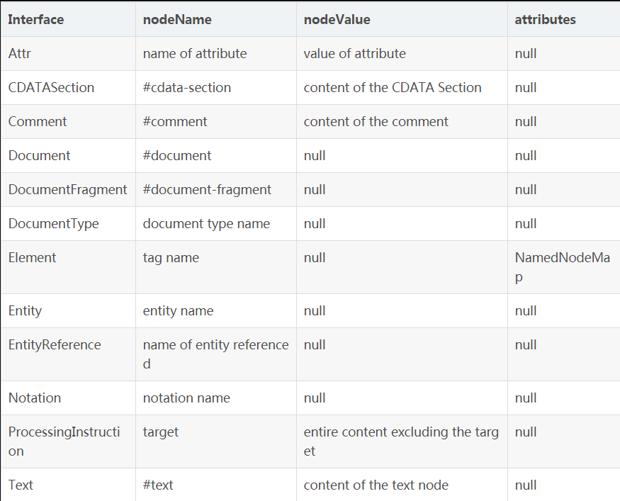
:::


1. 深度优先
```js
let str1 = '';
function deepLoopTagNode(parentNode){
  //parentNode.tagName && console.log(parentNode.tagName)
  parentNode.tagName && (str1 += parentNode.tagName);
	const childNodes = parentNode.childNodes;  //childNodes返回所有子节点包括元素节点，文本节点，属性节点
	//可以使用children
	Array.prototype.filter.call(childNodes, item => item.tagName)
	.map(itemNode => {deepLoopTagNode(itemNode)})
}

let str2 = '';
function deepLoopTagNode1(parentNode){
  parentNode.tagName && console.log(parentNode.tagName)
  parentNode.tagName && (str2 += parentNode.tagName);
	const childNodes = parentNode.children;  //childNodes返回所有子节点包括元素节点，文本节点，属性节点
	//可以使用children
	Array.prototype.map.call(childNodes, itemNode => {deepLoopTagNode1(itemNode)})
}
deepLogTagNames(document.body)
deepLogTagNames1(document.body)

```

2. 广度优先
```js
function	breadLogTagNames(root){
  const	queue	=	[root];
  while(queue.length)	{
    const	currentNode	=	queue.shift();
    const	{childNodes,	tagName}	=	currentNode;
    tagName	&&	console.log(currentNode.tagName) 
    //	过滤没有	tagName	的节点 ,遍历子节点然后将这一层级的所有点插入队列中处理
    Array.prototype.filter.call(childNodes,	item=>item.tagName).forEach(itemNode=>{ queue.push(itemNode) })	
  }
}
breadLogTagNames(document.body)	
```

3. TreeWalk版本
```js
function	getChildTagNames(){ 
  const	walker	=	document.createTreeWalker(document.body,	NodeFilter.SHOW_ELEMENT,	null,	false);
  let	node; 
  while(node	=	walker.nextNode()){ 
    if(node.tagName) console.log(node.tagName); 
  } 
} 
getChildTagNames(document.body); 
```
---

## for in用于对象，for of用于数组，那么有没有方法让对象可以使用for of语句[Symbol.iterator]?
```js
1. 数据结构默认的Iterator接口
//方法一
let obj = {
	[Symbol.iterator]: () => { //等同于 () => ({返回对象的内容})
    return {
      _value:0,
      next(){
        if(this._value > 4){
          return {
            done:true
          }
        }else{
          return {
            value:this._value++,
            done:false
          }
        }
      }
    }
  }
}

for(let	e of obj){console.log(e)};  // 0,1,2,3,4
[...obj];  //[0,1,2,3,4]
let iterator = obj[Symbol.iterator]();
iterator.next()  // {value: 0, done: false}
iterator.next()  // {value: 1, done: false}
iterator.next()  // {value: 2, done: false}
iterator.next()  // {value: 3, done: false}
iterator.next()  // {value: 4, done: false}
iterator.next()  // {done: true}

//方法二
let obj = {
    [Symbol.iterator] () {
    let val = 0
        return {
            next () {
                if (val >= 10) {
                    return {done: true}
                }
                return {value: val++,done: false}
            }
        }
    }
}
```

2. 使用generator函数
```js
let obj = {
    [Symbol.iterator]:function* (){
    for(let i = 0; i < 10; i++){
      yield i;
    }
  }
}
for (let val of obj) {console.log(val)};
[...obj];  

//遍历对象的值
let obj = {
    name:'zhangsan',
    age:18,
    sex:'man'
}
obj[Symbol.iterator]=function* (){
    for(var key in obj){
        yield obj[key];
    }
}
/**************优化写法****************/
let obj = {
	name:'haha',
	age:18,
	sex:'男',
	[Symbol.iterator]:function* (){
		for(let key in this){
			yield this[key];
		}
	}
}

for(let value of obj){
    console.log(value);//zhangsan 18 man
}
console.log([...obj]);//["zhangsan", 18, "man"]

//异步for await of
function	sleep(duration)	{
  return	new	Promise(function(resolve,	reject)	{
      //setTimeout(()=>{resolve()},duration)  下面的代码更简洁
      setTimeout(resolve,duration);
    })
}
async function* foo(){
  i = 0;
  while(i < 10){
    await sleep(1000);
    yield i++;
  }
}
for await(let e of foo()){
  console.log(e); //每隔1s打印0,1,2...9
}

/******************简化代码*********************/
async function* foo(){
	let i = 0;
	while(i < 10){
		await new Promise((resolve, reject) => {
			setTimeout(resolve, 1000);
		});
		yield i++;
	}
}


```
---

## 为什么JavaScript里面typeof(null)的值是"object"？
在JavaScript中，typeof null是'object'，它不正确地表明null是一个对象，这是一个错误，不幸的是无法修复，因为它会破坏现有的代码。我们来探讨这个bug的历史。   
“typeof null”错误是JavaScript第一个版本的补遗。在这个版本中，值以32位为单位存储，其中包含一个小型标记（1-3位）和实际的数据值。类型标签存储在单元的低位中。其中有五个：   
*. 000：object        数据是对对象的引用。
*. 1：int        数据是一个31位有符号整数。
*. 010：double        数据是对双浮点数的引用。
*. 100：string        数据是对字符串的引用。
*. 110：boolean        数据是一个布尔值。

也就是说，最低位是一个，然后类型标签只有一个位长。或者它是零，那么类型标签的长度是三位，为四种类型提供两个附加位。  

两个值是特殊的：
1. 未定义undefined（JSVAL_VOID）是负的 2 的 30 次方（超出当时整型取值范围的一个数）
2. null（JSVAL_NULL）是<font color="red">机器码空指针</font>。或者：<font color="red">一个对象类型标记加上一个为零的引用</font>。
显而易见，null 的存储单元最后三位和 object 一样是 000。然后让我们再看一下 typeof 的 实现 ：
```js
JS_PUBLIC_API(JSType)
    JS_TypeOfValue(JSContext *cx, jsval v)
    {
        JSType type = JSTYPE_VOID;
        JSObject *obj;
        JSObjectOps *ops;
        JSClass *clasp;
        CHECK_REQUEST(cx);
        if (JSVAL_IS_VOID(v)) {  // (1)
            type = JSTYPE_VOID;
        } else if (JSVAL_IS_OBJECT(v)) {  // (2)
            obj = JSVAL_TO_OBJECT(v);
            if (obj &&
                (ops = obj->map->ops,
                 ops == &js_ObjectOps
                 ? (clasp = OBJ_GET_CLASS(cx, obj),
                    clasp->call || clasp == &js_FunctionClass) // (3,4)
                 : ops->call != 0)) {  // (3)
                type = JSTYPE_FUNCTION;
            } else {
                type = JSTYPE_OBJECT;
            }
        } else if (JSVAL_IS_NUMBER(v)) {
            type = JSTYPE_NUMBER;
        } else if (JSVAL_IS_STRING(v)) {
            type = JSTYPE_STRING;
        } else if (JSVAL_IS_BOOLEAN(v)) {
            type = JSTYPE_BOOLEAN;
        }
        return type;
    }
```
代码的大致执行步骤：
*. 在步骤（1）判断值 v 是否为 undefined(VOID)，这个检查通过下面的比较来判断：
```js
  #define JSVAL_IS_VOID(v)  ((v) == JSVAL_VOID)
```
*. 接下来，在步骤（2）判断值是否包含 object 标志，并且通过（3）判断值是否可以调用，或者（4）判断值是否在属性 [[Class]] 中被标记为函数，来判断值为函数，否则为对象。
*. 接下来的步骤，依次判断是否为 number、 string 和 boolean 。

在步骤（2）中 null 会被判断为 object，其实避免这个 bug 的方式很简单，在步骤（2）之前显示的检查值是否为 null . 这可以由以下C宏执行。：
```js
  #define JSVAL_IS_NULL(v)  ((v) == JSVAL_NULL)
```
---

##  instanceof能否判断基本数据类型？
[MDN上关于hasInstance的解释](https://developer.mozilla.org/zh-CN/docs/Web/JavaScript/Reference/Global_Objects/Symbol/hasInstance)
instanceof的原理是基于原型链的查询，只要处于原型链中，判断永远为true; instanceof默认是无法判断基本数据类型的。但是我们可以通过改写Symbol.hasInstance属性来定义instanceof的行为
```js
//其实就是自定义instanceof行为的一种方式，
//这里将原有的instanceof方法重定义，换成了typeof，因此能够判断基本数据类型。
class PrimitiveNumber{
  static [Symbol.hasInstance](x){
    return typeof x === 'number'
  }
}
console.log(111 instanceof PrimitiveNumber); //true
```
---

## 能不能手动实现instanceof的功能？
```js
function myInstanceof(left,right){
  //基本数据类型直接返回false
  if(typeof left !== 'object' || left === null) return false;
  //getPrototypeOf是Object对象自带的方法，返回原型对象
  let proto = Object.getPrototypeOf(left);
  while(true){
    //查找到尽头还没找到
    if(proto === null) return false;
    //找到相同的原型对象
    if(proto == right.prototype) return true;
    proto = Object.getPrototypeOf(proto);
  }
}
//测试
console.log(myInstanceof("111", String)); //false
console.log(myInstanceof(new String("111"), String));//true
```

---

## '==' 和 '===' 有什么区别？
::: tip 
===叫做严格相等，是指：左右两边不仅值要相等，类型也要相等，例如'1'===1的结果是false，因为一边是string，另一边是number。   
'=='不像'==='那样严格，对于一般情况，只要值相等，就返回true，但==还涉及一些类型转换，它的转换规则如下：   
*. 两边的类型是否相同，相同的话就比较值的大小，例如1==2，返回false   
*. 判断的是否是null和undefined，是的话就返回true   
*. 判断的类型是否是String和Number，是的话，把String类型转换成Number，再进行比较   
*. 判断其中一方是否是Boolean，是的话就把Boolean转换成Number，再进行比较   
*. 如果其中一方为Object，且另一方为String、Number或者Symbol，会将Object转换成字符串，再进行比较   
:::
---

## 对象转原始类型是根据什么流程运行的?
对象转原始类型，会调用内置的<font color='red'>[ToPrimitive]</font>函数，对于该函数而言，其逻辑如下：   
1. 如果Symbol.toPrimitive()方法，优先调用再返回   
2. 调用valueOf()，如果转换为原始类型，则返回   
3. 调用toString()，如果转换为原始类型，则返回   
4. 如果都没有返回原始类型，会报错   
```js
var obj = {
  value: 3,
  valueOf() {
    return 4;
  },
  toString() {
    return '5'
  },
  [Symbol.toPrimitive]() {
    return 6
  }
}
console.log(obj + 1); // 输出7
```

---

## 如何让if(a == 1 && a == 2)条件成立？
其实就是对象转原始值的应用:[Symbol.toPrimitive] valueOf() toString()三种方法
```js
var a = {
  value: 0,
  valueOf() {
    this.value++;
    return this.value;
  },
  toString() {
    this.value++;
    return this.value;
  },
  [Symbol.toPrimitive]() {
    this.value++;
    return this.value;
  }
};
console.log(a == 1 && a == 2);//true

```

---

## ==不同类型比较的规则
类型不同的变量比较时==运算只有三条规则：
1. undefined与null相等；
2. 字符串和bool都转为数字再比较；
3. 对象转换成primitive类型再比较。

这样我们就可以理解一些不太符合直觉的例子了，比如：   
*. false	==	'0'	            //true    boolean vs string   
*. true	==	'true'	          //false   boolean vs string   
*. []	==	0	                  //true   
*. []	==	false	              //true   
*. []	==	null/undefined	              // false/false   
*. var a = {},a == null/undefined/[]  // false/false/false   
*. new	Boolean('false')	==	false	  //false    
*. new	Boolean(false)	==	false     // true   

原始类型primitive type(5种):   
1. number 数字(不分整型或浮点型)  
2. string 字符串  
3. boolean 布尔 
4. null 对象类型的占位符, 人为赋值null(系统不会自动赋值null)
5. undefined 未定义, null衍生类型(变量没有初始化,系统自动赋值undefined)

这里不太符合直觉的有两点：
一个是即使字符串与boolean比较，也都要转换成数字；  
二是对象如果转换成了primitive类型跟等号另一边类型恰好相同，则不需要转换成数字。  


此外，==	的行为也经常跟<font color="red">if的行为（转换为boolean）</font>混淆。  
if判断中[] {}都会判定为真，而null undefined 0 false都会判定为假

---

---

## Object.is和===的区别？
1. ===(严格等于)不会将数据类型进行转换，但是在判断+0 === -0(true) 和NaN === NaN(false)上会有问题   
2. [Object.is](https://developer.mozilla.org/zh-CN/docs/Web/JavaScript/Reference/Global_Objects/Object/is)方法判断两个参数是否相同. 它在===(严格等于)的基础上修复了一些特殊情况下的失误，具体来说就是+0和-0，NaN和NaN。 源码如下：   
```js
function is(x, y) {
  if (x === y) {
    //运行到1/x === 1/y的时候x和y都为0，但是1/+0 = +Infinity， 1/-0 = -Infinity, 是不一样的
    return x !== 0 || y !== 0 || 1 / x === 1 / y;
  } else {
    //NaN===NaN是false,这是不对的，我们在这里做一个拦截，x !== x，那么一定是 NaN, y 同理
    //两个都是NaN的时候返回true
    return x !== x && y !== y;
  }
```
---

## 为啥1.toString 、 {}.toString()会报错?
[为啥{}.toString()会报错](https://segmentfault.com/q/1010000013373775)   
[js中数字直接点方法会报错](https://www.cnblogs.com/stella1024/p/10573109.html)   
js 引擎在执行时，遇到 {，至少有两种选择:   
1. 当做语句块的开始   
2. 当做对象字面量表达式的开始   
但是，默认情况下，是当做语句块的，所以{}.toString()会报错：<font color='red'>Unexpected token .</font>, 因为实际上浏览器执行的可能是这样：   
```js
{}//空语句块
.toString()//另外一条错误的语句
```
如果要让 js 引擎认为 { 是一个对象字面量表达式的开始，一般就是加 ()，这个时候，js 引擎就知道()里的是表达式，所以当做表达式来解析，所以({}).toString()就不会报错;   
[].toString()不报错，很正常，因为这里没有歧义，肯定是数组字面量表达式    

1.toString()报错原因：   
JavaScript的解释器把数字后的"."偷走了（作为前面数字的小数点）, 类似于下面的操作：   
```js
(111.)toString()
```
---

## script标签异步引入外部资源，defer和async有啥区别？
当浏览器碰到 script 脚本的时候：
1. 常规
  ```js
  <script src="script.js"></script>
  ```
没有 defer 或 async，浏览器会立即加载并执行指定的脚本，“立即”指的是在渲染该 script 标签之下的文档元素之前，也就是说不等待后续载入的文档元素，读到就加载并执行。     
2. async
  ```js
  <script async src="script.js"></script>
  ```
  有 async，加载和渲染后续文档元素的过程将和 script.js 的加载与执行并行进行（异步）。   
3. defer
  ```js
  <script defer src="myscript.js"></script>
  ```
  有 defer，加载后续文档元素的过程将和 script.js 的加载并行进行（异步），但是 script.js 的执行要在所有元素解析完成之后，DOMContentLoaded 事件触发之前完成。   
4. 加载多个JS脚本，async无序加载，defer有序加载
执行时机见下图:


蓝色线代表网络读取，红色线代表执行时间，这俩都是针对脚本的；绿色线代表 HTML 解析。
此图告诉我们以下几个要点：
1. defer 和 async 在网络读取（下载）这块儿是一样的，都是异步的（相较于 HTML 解析）
2. 它俩的差别在于脚本下载完之后何时执行，显然 defer 是最接近我们对于应用脚本加载和执行的要求的
3. 关于 defer，此图未尽之处在于它是按照加载顺序执行脚本的，这一点要善加利用
4. async 则是一个乱序执行的主，反正对它来说脚本的加载和执行是紧紧挨着的，所以不管你声明的顺序如何，只要它加载完了就会立刻执行
5. 仔细想想，async 对于应用脚本的用处不大，因为它完全不考虑依赖（哪怕是最低级的顺序执行），不过它对于那些可以不依赖任何脚本或不被任何脚本依赖的脚本来说却是非常合适的，最典型的例子：Google Analytics

---

## mouseover mouseout和mouseenter mouseleave的区别

1. mouseover + mouseout:成对出现，父子元素都能触发，且先于下面的事件触发
2. mouseenter + mouseleave:成对出现，只在父元素触发。

::: tip 补充说明：
mouseover: 只要鼠标指针移入事件所绑定的元素或其子元素，都会触发该事件   
mouseenter: 只有鼠标指针移入事件所绑定的元素时，才会触发该事件   
mouseout: 只要鼠标指针移出事件所绑定的元素或其子元素，都会触发该事件   
mouseleave: 只有鼠标指针移出事件所绑定的元素时，才会触发该事件   
:::
```js
<style>
.b{
      width: 200px;
      height: 200px;
      background: beige;
    }
    .c{
      width: 100px;
      height: 100px;
      background: violet;
    }
</style>
<div class="b"
        onmouseenter="mouseenter()"
        onmouseleave="mouseleave()"
        onmouseout="mouseout()"
        onmouseover="mouseover()"
        onmousemove="mousemove()">B
        <div class="c">C</div>
</div>
<script>
      function mouseenter(){
        console.log('mouseenter')
      }
      function mouseleave(){
        console.log('mouseleave')
      }
      function mouseout(){
        console.log('mouseout')
      }
      function mouseover(){
        console.log('mouseover')
      }
      function mousemove(){
        console.log('mousemove')
      }
</script>
//鼠标从B左边到右边划过依次触发：
// 父mouseover -> 父mouseenter -> 父mousemove -> 父mouseout 
// -> 子mouseover -> 子mousemove -> 子mouseout -> 父mouseover 
// -> 父mousemove -> 父mouseout -> 父mouseleave
```
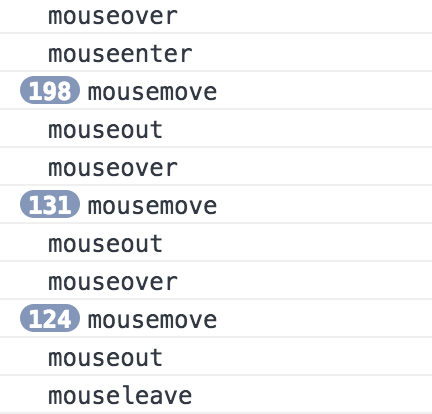

---

## JS中数组扁平化
```js
let ary = [1, [2, [3, [4, 5]]], 6];// -> [1, 2, 3, 4, 5, 6]
let str = JSON.stringify(ary);
```
需求:多维数组=>一维数组  
1. 调用ES6中的flat方法
```js
arr = arr.flat(Infinity)
```

2. replace + split
```js
let arr = str.replace(/[\[\]]/g,'').split(',');
```

3. replace + JSON.parse
```js
str = str.replace(/[\[\]]/g,'');
str = '[' + str + ']';
ary = JSON.parse(str);
```
4. 普通递归
```js
let result = [];
let fn = function(ary){
  for(let i = 0; i < ary.length; i++){
    let item = ary[i];
    if(Array.isArray(ary[i])){
      fn(item);
    }else{
      result.push(item);
    }
  }
}
```

5. 利用reduce函数迭代
```js
function flatten(ary){
  return ary.reduce((pre,cur) => {
    return pre.concat(Array.isArray(cur)?flatten(cur):cur);
  },[])
}
let ary = [1, 2, [3, 4], [5, [6, 7]]]
console.log(flatten(ary))
```

6. 扩展运算符
```js
//只要有一个元素有数组，那么循环继续
while (ary.some(Array.isArray)) {
  ary = [].concat(...ary); //二维转一维，如果还有更多维，则继续迭代
}
```
---

## 请用JS实现Ajax并发请求控制(字节跳动)
实现一个批量请求函数 multiRequest(urls, maxNum)，要求如下：

* 要求最大并发数 maxNum
* 每当有一个请求返回，就留下一个空位，可以增加新的请求
* 所有请求完成后，结果按照 urls 里面的顺序依次打出


::: tip 思路分析
整体采用递归调用来实现：最初发送的请求数量上限为允许的最大值，并且这些请求中的每一个都应该在完成时继续递归发送，通过传入的索引来确定了urls里面具体是那个URL，保证最后输出的顺序不会乱，而是依次输出。
:::
```js
function multiRequest(urls = [], maxNum) {
    // 请求总数量
    const len = urls.length;
    // 根据请求数量创建一个数组来保存请求的结果
    const result = new Array(len).fill(false);
    // 当前完成的数量
    let count = 0;
    
    return new Promise((resolve, reject) => {
        // 请求maxNum个
        while(count < maxNum) {
            next();
        }
        function next() {
            let current = count++;
            // 处理边界条件
            if (current >= len) {
                // 请求全部完成就将promise置为成功状态，然后将result作为promise值返回
                !result.includes(false) && resolve(result);
                return ;
            }
            const url = urls(current);
            console.log(`开始 ${current}`, new Date().toLocaleString());
            fetch(url)
                .then((res) => {
                    // 保存请求结果
                    result[current] = res;
                    console.log(`完成 ${current}`, new Date().toLocaleString());
                    // 请求没有全部完成，就递归
                    if (current < len) {
                        next();
                    }
                })
                .catch(err => {
                    console.log(`结束 ${current}`, new Date().toLocaleString());
                    result[current] = err;
                    // 请求没有全部完成，就递归
                    if (current < len) {
                        next();
                    }
                })
        }
    })
}
```
---

## JS实现将数字转成千分位的方法小结【5种方式】
[参考链接](https://www.jb51.net/article/99675.htm)
* 利用正则的零宽度正预测先行断言(?=exp);它断言自身出现的位置的后面能匹配表达式exp
```js
var str = "87463297";
console.info(str.replace(/\d{1,3}(?=(\d{3})+$)/g,function(s){
  return s+','
}) )
console.info( str.replace(/(\d{1,3})(?=(\d{3})+$)/g,'$1,')) // 出错！！！297,297,297
```

* 利用正则的子项来替换
```js
console.info( str.replace(/(\d{1,3})(?=(\d{3})+$)/g,function($1){
  return $1=$1+','
}))
console.info( str.replace(/(\d{1,3})(?=(\d{3})+$)/g,'$1,')) // 正常！！！
```

* 先将字符串转成数组，利用reverse反转数组后每3个数字后添加一个分隔符“,”，到字符串末尾除外，之后转回字符串
```js
// 利用字符串和数组方法
console.info( str.split("").reverse().join("").replace(/(\d{3})+?/g,function(s){
  return s+",";
}).replace(/,$/,"").split("").reverse().join("") )
```

* 利用while循环拼接字符串每隔3个数字加一个分隔符，首尾不加
```js
// 利用循环拼接字符串每隔3个加一个分隔符
var result="",
  index = 0,
  len = str.length-1;
while(len>=0) {
  index%3===0&&index!==0 ? result+=","+str[len] : result+=str[len];
  len--;
  index++;
};
result=result.split("").reverse().join("");
console.info(result);
```

* 利用while循环在数组里push分隔符，首尾不加
```js
// 利用while循环在数组里push分隔符
var result="",
  index = 0,
  len = str.length,
  i = len-1,
  arr = str.split("");
while(len-index>0){
  len>=index&&len-index!==len && arr.splice(len-index,0,",");
  index+=3;
  i-=4;
};
console.log(arr.join(""));
```
---
